# 📚 DavASko LLM Wiki

**A knowledge base that AI agents can actually search — fully offline.**

🌐 **English** · [Русская версия](README.ru.md)

DavASko LLM Wiki turns your project's scattered docs, code notes, and transcripts into a **structured, layered knowledge base** with a built‑in **hybrid search engine** (keywords + meaning). AI coding agents (Claude, Gemini, GPT) query it *before* answering, so they reason from your real project knowledge instead of guessing.

It runs **100% offline** — the embedding model and all dependencies are vendored.

> ### ✅ It's measured, not promised
> On a real 162‑document knowledge base with 15 labeled questions, semantic search reaches **recall@5 = 0.633 / MRR = 0.718**, vs a plain "grep the files" baseline of **0.333 / 0.435**. In plain words: the search layer **finds ~2× more** of the right pages and ranks the first correct hit **+65% higher** than just searching text. Full method, tables & charts: [`docs/paper/davasko-llm-wiki.html`](docs/paper/davasko-llm-wiki.html).

---

## 🧭 Table of contents

1. [What is this, in one picture](#1--what-is-this-in-one-picture)
2. [Why it exists](#2--why-it-exists)
3. [Core idea: layers](#3--core-idea-layers)
4. [`wiki/` vs `raw/`: derived vs truth](#4--wiki-vs-raw-derived-vs-truth)
5. [One shared model, many knowledge bases](#5--one-shared-model-many-knowledge-bases)
6. [✍️ Writing knowledge (the ingest pipeline)](#6-️-writing-knowledge-the-ingest-pipeline)
7. [🔎 Reading knowledge (the search pipeline)](#7--reading-knowledge-the-search-pipeline)
8. [🧩 The skills — what each one does](#8--the-skills--what-each-one-does)
9. [🚀 Deploy a knowledge base (2 ways)](#9--deploy-a-knowledge-base-2-ways)
10. [⌨️ Command cheat‑sheet](#10-️-command-cheatsheet)
11. [📊 Evaluation & results](#11--evaluation--results)
12. [📐 Data standards](#12--data-standards)
13. [🗂️ Repository layout](#13-️-repository-layout)

---

## 1. 🖼️ What is this, in one picture

Think of it as a **librarian for your AI agent**. You put knowledge in; the agent asks questions; the librarian hands back exactly the right pages.

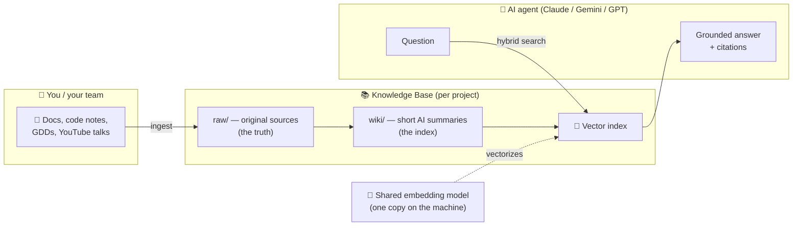

**The three moving parts:**

| Part | Plain meaning |
|---|---|
| 📚 **Knowledge base** | Your project's facts, organized into folders called *layers*. |
| 🧠 **Embedding model** | Turns text into numbers ("vectors") so the computer can find *meaning*, not just exact words. Installed **once per machine**, shared by every KB. |
| 🔎 **Search engine** | Given a question, returns the most relevant pages — by keyword **and** by meaning. |

---

## 2. 🤔 Why it exists

An AI agent without grounding **guesses**. The common alternative — let it `grep` your files — is weak: grep only finds exact words, misses synonyms, and floods the agent with noise.

This project asks the only honest question: **is a real search layer actually better than grep?** The answer, measured on a real corpus, is yes:

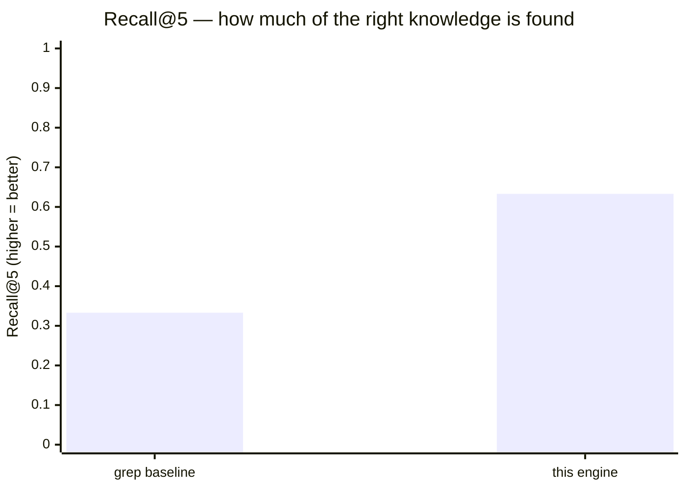

Roughly **double the recall**. See [§11](#11--evaluation--results) for the full numbers.

---

## 3. 🧱 Core idea: layers

Knowledge is split into **layers** — independent folders, each a self‑contained slice. A layer may **depend on** lower layers (and reuse their pages), but never the other way around. This keeps general rules separate from project specifics.

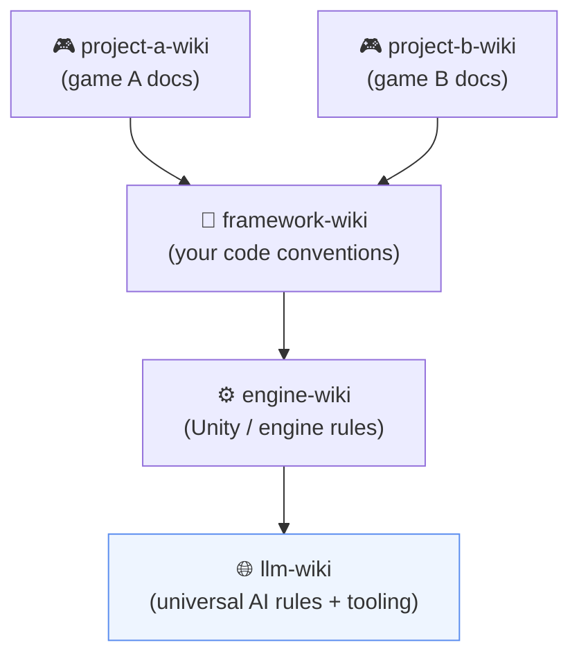

- Arrows mean **"depends on / can read from"**. Dependencies flow **strictly downward** — no cycles.
- Each layer carries a manifest `wiki.json`:

```json
{ "name": "project-a-wiki", "dependencies": ["framework-wiki", "engine-wiki", "llm-wiki"] }
```

**Conflict rule:** if the same topic exists in two layers, the **more specific** (closer‑to‑the‑project) layer wins. The agent should warn you about the duplicate and let you override. Order of priority:

```
project layer  >  framework layer  >  engine layer  >  llm-wiki (base)
```

---

## 4. 📂 `wiki/` vs `raw/`: derived vs truth

Every layer has two halves. This split is the heart of the system.

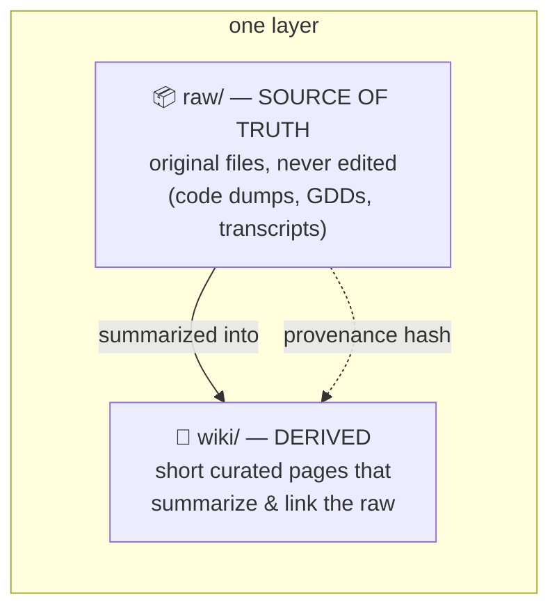

| | `raw/` | `wiki/` |
|---|---|---|
| **Role** | Ground truth | Human/AI‑friendly summary & map |
| **Edited?** | No (immutable snapshots) | Yes (curated) |
| **If they disagree** | `raw/` wins | flagged as possibly stale |

Each wiki page stores a **content hash** of the sources it cites. When a source changes, `check-staleness.js` flags the derived page as out‑of‑date — drift becomes *detectable*, not silent.

Inside `wiki/`, pages are typed: `concepts/`, `entities/`, `runbooks/`, `sources/`, `syntheses/`, `decisions/`, plus three special pages per layer: `index.md` (table of contents), `stubs.md` (planned pages), `contradictions.md` (open conflicts).

---

## 5. 🧠 One shared model, many knowledge bases

The embedding model is ~**1.1 GB**. Copying it into every knowledge base would waste gigabytes. Instead it's installed **once** into a system location, and a small **marker file** tells every KB where to find it.

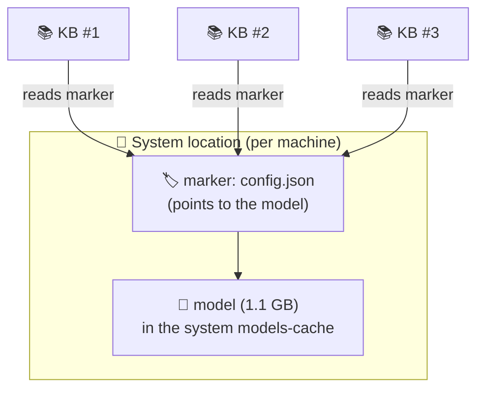

**How a KB finds the model** (`system/lib/model-locator.js`), first match wins:

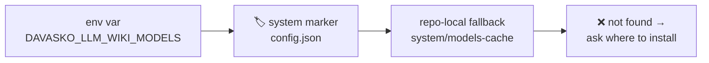

- **Default location:** Windows `%LOCALAPPDATA%\DavASkoLLMWiki\models-cache`, Linux/macOS `~/.davasko-llm-wiki/models-cache`.
- `setup-model.js` installs the model there (copying the bundled source offline, or downloading) and writes the marker. If nothing is found, the deploy **asks you** where to put it.

---

## 6. ✍️ Writing knowledge (the ingest pipeline)

You drop files into `NewData/<layer>/…`, run one command, and the pipeline does the rest — **ending with vectorization**, so the new knowledge is instantly searchable.

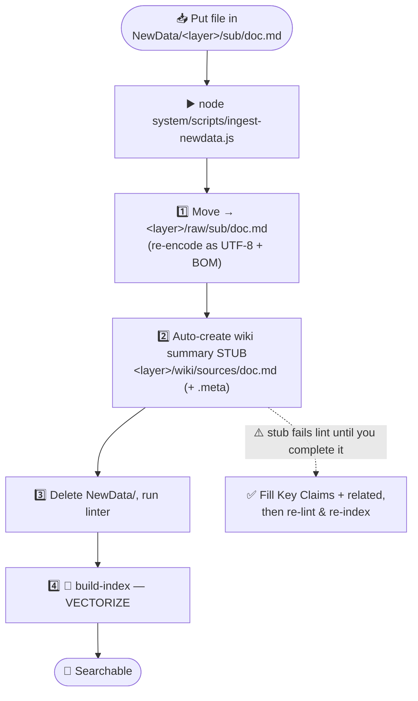

> ⚠️ **Important:** step 2 creates a *stub* summary (`related: []`, "No claims extracted") that **fails the linter on purpose**. You must fill in real **Key Claims** (each citing the raw source) and a non‑empty **related** list. This is what the **davasko-wiki-ingest** skill walks you through.

---

## 7. 🔎 Reading knowledge (the search pipeline)

One command searches by **keyword and meaning at the same time**, then writes the best pages to a context file the agent reads.

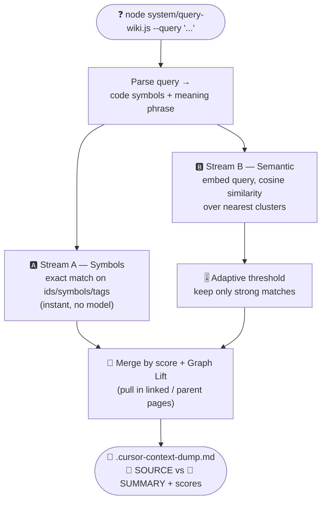

**Why two streams?** Code identifiers (`CowController`, `IEvent`) need exact matching; natural‑language questions ("how does physics tuning work?") need meaning. Hybrid search does both and ranks them on one scale.

**Adaptive threshold** — instead of a fragile fixed cutoff, the engine keeps matches scoring at least `α · (best score for this query)` (default α = 0.85, floor 0.35). Robust across languages and lengths. Tune it on labeled data with `eval-retrieval.js --sweep`, never by hand.

---

## 8. 🧩 The skills — what each one does

Skills are portable instruction packs (`skills/`) that teach any AI agent how to operate the KB. They sync into Cursor, Claude Code, Windsurf, Cline/Roo, Gemini, Copilot.

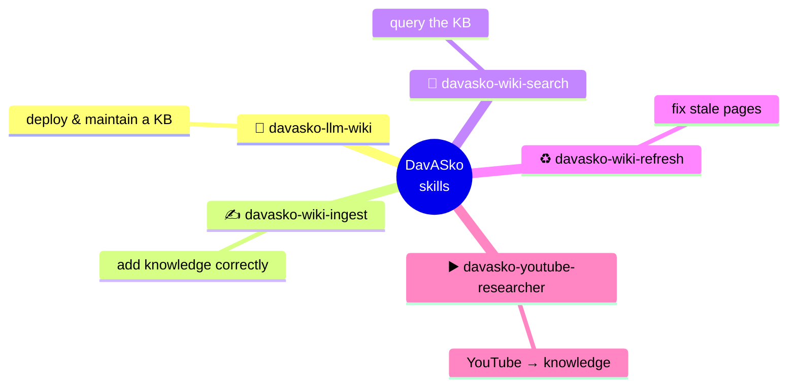

| Skill | What it's for | When to use it |
|---|---|---|
| 🚀 **davasko-llm-wiki** | **Deploy & maintain** a knowledge base: scaffold layers, install the shared model + marker, install rules, install skills, set up the test/validation environment. | "Set up / deploy the wiki here", growing the structure. |
| ✍️ **davasko-wiki-ingest** | **Add knowledge** through the exact pipeline (raw placement → auto‑summary → lint → vectorize) and bring the auto‑summary up to standard. | Importing any new source document. |
| 🔎 **davasko-wiki-search** | **Read knowledge**: run a hybrid query and hand the agent the right context. | Before answering any question about the project. |
| ♻️ **davasko-wiki-refresh** | **Actualize** wiki pages that `check-staleness.js` flags because their cited sources changed. | After raw sources change. |
| ▶️ **davasko-youtube-researcher** | **YouTube → knowledge**: pull a transcript, write structured notes, and hand them to the ingest pipeline. | Turning a video/lecture into KB pages. |

---

## 9. 🚀 Deploy a knowledge base (2 ways)

A full deploy always does the **same five things**:

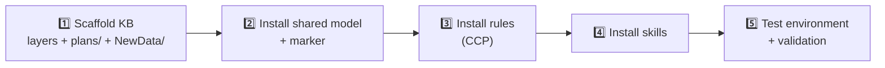

### 🅰️ Way A — one command (the script)

Best when you just want it done. From this repo:

```bash
node system/scripts/deploy-wiki.js --target ../my-kb --layers llm-wiki,project-a-wiki
```

It scaffolds the layers (with base pages + Unity `.meta`), copies the engine, runs an **offline** `npm install`, installs the **shared model + marker**, seeds the rules, syncs IDE adapters, and runs `npm test` + lint + `build-index`. A fresh deploy is **lint‑clean**.

| Flag | Meaning |
|---|---|
| `--target <path>` | **(required)** where to deploy |
| `--layers a,b,c` | layers to create (default `llm-wiki`; it's always the base) |
| `--model-dir <path>` | custom system location for the shared model |
| `--no-model` / `--no-install` / `--no-index` | skip heavy steps (reuse existing model, etc.) |
| `--force` | write into a non‑empty folder |

> 🛡️ **Your existing files are safe.** If the target already has a `CLAUDE.md` / `AGENTS.md`, the deploy **appends** its rules in a managed block — your content is preserved, never overwritten.

### 🅱️ Way B — via the skill (conversational)

Best when you want the agent to tailor the layers to your project. Just ask:

> *"Deploy the DavASko LLM Wiki into `./my-kb` with a layer for project A."*

The **davasko-llm-wiki** skill performs the same five functions, inspecting your workspace to choose sensible layers.

---

## 10. ⌨️ Command cheat‑sheet

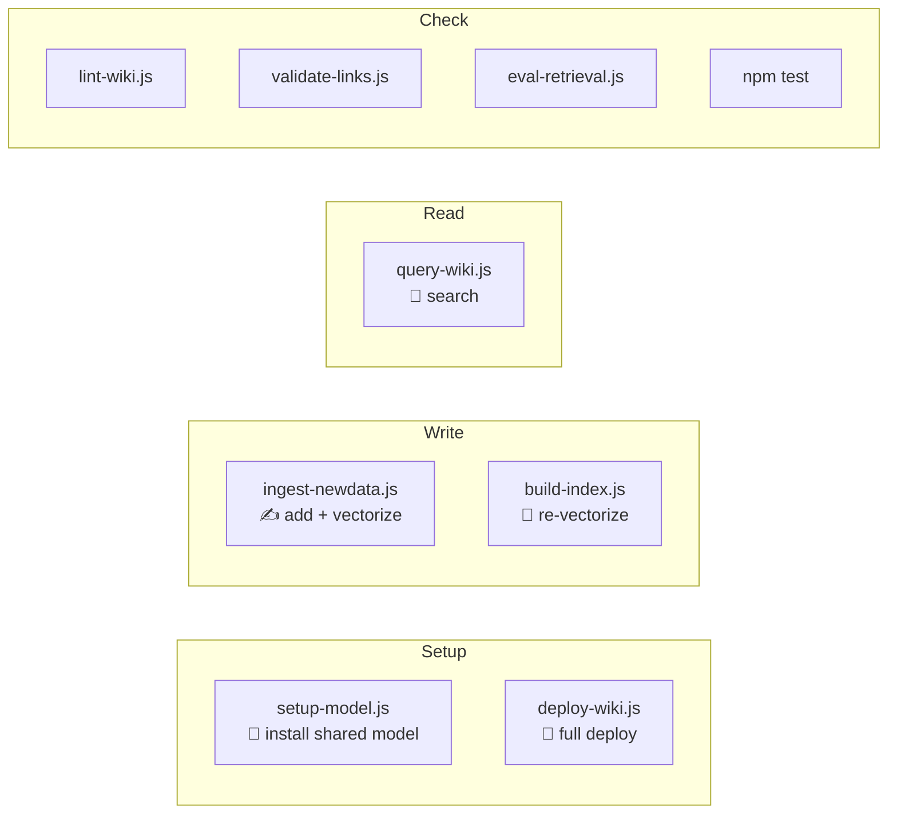

| Command | What it does |
|---|---|
| `node system/scripts/deploy-wiki.js --target <p>` | **One‑command full deploy** (scaffold + model + rules + skills + tests). |
| `node system/scripts/setup-model.js` | Install the shared model into the system location + write the marker. |
| `node system/scripts/ingest-newdata.js` | Run the **write pipeline**: place sources, lint, **vectorize**. |
| `node system/build-index.js [--force]` | Build / rebuild the vector index (incremental by default). |
| `node system/query-wiki.js --query "..."` | **Hybrid search** → `.cursor-context-dump.md`. |
| `node system/sync-ai-rules.js [--global]` | Sync IDE rules (append‑safe) + compile skill adapters. |
| `node system/scripts/lint-wiki.js` | Validate encoding, frontmatter, links (must be **0 errors**). |
| `node system/scripts/validate-links.js` | Check every `[[wiki link]]` and file link. |
| `node system/scripts/check-staleness.js` | Detect wiki pages whose cited sources changed. |
| `node system/scripts/eval-retrieval.js [--sweep]` | Measure retrieval quality (recall@k / MRR / nDCG) vs baselines. |
| `npm test` | 32 unit tests of the retrieval core (no model needed). |

---

## 11. 📊 Evaluation & results

Quality is **measured**, not asserted. `eval-retrieval.js` runs a labeled query set through several retrievers — including a `lexical` (grep‑like) baseline — and reports recall@k / MRR / nDCG.

**Real corpus** (162 docs, 15 labeled questions, top‑k = 5):

| Retriever | recall@5 | MRR | nDCG@5 |
|---|---|---|---|
| **semantic (this engine)** | **0.633** | **0.718** | **0.626** |
| hybrid (symbols + semantic) | 0.633 | 0.718 | 0.626 |
| lexical (grep baseline) | 0.333 | 0.435 | 0.303 |

**Data‑driven refinements** (measured before/after on the same corpus):

| Change | hybrid MRR |
|---|---|
| baseline (strict "symbols first") | 0.641 |
| → unified score‑based ranking | 0.685 |
| → drop generic acronyms (JSON/API) from symbol matching | **0.718** |

Structure‑aware chunking beat fixed‑window by **+7.8% MRR** at equal recall. Embedding runs on **GPU via DirectML** when available — measured **8× faster** than CPU (cosine parity 0.999984).

```bash
node system/build-index.js --force            # build the index (offline)
node system/scripts/eval-retrieval.js         # recall@k / MRR / nDCG + baselines
node system/scripts/eval-retrieval.js --sweep # calibrate the threshold on data
```

> **Honest caveats:** n = 15 questions is small; cluster routing is layer‑coarse; CPU indexing is slow without a GPU. Documented, not hidden — see the report's *Limitations* section.

Full write‑up (method, dataset, charts, threats to validity): [`docs/paper/davasko-llm-wiki.html`](docs/paper/davasko-llm-wiki.html).

---

## 12. 📐 Data standards

A few hard rules keep the KB machine‑readable (the linter enforces them):

- **Encoding:** `.md` → UTF‑8 **with BOM**; `.json` / `.js` / rules → UTF‑8 **without BOM** (a BOM breaks `JSON.parse`).
- **Frontmatter** (every wiki page): `title`, `type`, `status`, `sources`, `last_updated`, **non‑empty** `related`.
- **Links:** Obsidian‑style `[[page-name]]`, resolvable within the layer's dependency chain.
- **Plans** live in the root `plans/` folder — never inside a layer, never cited as a wiki source.

---

## 13. 🗂️ Repository layout

```
DavASkoLLMWiki/
├── system/                      # the engine
│   ├── build-index.js           # vectorize the KB
│   ├── query-wiki.js            # hybrid search
│   ├── sync-ai-rules.js         # deploy rules/skills to IDEs (append‑safe)
│   ├── lib/                     # model-locator, retrieval core, chunker, metrics
│   ├── scripts/                 # deploy-wiki, setup-model, ingest-newdata, lint, eval…
│   ├── vendor/                  # offline npm deps (.tgz)
│   └── models-cache/            # bundled model SOURCE (copied to the system location)
├── skills/                      # the 5 portable skills (sources of truth)
├── docs/paper/                  # the measured scientific report (EN + RU)
├── CLAUDE.md / AGENTS.md        # agent rules (Core Context Protocol)
├── README.md / README.ru.md     # this file
└── LICENSE.md                   # Proprietary EULA
```

---

<p align="center"><sub>© DavASko · Proprietary (<a href="LICENSE.md">EULA</a>) · Fully offline, reproducible · <a href="README.ru.md">Русская версия</a></sub></p>
