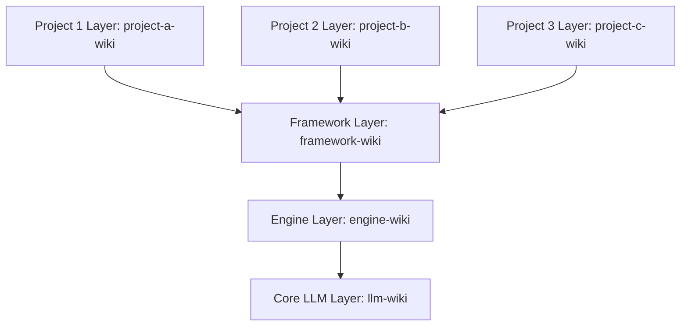
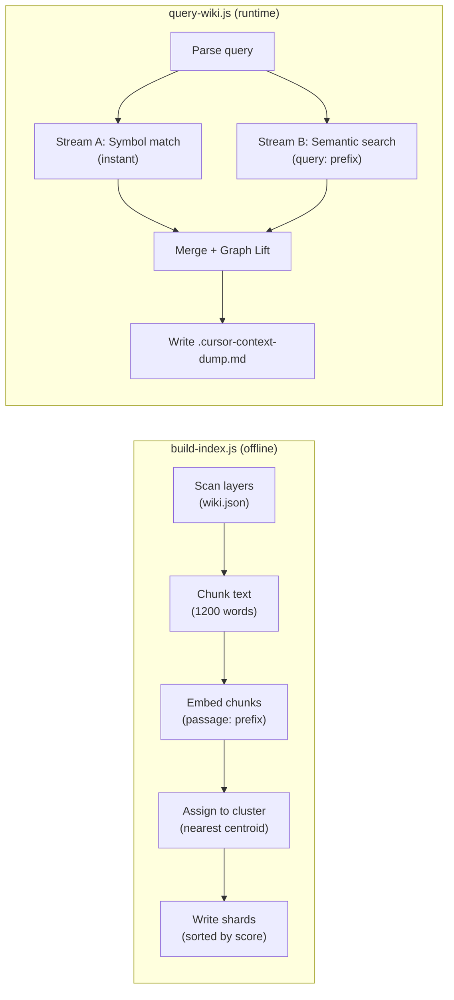
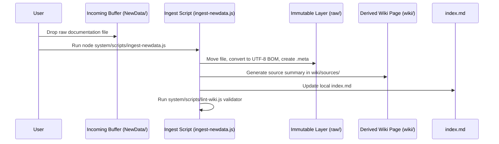

# DavASko LLM Wiki

A multi-layered, self-validating, and Obsidian-compatible knowledge base framework designed specifically to organize AI agent work with high-performance LLMs (such as Claude 3.5 Sonnet, Gemini 1.5 Pro, and GPT-4o) in developer workspaces.

---

## 1. Core Concept & Architecture

The **DavASko LLM Wiki** separates knowledge into hierarchical, independent folders called **layers**. This ensures that general AI rules, engine-specific constraints, framework conventions, and project-specific documentation are kept in separate contexts.

### The Dependency Chain
Dependencies flow strictly **downward**. A higher-level layer can depend on and link to a lower-level layer, but not vice versa. Multiple independent project layers can run in parallel and inherit from the common framework layer.



- **`llm-wiki`** (Core Layer): Contains universal AI rules, developer guidelines, video transcripts, and general helper scripts.
- **`engine-wiki`** (Engine Layer): Contains game engine details, naming styles, physics guidelines, and assembly rules.
- **`framework-wiki`** (Framework Layer): Contains core framework packages, architectural principles, C# code styles, and custom libraries definitions.
- **`project-a-wiki`, `project-b-wiki`, `project-c-wiki`** (Project Layers): Contain GDDs, scene lists, gameplay logic, and module definitions for their respective projects. Each project is fully isolated from others.

Each layer contains a manifest file `wiki.json` specifying its dependencies:
```json
{
  "name": "davasko-wiki",
  "dependencies": ["engine-wiki", "llm-wiki"]
}
```

---

## 2. Knowledge Priorities & Conflict Resolution

Knowledge has different weights depending on its "proximity to the project":

$$\text{Project Layer} > \text{Framework Layer} > \text{Engine Layer} > \text{Core LLM Layer}$$

### The Priority Override Rules
If a page, rule, or concept exists in multiple layers (e.g. both `engine-wiki` and `llm-wiki` contain a rule with conflicting conventions):
1. **Default Option**: The version in the most specific (project-level) layer is chosen and followed by default.
2. **Warn User**: The AI assistant must print a warning message notifying the user about the duplicate rules.
3. **Offer Choice**: The AI assistant must prompt the user to choose between using the default (project-level) rule or overriding it with the general base rule.
4. **Grep Search Gaps**: If the AI assistant searches the codebase using low-level search tools (grep, ripgrep) because of undocumented patterns or missing references, it MUST document the findings in the most appropriate layer of the knowledge base.
5. **Aesthetic Independence**: Rules, schemas, and instructions MUST NOT contain proprietary names or paths (such as client-specific folders or proprietary framework names) in general-purpose layers. Keep all conventions abstract, generalized, and portable.

---

## 3. Full-Text Search Gaps Policy

To continuously improve the quality and coverage of the knowledge base:
- **Search Gap Definition**: If an AI assistant performs a full-text search (using grep, ripgrep, custom script searches, etc.) because a topic, convention, or code pattern was not directly found in the wiki maps or concepts, this indicates a search gap.
- **Mandatory Documentation**: The AI assistant MUST document its findings before completing the task. This involves adding the description, links, and code symbols to the knowledge base (under the appropriate layer, e.g. `davasko-wiki` or `project-wiki`).
- **Linking Updates**: If the topic already exists but lacked the specific links/details that forced the search, it must be updated with the missing references so future searches can be done directly via the wiki query system.

---

## 4. Directory Layout and Plans Isolation

The system separates planning documentation (ExecPlans, checklists) from the durable knowledge base:

### Workspace Root Layout
```
<workspace-root>/
├── plans/                      # Centralized planning: task.md, implementation plans
├── system/                     # Maintenance scripts (lint-wiki.js, etc.)
├── NewData/                    # Buffer folder for manual document ingestion
├── llm-wiki/                   # Core LLM Layer (contains rules, scripts, transcripts)
├── engine-wiki/                 # Engine Layer (Unity specific)
├── framework-wiki/                 # Framework Layer (framework conventions, C# code styles)
└── <project-wiki>/             # Isolated project-specific layers (e.g. project-a-wiki)
```

### Folder Structure of a Single Layer
Each individual layer directory must conform to the following directory layout:
```
<layer-directory>/
├── wiki.json                   # Manifest file specifying dependencies
├── wiki/                       # Compiled, AI-maintained knowledge base
│   ├── index.md                # Layer-specific catalog of pages (Table of Contents)
│   ├── contradictions.md       # Open conflicts and questions register
│   ├── stubs.md                # Declared stubs to resolve out-of-boundary references
│   ├── concepts/               # Reusable patterns, guidelines, and rules
│   ├── entities/               # Service definitions, scenes, classes, packages
│   ├── runbooks/               # Step-by-step developer checklists and guides
│   ├── sources/                # AI-generated summaries of raw materials
│   ├── syntheses/              # Comparative designs and analyses
│   └── decisions/              # Architectural Decision Records (ADRs)
└── raw/                        # Immutable source materials (read-only)
    ├── docs/                   # Copied project documentation
    ├── transcripts/            # Text transcripts of meetings (llm-wiki/raw/transcripts/ only)
    └── ai-skills~/             # Portable AI skills (SKILL.md and assets)
```

---

## 5. RAG Vector Search Engine (v3.x)

The framework includes a built-in **Retrieval-Augmented Generation (RAG)** engine powered by [Jina v3 embeddings](https://huggingface.co/jinaai/jina-embeddings-v3) for semantic search across the entire knowledge base.

### Architecture Overview



### Search Algorithm

**Hybrid search** combines two parallel streams:

| Stream | Method | Speed | Use Case |
|---|---|---|---|
| **A — Symbolic** | Exact match on `id`, `symbols`, `tags`, `wikilinks` | Instant | C# classes, interfaces, enums |
| **B — Semantic** | Cosine similarity with Jina v3 vectors | 1–2s | Natural language queries (RU/EN) |

**Cosine similarity threshold** (configurable in `system/search-config.json`, default `0.70`):

$$\text{similarity}(q, d) = \frac{\vec{q} \cdot \vec{d}}{||\vec{q}|| \cdot ||\vec{d}||} \geq \tau,\quad \tau_{\text{default}} = 0.70$$

If nothing clears `τ`, the engine retries at a `similarity_fallback` (default `0.65`) for cross-lingual queries.

**Cluster probing (IVF multi-probe)**: Stream B ranks clusters by their centroid and scans the `nprobe` nearest (default `8`). When `nprobe ≥ cluster count` (the small-corpus case) the search is **exhaustive** — zero recall loss. `nprobe` trades recall for speed only on large corpora and is meant to be calibrated on labeled data via `system/scripts/eval-retrieval.js`.

**Graph Lift** (+1 step): For exact matches, the engine also returns:
- Parent document via `extends` field
- Referenced documents via `[[WikiLinks]]` in the body

All retrieval constants (`similarity_threshold`, `similarity_fallback`, `top_k_documents`, `nprobe`, `ground_truth_boost`) live in `system/search-config.json`, **not** hardcoded.

### Jina v3 Asymmetric Prefixes

The model uses **asymmetric prefixing** for optimal retrieval:
- **Indexing**: `passage: <chunk text>` — used when embedding document chunks
- **Querying**: `query: <search phrase>` — used when embedding the search query

### Model & Vector Specs

| Parameter | Value |
|---|---|
| Model | `jinaai/jina-embeddings-v3` |
| Precision | FP16 |
| Vector dimensions | 1024 |
| Chunk size | 1200 words |
| Chunk overlap | 200 words |
| Storage | JSON shards in `system/index-shards/` |

### Core Context Protocol (CCP)

AI agents should follow this protocol before answering questions:

```bash
# 1. Search the knowledge base
node system/query-wiki.js --query "CowController, blend tree optimization"

# 2. Read the context dump
cat .cursor-context-dump.md

# 3. Use retrieved documents as grounded context
```

The context dump file (`.cursor-context-dump.md`) is limited to **120KB** and only a short status line is sent to stdout to prevent IDE buffer overflow.

---

## 6. System Scripts & Commands

The framework includes automation tools in the `system/` directory:



### RAG Engine Scripts

| Command | Description |
|---|---|
| `node system/build-index.js` | Build/update vector index (incremental, MD5 cache) |
| `node system/build-index.js --force` | Full index rebuild (ignores MD5 cache) |
| `node system/query-wiki.js --query "..."` | Hybrid search → `.cursor-context-dump.md` |
| `node system/scripts/setup-model.js` | Download Jina v3 model to `system/models-cache/` |
| `node system/scripts/pack-deps.js` | Pack all npm dependencies into `system/vendor/` |

### Maintenance Scripts

| Command | Description |
|---|---|
| `node system/sync-ai-rules.js` | Sync IDE rules and compile skill adapters |
| `node system/scripts/lint-wiki.js` | Validate wiki pages (frontmatter, links, BOM) |
| `node system/scripts/validate-links.js` | Check all wiki and markdown links |
| `node system/scripts/query-wiki.js` | Legacy page lookup and single-file ingestion |
| `node system/scripts/ingest-newdata.js` | Process `NewData/` incoming folder |
| `node system/scripts/update-links.js` | Safe path migration (DEPRECATED) |
| `node system/scripts/run-evals.js` | Regression test runner |

---

## 7. How to Deploy the LLM Wiki in a New Workspace

Follow these steps to initialize the DavASko LLM Wiki in any project:

### Step 1: Clone Submodule
1. Add this repository as a submodule named `davasko-ai-docs` in your project repository:
   ```bash
   git submodule add <repo-url> Assets/DavASko/davasko-ai-docs
   ```

### Step 2: Install Dependencies
1. Install Node.js dependencies (uses offline `.tgz` from `system/vendor/`):
   ```bash
   npm install
   ```
2. Download the Jina v3 embedding model (one-time, requires internet):
   ```bash
   node system/scripts/setup-model.js
   ```

### Step 3: Initialize Layers and Plans
1. Create directories for your layers (e.g. `llm-wiki/`, `engine-wiki/`, `framework-wiki/`, and project-specific layers).
2. Create a `plans/` directory in the workspace root.
3. Add a `wiki.json` manifest to each layer to define its dependency chain.
4. In each layer, create the basic folder structures and write initial placeholder lists:
   - wiki/index.md
   - wiki/stubs.md
   - wiki/contradictions.md

### Step 4: Build the Search Index
Build the vector index for semantic search:
```bash
node system/build-index.js
```

### Step 5: Install AI Skills
You can install the portable skills from this repository either project-locally or globally:

#### Option A: Project-Local Installation (Recommended)
Copy the skills you want to use from the `skills/` directory of this repository into your layer's `raw/ai-skills~/` folder:
- `llm-wiki/raw/ai-skills~/davasko-llm-wiki/`
- `llm-wiki/raw/ai-skills~/davasko-wiki-search/`
- `llm-wiki/raw/ai-skills~/davasko-wiki-ingest/`
- `llm-wiki/raw/ai-skills~/davasko-youtube-researcher/`

Run the synchronizer to deploy rules and compile skill adapters for your IDE:
```bash
node system/sync-ai-rules.js
```

#### Option B: Global Installation
You can synchronize the skills globally to your system's global AI configurations directory (`~/.gemini/config/skills/`) by running the synchronizer with the `--global` flag:
```bash
node system/sync-ai-rules.js --global
```

This makes the skill globally available to all projects on this machine.

### Step 6: Verify the Setup
Validate the database setup and run regression tests:
```bash
node system/scripts/lint-wiki.js
node system/scripts/validate-links.js
node system/scripts/run-evals.js
```

Test the search engine:
```bash
node system/query-wiki.js --query "test query"
cat .cursor-context-dump.md
```

If the validation passes with **0 errors**, your workspace is fully prepared for structured AI collaboration!

