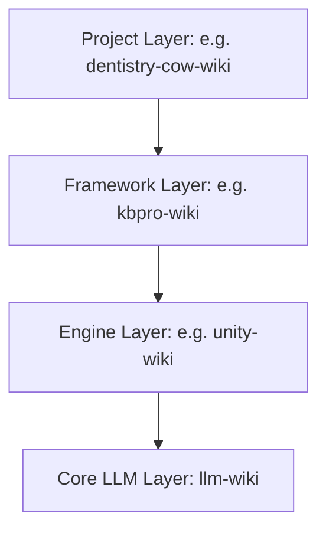
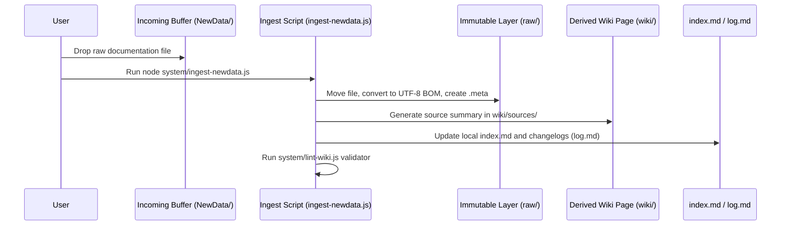

# DavASko LLM Wiki

A multi-layered, self-validating, and Obsidian-compatible knowledge base framework designed specifically to organize AI agent work with high-performance LLMs (such as Claude 3.5 Sonnet, Gemini 1.5 Pro, and GPT-4o) in developer workspaces.

---

## 1. Core Concept & Architecture

The **DavASko LLM Wiki** separates knowledge into hierarchical, independent folders called **layers**. This ensures that general AI rules, engine-specific constraints, framework conventions, and project-specific documentation are kept in separate contexts.

### The Dependency Chain
Dependencies flow strictly **downward**. A higher-level layer can depend on and link to a lower-level layer, but not vice versa.



- **`llm-wiki`** (Core Layer): Contains universal AI rules, project planning guides, and general helper scripts.
- **`unity-wiki`** (Engine Layer): Contains game engine details, naming styles, physics guidelines, and assembly rules.
- **`kbpro-wiki`** (Framework Layer): Contains core packages, architectural principles, and custom libraries definitions.
- **`dentistry-cow-wiki`** (Project Layer): Contains gameplay design documents (GDD), scene lists, and project-specific task builders.

Each layer contains a manifest file `wiki.json` specifying its dependencies:
```json
{
  "name": "kbpro-wiki",
  "dependencies": ["unity-wiki", "llm-wiki"]
}
```

---

## 2. Directory Structure of a Layer

Every layer in the system conforms to the following directory layout:

```
<layer-directory>/
├── wiki.json                   # Manifest file specifying dependencies
├── wiki/                       # Compiled, AI-maintained knowledge base
│   ├── index.md                # Layer-specific catalog of pages (Table of Contents)
│   ├── log.md                  # Local append-only operations log
│   ├── contradictions.md       # Open conflicts and questions register
│   ├── stubs.md                # Declared stubs to resolve out-of-boundary references
│   ├── concepts/               # Reusable patterns, guidelines, and rules
│   ├── entities/               # Service definitions, scenes, classes, packages
│   ├── runbooks/               # Step-by-step developer checklists and guides
│   ├── sources/                # AI-generated summaries of raw materials
│   ├── syntheses/              # Comparative designs and analyses
│   └── decisions/              # Architectural Decision Records (ADRs)
└── raw/                        # Immutable source materials (read-only)
    ├── docs/                   # Copied project documentation
    ├── transcripts/            # Text transcripts of meetings or videos
    └── ai-skills~/             # Portable AI skills (SKILL.md and assets)
```

---

## 3. Data Standards & Coding

To keep the knowledge base fully readable across Windows, macOS, Linux, Unity, Obsidian, and AI agents, all files must adhere to these rules:

1. **UTF-8 with BOM Encoding**: Every text, script, JSON, and markdown file MUST use UTF-8 with BOM (`EF BB BF`). This ensures Cyrillic (Russian) characters are supported natively by PowerShell, CLI utilities, and IDE rules.
2. **Page Format**: All pages must begin with a YAML frontmatter block:
   ```yaml
   ---
   title: "My Concept Page"
   type: concept
   status: draft
   sources:
     - my-layer/raw/docs/my-source.md
   last_updated: 2026-06-15
   related:
     - "[[another-page]]"
   ---
   ```
3. **Required Page Fields**: To pass validation, every wiki page (excluding logs and stubs) must contain the following fields:
   - `**Summary**:` — A 1-2 sentence description of the page.
   - `**Sources**:` — List of paths to source documents in the `raw/` folder.
   - `**Last updated**:` — ISO date string (`YYYY-MM-DD`).
   - `## Related Pages` — Section at the bottom with wiki-links.
4. **Wiki Links**: Double-bracket links `[[page-name]]` must use lowercase hyphenated filenames.
5. **Citations**: Claims made on compiled pages must reference the raw source using `(source: path/to/raw/file.md)`.
6. **Unity `.meta` files**: If the wiki resides inside a Unity project, every file must have a corresponding `.meta` file containing a unique GUID.

---

## 4. Ingestion Workflow & System Scripts

The framework includes automation tools in the `system/` directory:



- **`lint-wiki.js`**: Checks that all links resolve correctly, pages have the correct frontmatter/headers, UTF-8 BOM is present, and no secrets or Bitrix webhooks are committed.
- **`validate-links.js`**: Scans the entire project workspace (including rules files) to identify broken wiki and markdown file links.
- **`query-wiki.js`**: Provides CLI page searching and handles the single-file ingestion process.
- **`ingest-newdata.js`**: Automatically processes the `NewData/` incoming folder, routes files to layers, generates summaries, updates indexes/logs, and runs checks.

---

## 5. How to Deploy the LLM Wiki in a New Workspace

Follow these steps to initialize the DavASko LLM Wiki in any project:

### Step 1: Clone Rules and Scripts
1. Create a submodule or folder named `kbpro-ai-docs` in your repository.
2. Copy the contents of the `templates/system-scripts/` directory into `kbpro-ai-docs/system/`.
3. Copy the script `templates/sync-ai-rules.ps1` to the project root directory.

### Step 2: Initialize Layers
1. Create directories for your layers (e.g. `llm-wiki/`, `unity-wiki/`, `project-wiki/`).
2. Add a `wiki.json` manifest to each layer define its dependency chain.
3. In each layer, create the basic folder structures and write initial placeholder lists:
   - `wiki/index.md`
   - `wiki/stubs.md`
   - `wiki/log.md`
   - `wiki/contradictions.md`

### Step 3: Copy Master IDE Rules
1. Copy the rules templates from `templates/ide-rules/` into your core layer `llm-wiki/raw/ide-rules/`.
2. Configure agent instructions in `AGENTS.md` and `GEMINI.md` to point to the newly created layers.

### Step 4: Install AI Skills
1. Copy the portable skills you want to use (from the `skills/` directory of this repository) into your layer's `raw/ai-skills~/` folder. For example:
   - `llm-wiki/raw/ai-skills~/davasko-llm-wiki/`
   - `llm-wiki/raw/ai-skills~/davasko-youtube-researcher/`

### Step 5: Synchronize and Validate
1. Run the synchronizer from the project root to deploy rules and compile skill adapters for your IDE:
   ```powershell
   powershell.exe -NoProfile -ExecutionPolicy Bypass -File .\sync-ai-rules.ps1
   ```
2. Validate the database setup:
   ```powershell
   node kbpro-ai-docs/system/lint-wiki.js
   node kbpro-ai-docs/system/validate-links.js
   ```

If the validation passes with **0 errors**, your workspace is fully prepared for structured AI collaboration!
