# 📚 DavASko LLM Wiki

**База знаний, в которой ИИ-агент реально умеет искать — и работает полностью офлайн.**

🌐 [English version](README.md) · **Русский**

DavASko LLM Wiki превращает разрозненные документы проекта, заметки по коду и транскрипты в **структурированную слоевую базу знаний** со встроенным **гибридным поиском** (по ключевым словам + по смыслу). ИИ-агенты для кода (Claude, Gemini, GPT) запрашивают её *перед* ответом — и рассуждают на основе реальных знаний проекта, а не догадок.

Работает **на 100% офлайн** — модель эмбеддингов и все зависимости вшиты в репозиторий.

> ### ✅ Это измерено, а не обещано
> На реальной базе из 162 документов с 15 размеченными вопросами семантический поиск даёт **recall@5 = 0.633 / MRR = 0.718** против тривиального «грепа по файлам» с **0.333 / 0.435**. Простыми словами: слой поиска **находит примерно вдвое больше** нужных страниц и ставит первый верный результат **на 65% выше**, чем простой текстовый поиск. Полная методика, таблицы и графики: [`docs/paper/davasko-llm-wiki.ru.html`](docs/paper/davasko-llm-wiki.ru.html).

---

## 🧭 Содержание

1. [Что это — одной картинкой](#1-️-что-это--одной-картинкой)
2. [Зачем это нужно](#2--зачем-это-нужно)
3. [Главная идея: слои](#3--главная-идея-слои)
4. [`wiki/` против `raw/`: производное против истины](#4--wiki-против-raw-производное-против-истины)
5. [Одна общая модель — много баз знаний](#5--одна-общая-модель--много-баз-знаний)
6. [✍️ Запись знаний (пайплайн ингеста)](#6-️-запись-знаний-пайплайн-ингеста)
7. [🔎 Чтение знаний (пайплайн поиска)](#7--чтение-знаний-пайплайн-поиска)
8. [🧩 Скилы — что каждый делает](#8--скилы--что-каждый-делает)
9. [🚀 Развернуть базу знаний (2 способа)](#9--развернуть-базу-знаний-2-способа)
10. [⌨️ Шпаргалка по командам](#10-️-шпаргалка-по-командам)
11. [📊 Оценка и результаты](#11--оценка-и-результаты)
12. [📐 Стандарты данных](#12--стандарты-данных)
13. [🗂️ Структура репозитория](#13-️-структура-репозитория)

---

## 1. 🖼️ Что это — одной картинкой

Представьте **библиотекаря для ИИ-агента**. Вы кладёте знания внутрь; агент задаёт вопросы; библиотекарь выдаёт ровно нужные страницы.

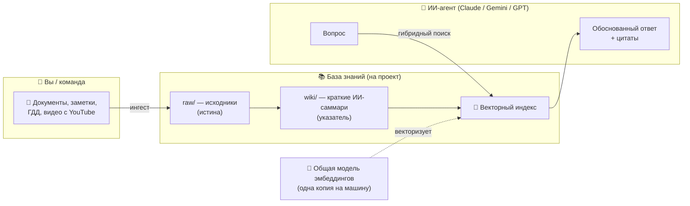

**Три движущиеся части:**

| Часть | Простыми словами |
|---|---|
| 📚 **База знаний** | Факты проекта, разложенные по папкам — *слоям*. |
| 🧠 **Модель эмбеддингов** | Превращает текст в числа («векторы»), чтобы машина искала по *смыслу*, а не только по точным словам. Ставится **один раз на машину**, общая для всех баз. |
| 🔎 **Движок поиска** | По вопросу возвращает самые релевантные страницы — и по словам, и по смыслу. |

---

## 2. 🤔 Зачем это нужно

ИИ-агент без заземления **догадывается**. Частая альтернатива — дать ему `grep` по файлам — слаба: grep находит только точные слова, пропускает синонимы и заваливает агента шумом.

Проект задаёт единственный честный вопрос: **реально ли слой поиска лучше грепа?** Ответ, измеренный на реальном корпусе, — да:

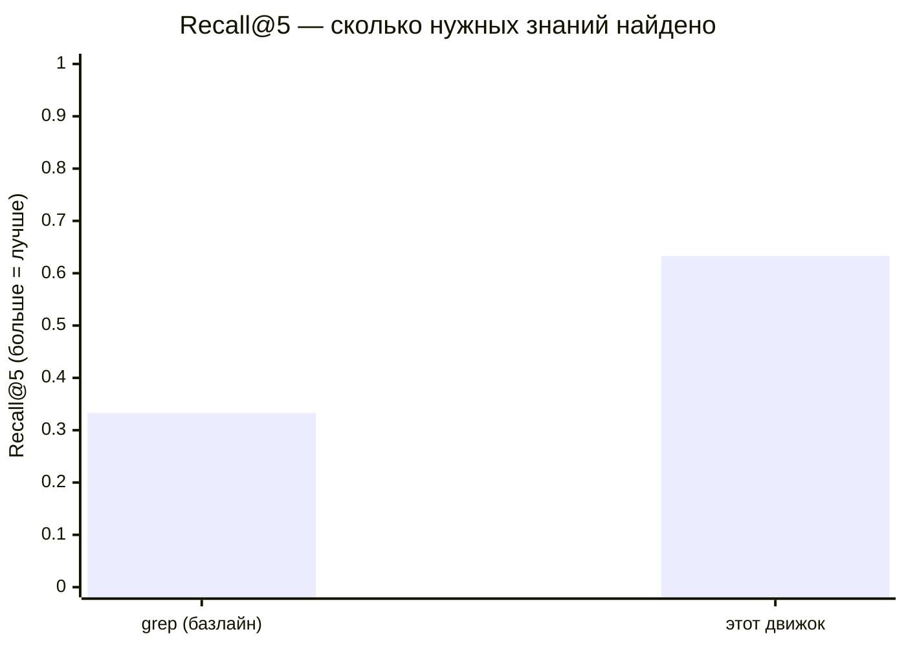

Примерно **вдвое выше полнота**. Полные цифры — в [§11](#11--оценка-и-результаты).

---

## 3. 🧱 Главная идея: слои

Знания разбиты на **слои** — независимые папки, каждая самодостаточный срез. Слой может **зависеть** от нижних (и переиспользовать их страницы), но не наоборот. Так общие правила отделены от проектной специфики.

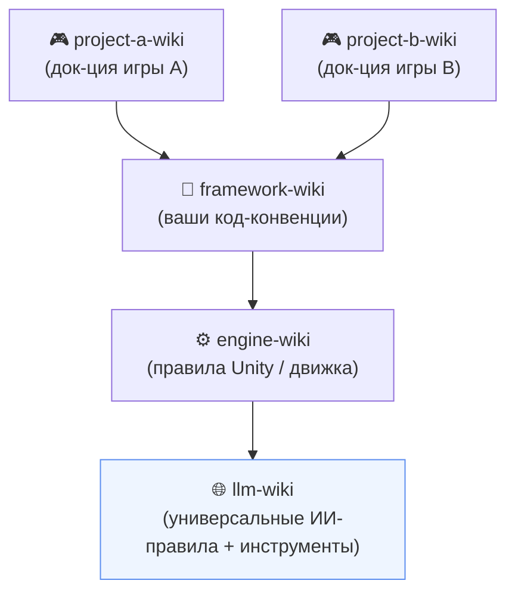

- Стрелка значит **«зависит от / может читать из»**. Зависимости строго **вниз** — без циклов.
- У каждого слоя манифест `wiki.json`:

```json
{ "name": "project-a-wiki", "dependencies": ["framework-wiki", "engine-wiki", "llm-wiki"] }
```

**Правило конфликта:** если одна тема есть в двух слоях, побеждает **более специфичный** (ближе к проекту). Агент предупреждает о дубле и даёт переопределить. Порядок приоритета:

```
слой проекта  >  слой фреймворка  >  слой движка  >  llm-wiki (база)
```

---

## 4. 📂 `wiki/` против `raw/`: производное против истины

В каждом слое две половины. Это разделение — сердце системы.

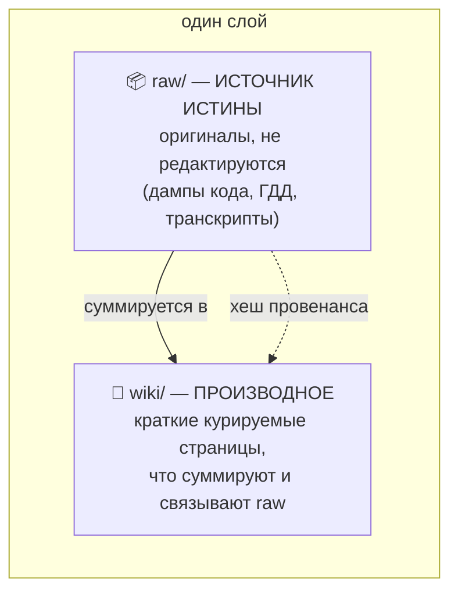

| | `raw/` | `wiki/` |
|---|---|---|
| **Роль** | Истина | Удобное саммари и карта |
| **Редактируется?** | Нет (иммутабельные снимки) | Да (курируется) |
| **Если расходятся** | Прав `raw/` | Помечается как возможно устаревшее |

Каждая wiki-страница хранит **хеш содержимого** процитированных источников. При изменении источника `check-staleness.js` помечает производную страницу как устаревшую — дрейф становится *обнаружимым*, а не молчаливым.

Внутри `wiki/` страницы типизированы: `concepts/`, `entities/`, `runbooks/`, `sources/`, `syntheses/`, `decisions/`, плюс три служебные страницы на слой: `index.md` (оглавление), `stubs.md` (запланированные страницы), `contradictions.md` (открытые конфликты).

---

## 5. 🧠 Одна общая модель — много баз знаний

Модель эмбеддингов весит ~**1.1 ГБ**. Копировать её в каждую базу — терять гигабайты. Поэтому она ставится **один раз** в системное место, а маленький **файл-метка** говорит каждой базе, где её искать.

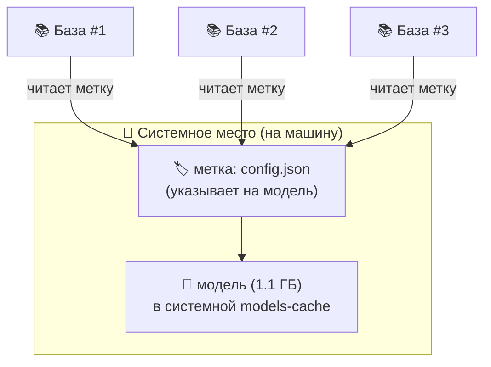

**Как база находит модель** (`system/lib/model-locator.js`), первое совпадение побеждает:

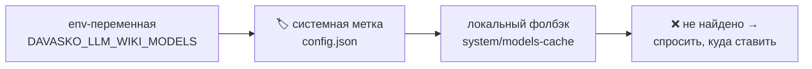

- **Место по умолчанию:** Windows `%LOCALAPPDATA%\DavASkoLLMWiki\models-cache`, Linux/macOS `~/.davasko-llm-wiki/models-cache`.
- `setup-model.js` ставит модель туда (копируя вшитый исходник офлайн или скачивая) и пишет метку. Если ничего не найдено — развёртывание **спросит**, куда её положить.

---

## 6. ✍️ Запись знаний (пайплайн ингеста)

Вы кладёте файлы в `NewData/<слой>/…`, запускаете одну команду — и пайплайн делает остальное, **завершаясь векторизацией**, так что новые знания сразу находятся поиском.

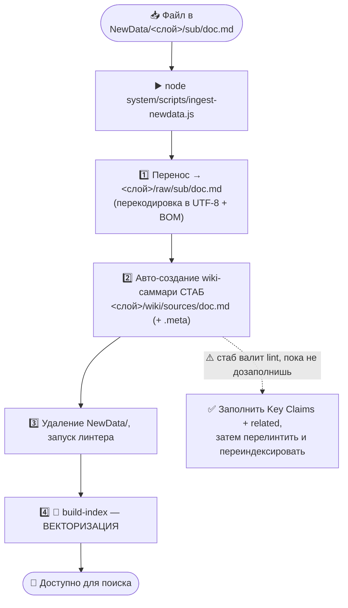

> ⚠️ **Важно:** шаг 2 создаёт *стаб*-саммари (`related: []`, «No claims extracted»), который **намеренно валит линтер**. Нужно вписать реальные **Key Claims** (каждый с цитатой raw-источника) и непустой **related**. Именно через это проводит скилл **davasko-wiki-ingest**.

---

## 7. 🔎 Чтение знаний (пайплайн поиска)

Одна команда ищет **по словам и по смыслу одновременно**, затем пишет лучшие страницы в контекст-файл, который читает агент.

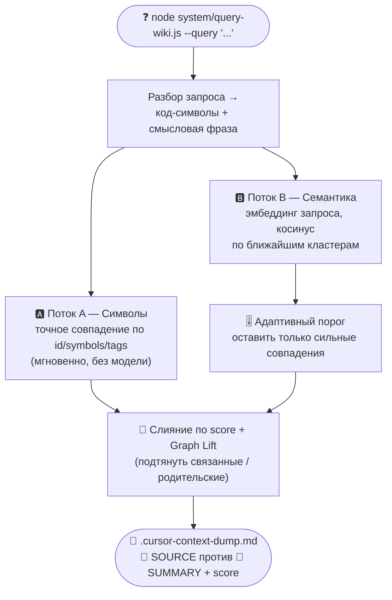

**Зачем два потока?** Код-идентификаторы (`CowController`, `IEvent`) требуют точного совпадения; вопросы на естественном языке («как работает настройка физики?») — смысла. Гибридный поиск делает оба и ранжирует на одной шкале.

**Адаптивный порог** — вместо хрупкого фиксированного отсечения движок держит совпадения со score не ниже `α · (лучший score этого запроса)` (по умолчанию α = 0.85, пол 0.35). Устойчиво к языку и длине. Калибруется на размеченных данных `eval-retrieval.js --sweep`, а не руками.

---

## 8. 🧩 Скилы — что каждый делает

Скилы — переносимые пакеты инструкций (`skills/`), обучающие любого ИИ-агента работать с базой. Синкаются в Cursor, Claude Code, Windsurf, Cline/Roo, Gemini, Copilot.

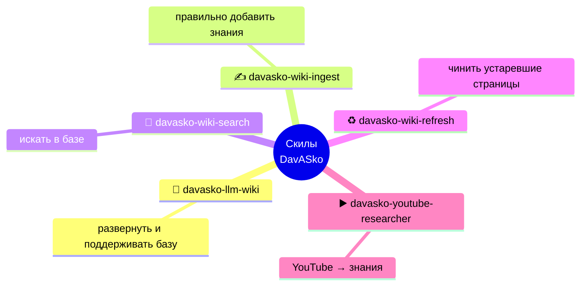

| Скилл | Для чего | Когда использовать |
|---|---|---|
| 🚀 **davasko-llm-wiki** | **Развернуть и поддерживать** базу: каркас слоёв, установка общей модели + метки, правила, скилы, тест-окружение. | «Разверни/настрой вики здесь», рост структуры. |
| ✍️ **davasko-wiki-ingest** | **Добавить знания** точным пайплайном (raw → авто-саммари → lint → векторизация) и довести саммари до стандарта. | Импорт любого нового документа. |
| 🔎 **davasko-wiki-search** | **Прочитать знания**: гибридный запрос и выдача нужного контекста агенту. | Перед ответом на любой вопрос о проекте. |
| ♻️ **davasko-wiki-refresh** | **Актуализировать** страницы, которые `check-staleness.js` пометил из-за изменившихся источников. | После изменения raw-источников. |
| ▶️ **davasko-youtube-researcher** | **YouTube → знания**: достать транскрипт, написать структурные заметки и передать в пайплайн ингеста. | Превратить видео/лекцию в страницы базы. |

---

## 9. 🚀 Развернуть базу знаний (2 способа)

Полное развёртывание всегда делает **одни и те же пять вещей**:

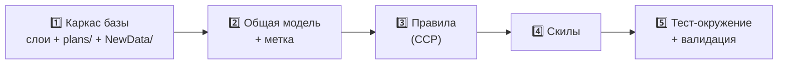

### 🅰️ Способ A — одна команда (скрипт)

Когда нужно просто сделать. Из этого репо:

```bash
node system/scripts/deploy-wiki.js --target ../my-kb --layers llm-wiki,project-a-wiki
```

Создаёт слои (с базовыми страницами + Unity `.meta`), копирует движок, ставит зависимости **офлайн** (`npm install`), ставит **общую модель + метку**, сидит правила, синкает IDE-адаптеры и прогоняет `npm test` + lint + `build-index`. Свежий деплой **чист по линту**.

| Флаг | Значение |
|---|---|
| `--target <path>` | **(обязательно)** куда разворачивать |
| `--layers a,b,c` | какие слои создать (по умолчанию `llm-wiki`; он всегда базовый) |
| `--model-dir <path>` | своё системное место для общей модели |
| `--no-model` / `--no-install` / `--no-index` | пропустить тяжёлые шаги (использовать существующую модель и т.п.) |
| `--force` | писать в непустую папку |

> 🛡️ **Ваши файлы в безопасности.** Если в цели уже есть `CLAUDE.md` / `AGENTS.md`, развёртывание **дописывает** правила в управляемый блок — ваш контент сохраняется, не затирается.

### 🅱️ Способ B — через скилл (диалогом)

Когда хочется, чтобы агент подобрал слои под ваш проект. Просто попросите:

> *«Разверни DavASko LLM Wiki в `./my-kb` со слоем под проект A».*

Скилл **davasko-llm-wiki** выполнит те же пять функций, осмотрев рабочее пространство и подобрав разумные слои.

---

## 10. ⌨️ Шпаргалка по командам

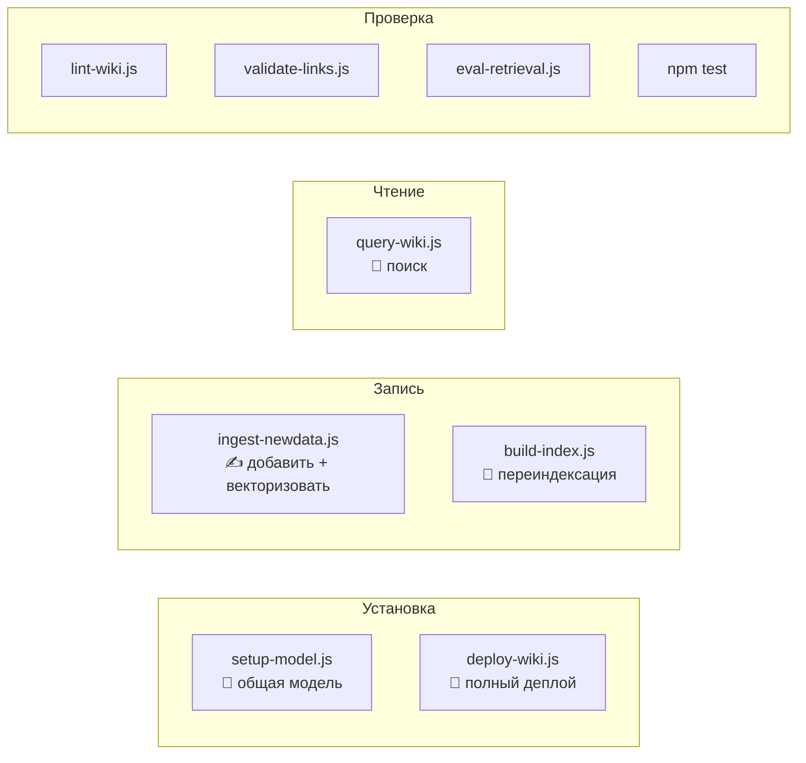

| Команда | Что делает |
|---|---|
| `node system/scripts/deploy-wiki.js --target <p>` | **Полное развёртывание одной командой** (каркас + модель + правила + скилы + тесты). |
| `node system/scripts/setup-model.js` | Поставить общую модель в системное место + записать метку. |
| `node system/scripts/ingest-newdata.js` | Запустить **пайплайн записи**: разместить источники, lint, **векторизация**. |
| `node system/build-index.js [--force]` | Собрать / пересобрать векторный индекс (по умолчанию инкрементально). |
| `node system/query-wiki.js --query "..."` | **Гибридный поиск** → `.cursor-context-dump.md`. |
| `node system/sync-ai-rules.js [--global]` | Синк IDE-правил (безопасно дописывает) + сборка скилл-адаптеров. |
| `node system/scripts/lint-wiki.js` | Проверка кодировки, frontmatter, ссылок (должно быть **0 ошибок**). |
| `node system/scripts/validate-links.js` | Проверка всех `[[вики-ссылок]]` и файловых ссылок. |
| `node system/scripts/check-staleness.js` | Найти страницы, чьи процитированные источники изменились. |
| `node system/scripts/eval-retrieval.js [--sweep]` | Измерить качество поиска (recall@k / MRR / nDCG) против базлайнов. |
| `npm test` | 32 юнит-теста ядра поиска (модель не нужна). |

---

## 11. 📊 Оценка и результаты

Качество **измеряется**, а не заявляется. `eval-retrieval.js` прогоняет размеченный набор запросов через несколько ретриверов — включая `lexical` (как греп) — и считает recall@k / MRR / nDCG.

**Реальный корпус** (162 документа, 15 размеченных вопросов, top‑k = 5):

| Ретривер | recall@5 | MRR | nDCG@5 |
|---|---|---|---|
| **semantic (этот движок)** | **0.633** | **0.718** | **0.626** |
| hybrid (символы + семантика) | 0.633 | 0.718 | 0.626 |
| lexical (греп-базлайн) | 0.333 | 0.435 | 0.303 |

**Уточнения по данным** (измерено до/после на том же корпусе):

| Изменение | hybrid MRR |
|---|---|
| базлайн (жёсткий «символы первыми») | 0.641 |
| → единое ранжирование по score | 0.685 |
| → исключение дженерик-аббревиатур (JSON/API) из символов | **0.718** |

Структурный чанкинг обошёл оконный на **+7.8% MRR** при равной полноте. Эмбеддинг идёт на **GPU через DirectML** при наличии — измеренное ускорение **8×** против CPU (косинус-паритет 0.999984).

```bash
node system/build-index.js --force            # собрать индекс (офлайн)
node system/scripts/eval-retrieval.js         # recall@k / MRR / nDCG + базлайны
node system/scripts/eval-retrieval.js --sweep # калибровка порога на данных
```

> **Честные оговорки:** n = 15 вопросов — мало; маршрутизация кластеров грубая (по слоям); без GPU индексация на CPU медленная. Это задокументировано, а не спрятано — см. раздел *Ограничения* в отчёте.

Полное изложение (метод, данные, графики, угрозы валидности): [`docs/paper/davasko-llm-wiki.ru.html`](docs/paper/davasko-llm-wiki.ru.html).

---

## 12. 📐 Стандарты данных

Несколько жёстких правил держат базу машиночитаемой (линтер их проверяет):

- **Кодировка:** `.md` → UTF‑8 **с BOM**; `.json` / `.js` / правила → UTF‑8 **без BOM** (BOM ломает `JSON.parse`).
- **Frontmatter** (каждая wiki-страница): `title`, `type`, `status`, `sources`, `last_updated`, **непустой** `related`.
- **Ссылки:** в стиле Obsidian `[[page-name]]`, разрешимые в цепочке зависимостей слоя.
- **Планы** живут в корневой папке `plans/` — никогда внутри слоя и никогда не цитируются как wiki-источник.

---

## 13. 🗂️ Структура репозитория

```
DavASkoLLMWiki/
├── system/                      # движок
│   ├── build-index.js           # векторизация базы
│   ├── query-wiki.js            # гибридный поиск
│   ├── sync-ai-rules.js         # выкладка правил/скилов в IDE (безопасно дописывает)
│   ├── lib/                     # model-locator, ядро поиска, чанкер, метрики
│   ├── scripts/                 # deploy-wiki, setup-model, ingest-newdata, lint, eval…
│   ├── vendor/                  # офлайн npm-зависимости (.tgz)
│   └── models-cache/            # вшитый ИСХОДНИК модели (копируется в системное место)
├── skills/                      # 5 переносимых скилов (источники истины)
├── docs/paper/                  # измеренный научный отчёт (EN + RU)
├── CLAUDE.md / AGENTS.md        # правила агента (Core Context Protocol)
├── README.md / README.ru.md     # этот файл
└── LICENSE.md                   # Проприетарная EULA
```

---

<p align="center"><sub>© DavASko · Проприетарно (<a href="LICENSE.md">EULA</a>) · Полностью офлайн, воспроизводимо · <a href="README.md">English version</a></sub></p>
