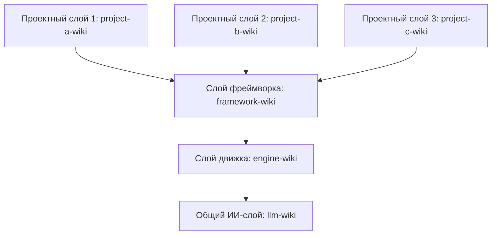
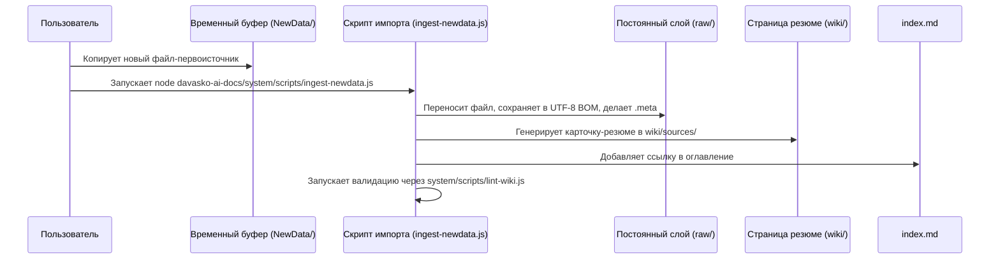

# DavASko LLM Wiki

Многоуровневая, самовалидируемая, Obsidian-совместимая база знаний со встроенным гибридным (символьный + семантический) поисковым движком, полностью **офлайн** (модель и зависимости вендорятся). Для организации работы ИИ-агентов с современными LLM (Claude, Gemini, GPT) в рабочей области проекта.

> **Проверено на реальном корпусе.** На развёрнутой базе KBPro (162 документа, 15 размеченных вопросов) семантический поиск даёт **recall@5 = 0.633 / MRR = 0.718** против grep-базлайна **0.333 / 0.435** — почти двукратный recall и +65% MRR над «просто грепнуть файлы». Доработки по данным подняли MRR гибрида с 0.641 до 0.718 (+12%), структурный чанкинг превзошёл оконный на +7.8% MRR, а эмбеддинг на **GPU (DirectML) — в 8× быстрее CPU** (численно эквивалентно). Полная методология, таблицы и графики: [`docs/paper/davasko-llm-wiki.ru.html`](docs/paper/davasko-llm-wiki.ru.html). См. раздел 5.

---

## 1. Концепция и архитектура

**DavASko LLM Wiki** разделяет накопленные знания на независимые каталоги, называемые **слоями** (layers). Это позволяет четко изолировать общие правила ИИ, специфику игрового движка, соглашения фреймворка и документацию конкретного проекта.

### Цепочка зависимостей
Зависимости между слоями распространяются строго **сверху вниз**. Более высокий слой может ссылаться на более низкий, но не наоборот. Поддерживается параллельная работа нескольких независимых проектных слоев, наследующих общий кора-фреймворк.



- **`llm-wiki`** (Общий ИИ-слой): Содержит общие правила взаимодействия с ИИ, стандарты ведения планов работ (ExecPlans), видео-транскрипты и базовые сценарии.
- **`engine-wiki`** (Слой движка): Описывает правила платформы (Unity), стандарты именования.
- **`framework-wiki`** (Слой фреймворка): Хранит информацию о модульной архитектуре DavASko, кодостиле C#, её пакетах и правилах жизненного цикла.
- **`project-a-wiki`, `project-b-wiki`, `project-c-wiki`** (Проектные слои): Содержат геймдизайн-документы (GDD), описание игровых модулей и специфичную бизнес-логику для конкретных проектов. Проекты полностью изолированы друг от друга.

Каждый слой содержит манифест `wiki.json`, определяющий зависимости:
```json
{
  "name": "davasko-wiki",
  "dependencies": ["engine-wiki", "llm-wiki"]
}
```

---

## 2. Приоритеты знаний и разрешение конфликтов

Знания в системе имеют разный вес (приоритет) в зависимости от их «близости к проекту»:

$$\text{Проектный слой} > \text{Слой фреймворка} > \text{Слой движка} > \text{Общий ИИ-слой}$$

### Правила переопределения приоритетов
Если страница, концепт или правило дублируется в нескольких слоях (например, в `engine-wiki` и `llm-wiki` описаны конфликтующие соглашения):
1. **Выбор по умолчанию**: ИИ-ассистент по умолчанию выбирает и следует версии из наиболее специфичного (проектного) слоя.
2. **Предупреждение пользователя**: ИИ обязан вывести в консоль/чат предупреждение (warning) о наличии дублирующихся правил в слоях.
3. **Предложение выбора**: ИИ предлагает пользователю подтвердить использование версии по умолчанию или явно переопределить её базовым правилом.
4. **Заполнение пробелов поиска (Grep Search Gaps)**: Если ИИ использует grep/ripgrep из-за отсутствия информации в БЗ, результаты поиска должны быть задокументированы в наиболее подходящем слое БЗ в обобщенном виде, чтобы исключить повторный низкоуровневый поиск.
5. **Принцип обобщенности (Generalization)**: Общие правила, инструкции и схемы не должны содержать жестко закодированных названий проприетарных фреймворков или чужих проектов (например, сторонних фреймворков). Вся информация должна храниться в обобщенном, абстрагированном и переносимом виде.

---

## 3. Политика пробелов полнотекстового поиска (Full-Text Search Gaps)

Для непрерывного наполнения и повышения качества базы знаний:
- **Пробел поиска**: Если ассистент использует grep, ripgrep, кастомные скрипты или любой другой полнотекстовый поиск из-за того, что тема, соглашение или паттерн кода отсутствовали в картах знаний или концептах вики, это считается пробелом поиска.
- **Обязательное документирование**: Ассистент обязан зафиксировать свои находки в базе знаний перед завершением задачи. Описание, ссылки и символы кода должны быть добавлены в соответствующий слой базы знаний (`davasko-wiki` или проектный слой).
- **Обновление связей**: Если тема уже есть в вики, но не содержала нужных связей или деталей, из-за чего пришлось выполнять поиск в коде, статья должна быть дополнена недостающими ссылками, чтобы в будущем поиск выполнялся напрямую через вики-систему.

---

## 4. Структура каталогов и изоляция планов

Система отделяет планирование (планы реализации, чек-листы) от постоянной базы знаний:

### Структура рабочей области (Workspace Root)
```
<корень-проекта>/
├── plans/                      # Изолированное планирование: task.md, plans реализации
├── system/                     # Скрипты обслуживания (lint-wiki.js и др.)
├── NewData/                    # Буферная папка для импорта файлов
├── llm-wiki/                   # Базовый ИИ-слой (правила, скрипты, видео-транскрипты)
├── engine-wiki/                 # Слой игрового движка (Unity-специфика)
├── framework-wiki/                 # Слой фреймворка (концепты фреймворка, кодостиль C#)
└── <project-wiki>/             # Проектные слои (например, project-a-wiki)
```

### Структура отдельного слоя
Каждая папка слоя должна иметь следующую структуру:
```
<папка-слоя>/
├── wiki.json                   # Манифест зависимостей слоя
├── wiki/                       # Компилируемая база знаний (поддерживается ИИ)
│   ├── index.md                # Оглавление слоя (карта страниц)
│   ├── contradictions.md       # Журнал противоречий и открытых вопросов
│   ├── stubs.md                # Заглушки (для ссылок на внешние слои)
│   ├── concepts/               # Многократно используемые идеи и правила
│   ├── entities/               # Описания модулей, классов, сцен и инструментов
│   ├── runbooks/               # Пошаговые инструкции и чек-листы разработчика
│   ├── sources/                # Автоматические резюме первоисточников
│   ├── syntheses/              # Сравнительные анализы и таблицы
│   └── decisions/              # Записи архитектурных решений (ADR)
└── raw/                        # Неизменяемые первоисточники (только для чтения)
    ├── docs/                   # Скопированная документация
    ├── transcripts/            # Транскрипты (только в llm-wiki/raw/transcripts/)
    └── ai-skills~/             # Локальные ИИ-навыки (SKILL.md и референсы)
```

---

## 5. Оценка и результаты (измерено, не на веру)

Качество поиска **измеряется**, а не декларируется. `system/scripts/eval-retrieval.js` прогоняет размеченный набор через несколько ретриверов и считает **recall@k / MRR / nDCG@k**, включая `lexical` (grep-подобный) базлайн — он отвечает на единственный важный вопрос: *бьёт ли RAG-слой простое чтение файлов?*

**Результат на реальной развёрнутой базе** (KBPro, 162 документа, 2 слоя, 15 размеченных вопросов, top-k = 5):

| Ретривер | recall@5 | MRR | nDCG@5 |
|---|---|---|---|
| **semantic (этот движок)** | **0.633** | **0.718** | **0.626** |
| hybrid (символы + семантика) | 0.633 | 0.718 | 0.626 |
| lexical (grep-базлайн) | 0.333 | 0.435 | 0.303 |

RAG-слой почти **удваивает recall** и улучшает ранжирование первого релевантного на **+65% MRR** — эмпирическое оправдание его существования.

**Доработки по данным** (каждая измерена до/после на том же корпусе):

| Изменение | MRR гибрида |
|---|---|
| baseline (жёсткое «символы первыми») | 0.641 |
| → унифицированное ранжирование по score | 0.685 |
| → строгие символы (убрать JSON/API как «символы») | **0.718** |

**A/B чанкинга** (структурный vs оконный): MRR **0.718 vs 0.666 (+7.8%)**, nDCG +7%, recall равный — структурный побеждает.

**Скорость.** Эмбеддинг идёт на **GPU через DirectML** (авто-выбор, фолбэк на CPU) — измерено **в 8× быстрее CPU** (cosine-паритет 0.999984); батчинг на CPU добавляет ещё ~11%. Параметр `device` в `system/index-config.json` / `search-config.json` (по умолчанию `auto`).

**Воспроизвести:**
```bash
node system/build-index.js --force              # сборка индекса (офлайн, GPU при наличии)
node system/scripts/eval-retrieval.js           # recall@k / MRR / nDCG + базлайны
node system/scripts/eval-retrieval.js --sweep   # калибровка порога на данных
npm test                                        # 32 юнит-теста ядра
```

Полное описание (метод, датасет, все таблицы, графики, угрозы валидности) — научный отчёт: [`docs/paper/davasko-llm-wiki.ru.html`](docs/paper/davasko-llm-wiki.ru.html) (RU) / [`davasko-llm-wiki.html`](docs/paper/davasko-llm-wiki.html) (EN).

> Честные оговорки: n = 15 вопросов (мало); recall@5 = 0.633 (~37% релевантного теряется в top-5); без GPU индексация на CPU медленная. Всё задокументировано в разделе *Ограничения* отчёта.

---

## 6. Сценарий импорта и скрипты автоматизации

Система автоматизации импорта спроектирована следующим образом:



- **`system/sync-ai-rules.js`**: Кроссплатформенный скрипт на Node.js для копирования мастер-правил и компиляции активных навыков для IDE.
- **`system/scripts/lint-wiki.js`**: Проверяет целостность ссылок, разметку страниц, наличие UTF-8 BOM, отсутствие секретов или вебхуков Битрикса.
- **`system/scripts/validate-links.js`**: Глобальный валидатор, сканирующий все файлы проекта на наличие сломанных ссылок.
- **`system/scripts/query-wiki.js`**: Консольный инструмент поиска и импорта. Если страница найдена в нескольких слоях, он сообщает о конфликте приоритетов и по умолчанию отдает проектную версию.
- **`system/scripts/ingest-newdata.js`**: Скрипт автоматического переноса файлов из временного буфера `NewData/` в постоянные слои.
- **`system/scripts/update-links.js`**: Скрипт безопасной миграции путей с регулярными выражениями границ путей и слов.
- **`system/scripts/check-sources.js`**: Проверка целостности цитат Q&A-набора (файлы-источники существуют) — НЕ метрика качества.
- **`system/scripts/eval-retrieval.js`**: Измерение качества поиска (recall@k / MRR / nDCG, базлайны, калибровка порога).

---

## 7. Как развернуть LLM Wiki в новом месте

Для разворачивания базы знаний выполните следующие шаги:

### Шаг 1: Подключение субмодуля
1. Добавьте этот репозиторий в свой проект как Git-субмодуль с именем `davasko-ai-docs`:
   ```bash
   git submodule add <repo-url> Assets/DavASko/davasko-ai-docs
   ```

### Шаг 2: Инициализация слоев и планов
1. Создайте папки слоев (например, `llm-wiki/`, `engine-wiki/`, `framework-wiki/`, и проектные слои).
2. Создайте папку `plans/` в корне проекта.
3. Добавьте файл `wiki.json` в каждый слой, указав его зависимости.
4. Внутри каждого слоя создайте пустые файлы-заготовки:
   - `wiki/index.md`
   - `wiki/stubs.md`
   - `wiki/contradictions.md`

### Шаг 3: Установка и синхронизация ИИ-навыков
Скопируйте папки нужных навыков из каталога `skills/` этого репозитория в папку `raw/ai-skills~/` соответствующего слоя вашей базы знаний:
- `llm-wiki/raw/ai-skills~/davasko-llm-wiki/`
- `llm-wiki/raw/ai-skills~/davasko-youtube-researcher/`

Запустите кроссплатформенный скрипт синхронизации через Node.js:
```bash
node Assets/DavASko/davasko-ai-docs/system/sync-ai-rules.js
```

#### Вариант Б: Глобальная установка навыков
Вы можете синхронизировать навыки глобально в каталог конфигурации пользователя на машине (`~/.gemini/config/skills/`), запустив скрипт с флагом `--global`:
```bash
node Assets/DavASko/davasko-ai-docs/system/sync-ai-rules.js --global
```

Это сделает навыки доступными для всех сессий ИИ на данной машине.

### Шаг 4: Проверка готовности
Запустите проверку базы знаний и регрессионное тестирование:
```bash
node Assets/DavASko/davasko-ai-docs/system/scripts/lint-wiki.js
node Assets/DavASko/davasko-ai-docs/system/scripts/validate-links.js
node Assets/DavASko/davasko-ai-docs/system/scripts/check-sources.js
```

Если валидация завершилась с **0 ошибок**, ваша база знаний полностью готова к работе с ИИ-ассистентами!
