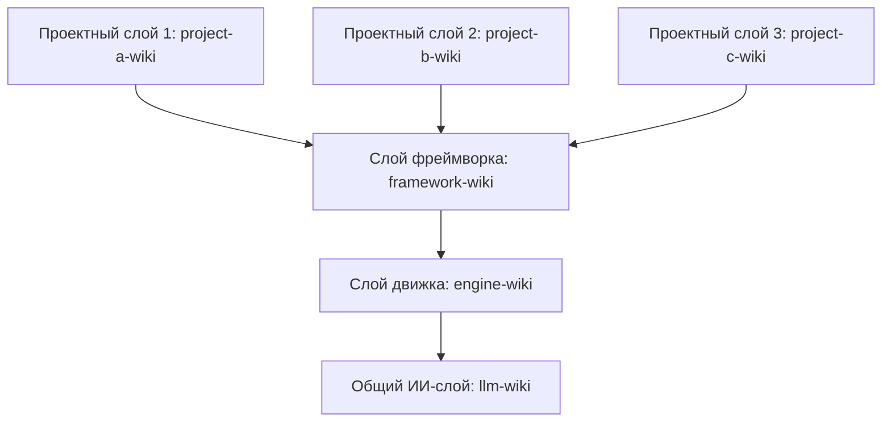
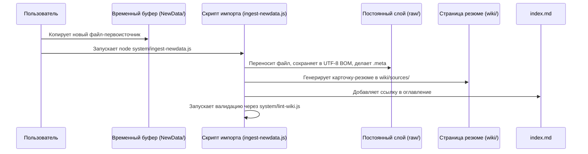

# DavASko LLM Wiki

Многоуровневая, самовалидируемая база знаний, совместимая с Obsidian и оптимизированная для организации совместной работы разработчиков и ИИ-ассистентов (таких как Claude 3.5 Sonnet, Gemini 1.5 Pro и GPT-4o) в рабочей области проекта.

---

## 1. Концепция и архитектура

**DavASko LLM Wiki** разделяет накопленные знания на независимые каталоги, называемые **слоями** (layers). Это позволяет четко изолировать общие правила ИИ, специфику игрового движка, соглашения фреймворка и документацию конкретного проекта.

### Цепочка зависимостей
Зависимости между слоями распространяются строго **сверху вниз**. Более высокий слой может ссылаться на более низкий, но не наоборот. Поддерживается параллельная работа нескольких независимых проектных слоев, наследующих общий кора-фреймворк.



- **`llm-wiki`** (Общий ИИ-слой): Содержит общие правила взаимодействия с ИИ, стандарты ведения планов работ (ExecPlans), видео-транскрипты и базовые сценарии.
- **`engine-wiki`** (Слой движка): Описывает правила платформы (Unity), стандарты именования.
- **`framework-wiki`** (Слой фреймворка): Хранит информацию о модульной архитектуре DavASko, кодостиле C#, её пакетах и правилах жизненного цикла.
- **`project-a-wiki`, `project-b-wiki`, `project-c-wiki`** (Проектные слои): Содержат геймдизайн-документы (GDD), описание игровых модулей и специфичную бизнес-логику для конкретных проектов. Проекты полностью изолированы друг от друга.

Каждый слой содержит манифест `wiki.json`, определяющий зависимости:
```json
{
  "name": "davasko-wiki",
  "dependencies": ["engine-wiki", "llm-wiki"]
}
```

---

## 2. Приоритеты знаний и разрешение конфликтов

Знания в системе имеют разный вес (приоритет) в зависимости от их «близости к проекту»:

$$\text{Проектный слой} > \text{Слой фреймворка} > \text{Слой движка} > \text{Общий ИИ-слой}$$

### Правила переопределения приоритетов
Если страница, концепт или правило дублируется в нескольких слоях (например, в `engine-wiki` и `llm-wiki` описаны конфликтующие соглашения):
1. **Выбор по умолчанию**: ИИ-ассистент по умолчанию выбирает и следует версии из наиболее специфичного (проектного) слоя.
2. **Предупреждение пользователя**: ИИ обязан вывести в консоль/чат предупреждение (warning) о наличии дублирующихся правил в слоях.
3. **Предложение выбора**: ИИ предлагает пользователю подтвердить использование версии по умолчанию или явно переопределить её базовым правилом.
4. **Заполнение пробелов поиска (Grep Search Gaps)**: Если ИИ использует grep/ripgrep из-за отсутствия информации в БЗ, результаты поиска должны быть задокументированы в наиболее подходящем слое БЗ в обобщенном виде, чтобы исключить повторный низкоуровневый поиск.
5. **Принцип обобщенности (Generalization)**: Общие правила, инструкции и схемы не должны содержать жестко закодированных названий проприетарных фреймворков или чужих проектов (например, сторонних фреймворков). Вся информация должна храниться в обобщенном, абстрагированном и переносимом виде.

---

## 3. Политика пробелов полнотекстового поиска (Full-Text Search Gaps)

Для непрерывного наполнения и повышения качества базы знаний:
- **Пробел поиска**: Если ассистент использует grep, ripgrep, кастомные скрипты или любой другой полнотекстовый поиск из-за того, что тема, соглашение или паттерн кода отсутствовали в картах знаний или концептах вики, это считается пробелом поиска.
- **Обязательное документирование**: Ассистент обязан зафиксировать свои находки в базе знаний перед завершением задачи. Описание, ссылки и символы кода должны быть добавлены в соответствующий слой базы знаний (`davasko-wiki` или проектный слой).
- **Обновление связей**: Если тема уже есть в вики, но не содержала нужных связей или деталей, из-за чего пришлось выполнять поиск в коде, статья должна быть дополнена недостающими ссылками, чтобы в будущем поиск выполнялся напрямую через вики-систему.

---

## 4. Структура каталогов и изоляция планов

Система отделяет планирование (планы реализации, чек-листы) от постоянной базы знаний:

### Структура рабочей области (Workspace Root)
```
<корень-проекта>/
├── plans/                      # Изолированное планирование: task.md, plans реализации
├── system/                     # Скрипты обслуживания (lint-wiki.js и др.)
├── NewData/                    # Буферная папка для импорта файлов
├── llm-wiki/                   # Базовый ИИ-слой (правила, скрипты, видео-транскрипты)
├── engine-wiki/                 # Слой игрового движка (Unity-специфика)
├── framework-wiki/                 # Слой фреймворка (концепты фреймворка, кодостиль C#)
└── <project-wiki>/             # Проектные слои (например, project-a-wiki)
```

### Структура отдельного слоя
Каждая папка слоя должна иметь следующую структуру:
```
<папка-слоя>/
├── wiki.json                   # Манифест зависимостей слоя
├── wiki/                       # Компилируемая база знаний (поддерживается ИИ)
│   ├── index.md                # Оглавление слоя (карта страниц)
│   ├── contradictions.md       # Журнал противоречий и открытых вопросов
│   ├── stubs.md                # Заглушки (для ссылок на внешние слои)
│   ├── concepts/               # Многократно используемые идеи и правила
│   ├── entities/               # Описания модулей, классов, сцен и инструментов
│   ├── runbooks/               # Пошаговые инструкции и чек-листы разработчика
│   ├── sources/                # Автоматические резюме первоисточников
│   ├── syntheses/              # Сравнительные анализы и таблицы
│   └── decisions/              # Записи архитектурных решений (ADR)
└── raw/                        # Неизменяемые первоисточники (только для чтения)
    ├── docs/                   # Скопированная документация
    ├── transcripts/            # Транскрипты (только в llm-wiki/raw/transcripts/)
    └── ai-skills~/             # Локальные ИИ-навыки (SKILL.md и референсы)
```

---

## 5. Сценарий импорта и скрипты автоматизации

Система автоматизации импорта спроектирована следующим образом:



- **`lint-wiki.js`**: Проверяет целостность ссылок, разметку страниц, наличие UTF-8 BOM, отсутствие секретов или вебхуков Битрикса.
- **`validate-links.js`**: Глобальный валидатор, сканирующий все файлы проекта на наличие сломанных ссылок.
- **`query-wiki.js`**: Консольный инструмент поиска и импорта. Если страница найдена в нескольких слоях, он сообщает о конфликте приоритетов и по умолчанию отдает проектную версию.
- **`ingest-newdata.js`**: Скрипт автоматического переноса файлов из временного буфера `NewData/` в постоянные слои.
- **`update-links.js`**: Скрипт безопасной миграции путей с регулярными выражениями границ путей и слов.
- **`run-evals.js`**: Инструмент запуска регрессионных тестов Q&A.

---

## 6. Как развернуть LLM Wiki в новом месте

Для разворачивания базы знаний выполните следующие шаги:

### Шаг 1: Копирование скриптов и правил
1. Создайте в корне проекта папку базы знаний (например, `davasko-ai-docs`).
2. Скопируйте шаблоны скриптов из `templates/system-scripts/` в папку `davasko-ai-docs/system/`.
3. Поместите скрипт `templates/sync-ai-rules.ps1` в корень проекта.

### Шаг 2: Инициализация слоев и планов
1. Создайте папки слоев (например, `llm-wiki/`, `engine-wiki/`, `framework-wiki/`, и проектные слои).
2. Создайте папку `plans/` в корне проекта.
3. Добавьте файл `wiki.json` в каждый слой, указав его зависимости.
4. Внутри каждого слоя создайте пустые файлы-заготовки:
   - `wiki/index.md`
   - `wiki/stubs.md`
   - `wiki/contradictions.md`

### Шаг 3: Установка ИИ-навыков
Вы можете установить переносимые навыки из этого репозитория локально в проект или глобально в систему:

#### Вариант А: Локально в проект (Рекомендуется)
Скопируйте папки нужных навыков из каталога `skills/` этого репозитория в папку `raw/ai-skills~/` соответствующего слоя вашей базы знаний:
- `llm-wiki/raw/ai-skills~/davasko-llm-wiki/`
- `llm-wiki/raw/ai-skills~/davasko-youtube-researcher/`

Запустите скрипт синхронизации из корня проекта для развертывания правил в IDE:
```powershell
powershell.exe -NoProfile -ExecutionPolicy Bypass -File .\sync-ai-rules.ps1
```

#### Вариант Б: Глобально на машине разработчика
Поместите папки навыков из каталога `skills/` в глобальную директорию конфигурации ИИ:
- Путь: `C:\Users\<ИмяПользователя>\.gemini\config\skills\` (например, скопируйте туда папку `skills/davasko-youtube-researcher/`).

Это сделает навыки доступными для всех сессий ИИ на данной машине.

### Шаг 4: Проверка готовности
Запустите проверку базы знаний и регрессионное тестирование:
```powershell
node davasko-ai-docs/system/lint-wiki.js
node davasko-ai-docs/system/validate-links.js
node davasko-ai-docs/system/run-evals.js
```

Если валидация завершилась с **0 ошибок**, ваша база знаний полностью готова к работе с ИИ-ассистентами!
