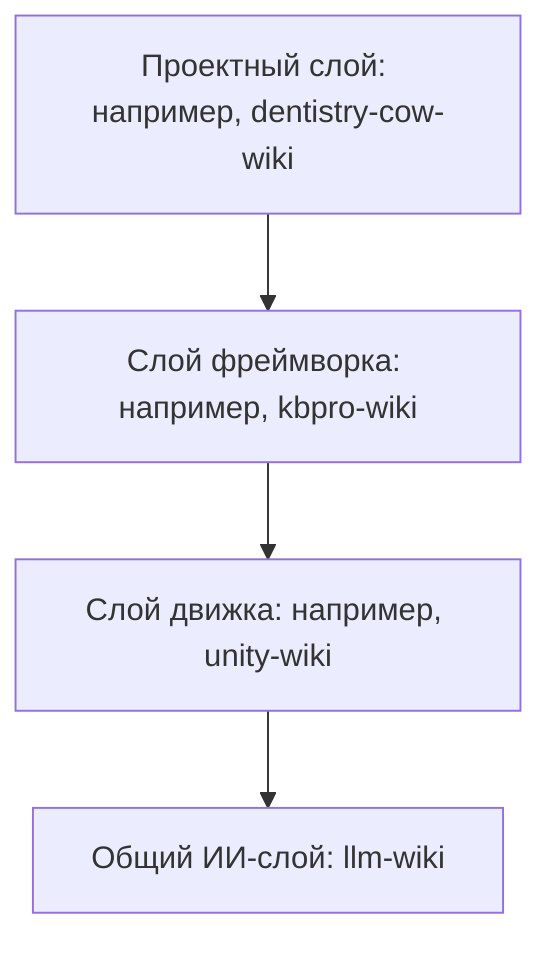
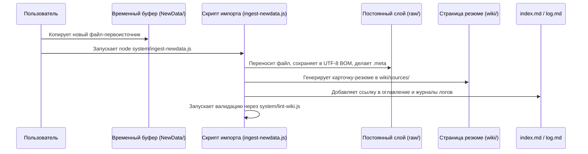

# DavASko LLM Wiki

Многоуровневая, самовалидируемая база знаний, совместимая с Obsidian и оптимизированная для организации совместной работы разработчиков и ИИ-ассистентов (таких как Claude 3.5 Sonnet, Gemini 1.5 Pro и GPT-4o) в рабочей области проекта.

---

## 1. Концепция и архитектура

**DavASko LLM Wiki** разделяет накопленные знания на независимые каталоги, называемые **слоями** (layers). Это позволяет четко изолировать общие правила ИИ, специфику игрового движка, соглашения фреймворка и документацию конкретного проекта.

### Цепочка зависимостей
Зависимости между слоями распространяются строго **сверху вниз**. Более высокий слой может ссылаться на более низкий, но не наоборот.



- **`llm-wiki`** (Общий ИИ-слой): Содержит общие правила взаимодействия с ИИ, стандарты ведения планов работ (ExecPlans) и базовые сценарии.
- **`unity-wiki`** (Слой движка): Описывает правила платформы (Unity), стандарты именования и стили написания C#-кода.
- **`kbpro-wiki`** (Слой фреймворка): Хранит информацию о модульной архитектуре KBPro, её пакетах и правилах жизненного цикла.
- **`dentistry-cow-wiki`** (Проектный слой): Содержит геймдизайн-документы (GDD), описание игровых модулей и скрипты автоматизации для конкретного проекта.

Каждый слой содержит манифест `wiki.json`, определяющий зависимости:
```json
{
  "name": "kbpro-wiki",
  "dependencies": ["unity-wiki", "llm-wiki"]
}
```

---

## 2. Структура каталогов слоя

Каждый слой в системе имеет следующую структуру:

```
<папка-слоя>/
├── wiki.json                   # Манифест зависимостей слоя
├── wiki/                       # Компилируемая база знаний (поддерживается ИИ)
│   ├── index.md                # Оглавление слоя (карта страниц)
│   ├── log.md                  # Локальный журнал изменений операций
│   ├── contradictions.md       # Журнал противоречий и открытых вопросов
│   ├── stubs.md                # Заглушки (для ссылок на внешние слои)
│   ├── concepts/               # Многократно используемые идеи и правила
│   ├── entities/               # Описания модулей, классов, сцен и инструментов
│   ├── runbooks/               # Пошаговые инструкции и чек-листы разработчика
│   ├── sources/                # Автоматические резюме первоисточников
│   ├── syntheses/              # Сравнительные анализы и таблицы
│   └── decisions/              # Записи архитектурных решений (ADR)
└── raw/                        # Неизменяемые первоисточники (только для чтения)
    ├── docs/                   # Скопированная документация
    ├── transcripts/            # Транскрипты встреч или видеороликов
    └── ai-skills~/             # Локальные ИИ-навыки (SKILL.md и референсы)
```

---

## 3. Стандарты разметки и кодирования данных

Для обеспечения стабильной читаемости базы знаний в Windows, macOS, Linux, Unity, Obsidian и ИИ-инструментах установлены следующие стандарты:

1. **Кодировка UTF-8 с BOM**: Все текстовые файлы (`.md`, `.json`, `.clinerules`, `.cursorrules`, `.windsurfrules`, `.ps1`, `.js`) ДОЛЖНЫ быть сохранены в кодировке **UTF-8 с BOM** (`EF BB BF`). Это критично для корректного отображения кириллицы (русского языка) в консоли и IDE.
2. **Формат страниц**: Любая страница wiki (кроме журналов изменений и заглушек) должна начинаться с YAML-блока метаданных:
   ```yaml
   ---
   title: "Название страницы"
   type: concept
   status: draft
   sources:
     - my-layer/raw/docs/my-source.md
   last_updated: 2026-06-15
   related:
     - "[[another-page]]"
   ---
   ```
3. **Обязательные поля на страницах**: Страница должна содержать разделы:
   - `**Summary**:` — краткое описание страницы в 1-2 предложениях.
   - `**Sources**:` — ссылки на файлы-источники из папки `raw/`.
   - `**Last updated**:` — дата последнего обновления в формате `YYYY-MM-DD`.
   - `## Related Pages` — блок перелинковки в самом низу страницы.
4. **Внутренние ссылки**: Используются Obsidian-ссылки вида `[[имя-файла-в-нижнем-регистре]]`.
5. **Цитаты и источники**: Любое утверждение должно ссылаться на первоисточник: `(source: имя_слоя/raw/docs/файл.md)`.
6. **Unity `.meta` файлы**: Если база знаний находится внутри папки `Assets/` Unity-проекта, каждый файл должен сопровождаться своим `.meta` файлом с уникальным GUID.

---

## 4. Сценарий импорта и скрипты автоматизации

Система автоматизации импорта спроектирована следующим образом:



- **`lint-wiki.js`**: Проверяет целостность ссылок, разметку страниц, наличие UTF-8 BOM, отсутствие секретов или вебхуков Битрикса.
- **`validate-links.js`**: Глобальный валидатор, сканирующий все файлы проекта на наличие сломанных ссылок.
- **`query-wiki.js`**: Консольный инструмент поиска и атомарного импорта файлов.
- **`ingest-newdata.js`**: Скрипт автоматического переноса файлов из временного буфера `NewData/` в постоянные слои.

---

## 5. Как развернуть LLM Wiki в новом месте

Для разворачивания базы знаний выполните следующие шаги:

### Шаг 1: Копирование скриптов и правил
1. Создайте в корне проекта папку базы знаний (например, `kbpro-ai-docs`).
2. Скопируйте шаблоны скриптов из `templates/system-scripts/` в папку `kbpro-ai-docs/system/`.
3. Поместите скрипт `templates/sync-ai-rules.ps1` в корень проекта.

### Шаг 2: Инициализация слоев
1. Создайте папки слоев (например, `llm-wiki/`, `unity-wiki/`, `project-wiki/`).
2. Добавьте файл `wiki.json` в каждый слой, указав его зависимости.
3. Внутри каждого слоя создайте пустые файлы-заготовки:
   - `wiki/index.md`
   - `wiki/stubs.md`
   - `wiki/log.md`
   - `wiki/contradictions.md`

### Шаг 3: Настройка правил IDE
1. Скопируйте мастер-копии правил из `templates/ide-rules/` в `llm-wiki/raw/ide-rules/`.
2. Отредактируйте инструкции в `AGENTS.md` и `GEMINI.md`, адаптировав их под ваш проект.

### Шаг 4: Установка ИИ-навыков
1. Скопируйте нужные навыки из папки `skills/` этого репозитория в папку `raw/ai-skills~/` соответствующего слоя вашей базы знаний. Например:
   - `llm-wiki/raw/ai-skills~/davasko-llm-wiki/`
   - `llm-wiki/raw/ai-skills~/davasko-youtube-researcher/`

### Шаг 5: Синхронизация и проверка
1. Запустите скрипт синхронизации из корня проекта для развертывания правил в IDE:
   ```powershell
   powershell.exe -NoProfile -ExecutionPolicy Bypass -File .\sync-ai-rules.ps1
   ```
2. Проверьте правильность настройки:
   ```powershell
   node kbpro-ai-docs/system/lint-wiki.js
   node kbpro-ai-docs/system/validate-links.js
   ```

Если валидация завершилась с **0 ошибок**, ваша база знаний полностью готова к работе с ИИ-ассистентами!
