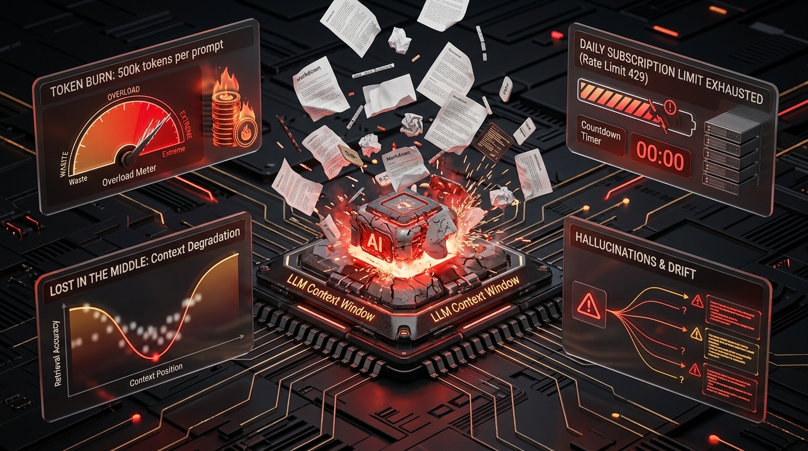
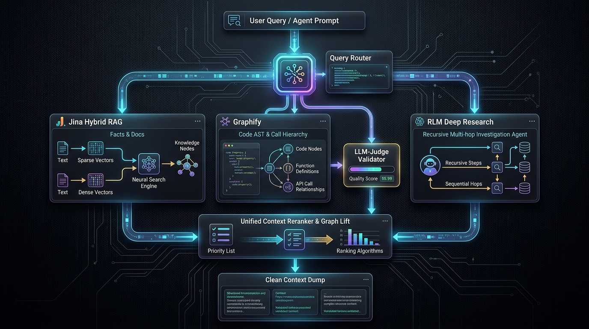
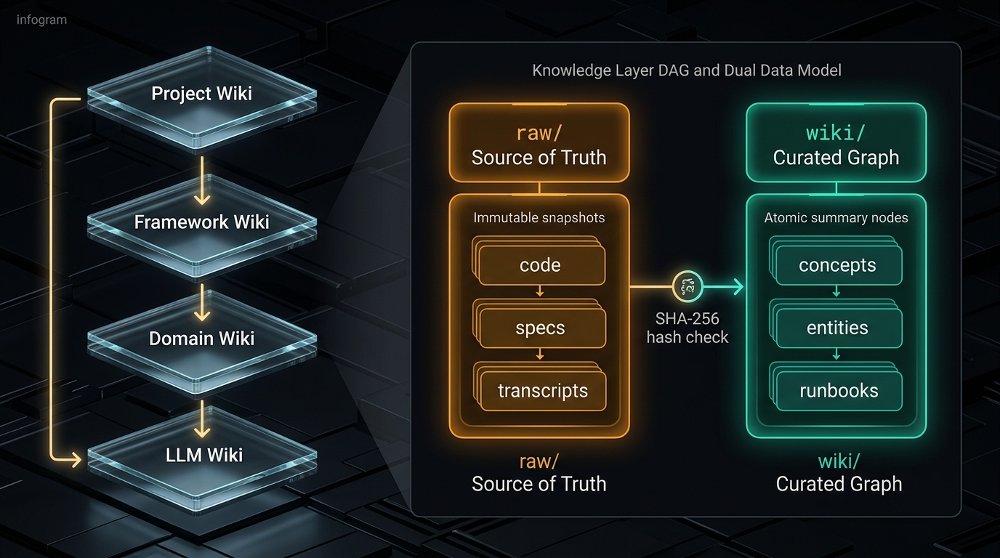
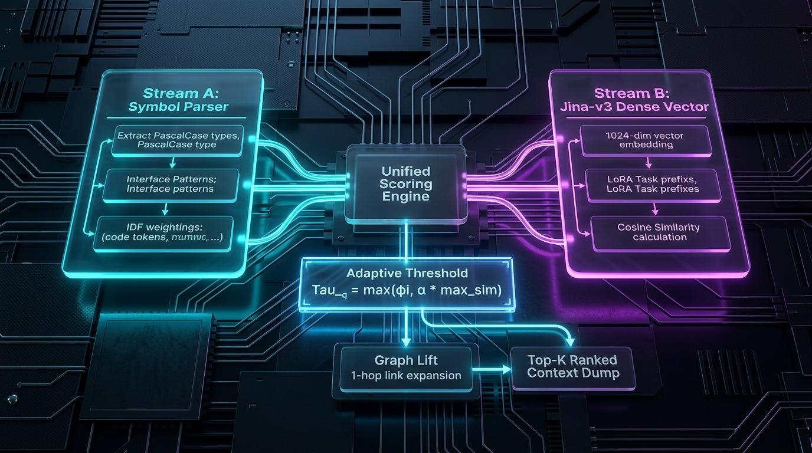
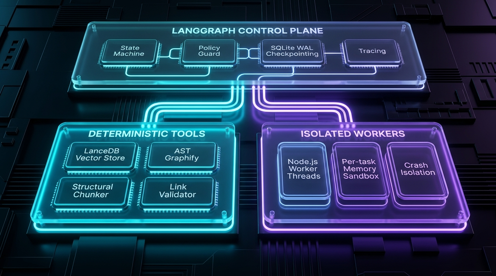
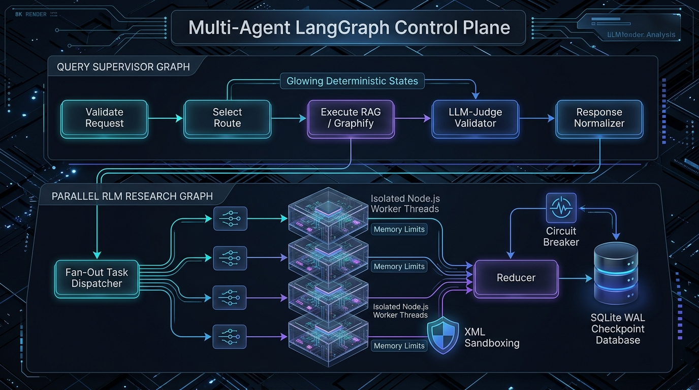
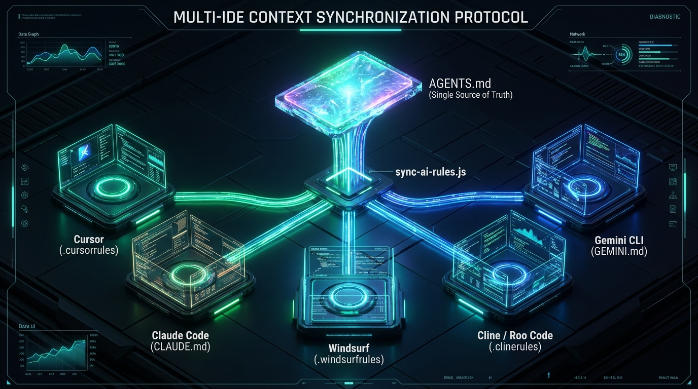

# DavASko LLM Wiki Architecture: How Layered RAG, Graphify, and RLM Tamed LLMs in Complex Systems

> **TL;DR:** Sooner or later, every engineer trying to apply modern LLM agents (Claude, GPT-4, Gemini) to real-world production codebases and sprawling documentation repositories hits two brick walls: skyrocketing API bills with daily token quotas exhausted by midday, and "confident hallucinations". We abandoned the naive illusion of "just dumping 2 million tokens into the context window" and built **DavASko LLM Wiki** — an autonomous, layered context grounding and multi-engine retrieval system.
>
> In this technical deep-dive: why naive flat RAG fails on code and software architecture; how our Tri-Engine retrieval works (**Jina Hybrid RAG + AST Graphify + RLM Deep Research**); the mathematics of dynamic query-adaptive thresholds ($\tau_q$); deterministic orchestration via **LangGraph Control Plane** with isolated Node.js Worker Threads; hardware GPU acceleration with DirectML (8.01× speedup at 0.999984 cosine parity); and a transparent post-mortem of bugs that boosted retrieval recall by +90% over raw `grep` (Recall@5 0.633 vs 0.333, MRR 0.718 vs 0.435).

🐙 **Open Source GitHub Repository**: [https://github.com/gDavASko/DavASkoLLMWiki](https://github.com/gDavASko/DavASkoLLMWiki)

*This article was co-edited and structured with AI assistance under the author's direct technical supervision.*

---

## 1. Introduction: From Naive Markdown Dumps to Burned Token Quotas

When the LLM coding revolution took off, my initial impulse mirrored that of most engineers: *“I have a large codebase spanning hundreds of thousands of lines of code and dozens of fragmented specifications. I'll just write a script to convert everything into a neat pile of `.md` files, pass them as context to an IDE agent, and instantly get a 24/7 AI Principal Architect.”*

Reality struck hard within the first week.



> **What happens with the naive approach:**
> 1. In just 3–4 interactions, **300k–500k tokens** are consumed simply passing bulk files back and forth.
> 2. Daily subscription limits on Claude Pro / ChatGPT Plus are exhausted by 2:00 PM.
> 3. **50–70% of tokens** are wasted on irrelevant noise, stale notes, and duplicated data.
> 4. The *“Lost in the Middle”* phenomenon degrades model attention across massive context windows.
> 5. **Result:** The task remains unsolved, API credits are drained, and the agent hallucinates.

### Anatomy of the Naive Approach Failure
1. **The Financial and Quota Black Hole**: Feeding 150 Markdown files into an IDE agent transforms every routine refactoring prompt into a 200k+ token payload. API bills skyrocket and subscription rate limits (Rate Limit 429) lock you out in the middle of a sprint.
2. **The *Lost in the Middle* Degradation**: Even when state-of-the-art models boast 1M–2M token context windows, empirical recall degrades along a U-shaped curve. The model attends well to the system prompt and the latest user message, but silently ignores critical architectural constraints buried at token offset 450,000.
3. **Time to First Token (TTFT) Latency**: Waiting for an LLM to digest 500k input tokens takes anywhere from 30 to 90 seconds. Pair programming turns into endless spinner watching.
4. **Drift Hallucinations**: The moment an interface changes, legacy notes in adjacent documents contradict the code. The model confidently merges legacy patterns with new interfaces, generating uncompilable Frankenstein code.

The conclusion was unequivocal: **the bottleneck is not the size of the context window, but the total absence of context grounding architecture.**

### The Two Fundamental Invariants of Grounded Context

To make AI assistance viable for industrial engineering, we formulated two non-negotiable architectural rules:

| System Invariant | Architectural Requirement |
|---|---|
| **Rule 1: Surgical Token Economics** | The model must receive strictly **3–5 pages of curated context** (between 2k and 8k tokens) — containing exclusively the exact facts and interfaces required for the immediate step. |
| **Rule 2: Localized Heavy Compute ($0 Search Cost)** | Vectorization, embeddings, AST code parsing, dependency graph construction, and validation execute **100% locally on the developer's hardware**. |

### The Truth About Autonomy and Hybrid Architecture

Let's dispense with marketing hype: **no RAG system is a 100% autonomous "magic box", because high-level reasoning, intent resolution, and code generation ultimately require an LLM.**

However, the compute topology is split into two strictly decoupled layers:
* **The Local Grounding Plane (100% Offline / Air-Gapped)**: Knowledge base management, LanceDB vector storage, local `jina-embeddings-v3` running on GPU via DirectML, deterministic AST parsing, provenance hashing, and linters run completely offline with zero network calls. Context preparation costs **exactly 0 tokens and $0**.
* **The Reasoning Plane (Hybrid Backend)**: For final inference, developers can plug in fully local models (Ollama, DeepSeek, Llama 3) for strict privacy, or cloud APIs (Claude 3.5 Sonnet, Gemini 2.0 Flash/Pro) through CLI adapters. Crucially, these models now receive surgical facts rather than megabytes of unstructured noise.

---

## 2. Why Naive RAG Fails: The Tri-Engine Retrieval Architecture

Standard RAG implementations (circa 2023) follow a primitive playbook: chunk text into 500-token blocks $\to$ store in Chroma/Pinecone $\to$ run cosine similarity $\to$ return top-5 chunks to the prompt.

For complex software engineering, this approach is fundamentally broken:
* **Vectors are blind to code topology**: Ask a naive vector RAG: *“Which classes inherit from `BaseService`, implement `ITickable`, and are invoked inside `NetworkManager.Update()`?”*. Vector search will surface arbitrary paragraphs mentioning "service" and "tick", but will never resolve the exact call hierarchy.
* **Vectors fail on deep architectural questions**: On questions like *“How does the persistence layer guarantee ACID transactional safety during unexpected process termination?”*, the answer is distributed across ten separate modules. No single text chunk contains the complete answer.



### 1. Jina Hybrid RAG (Facts, Specifications, Runbooks)
The workhorse for 80% of routine developer queries. It combines deterministic code-symbol token parsing (Stream A) and dense semantic vector similarity using `jina-embeddings-v3` (Stream B). It executes in 50–150 ms, returning precise slices of rules and system invariants.

### 2. Graphify (Deterministic Code AST Knowledge Graph)
A specialized engine for codebase navigation. Instead of fuzzy vector guesses, Graphify parses the Abstract Syntax Tree (AST) of the repository, extracting classes, methods, properties, interfaces, inheritance hierarchies, and call relationships.
* On queries like `Who calls ProcessPayload?`, Graphify traverses the deterministic `Caller -> Callee` graph directly from the syntax tree.
* Graphify outputs are validated by a lightweight **LLM-Judge**: if the extracted subgraph is incomplete or encounters a parsing edge-case, the system automatically executes a fallback to Hybrid RAG, logging the event for diagnostics.

### 3. RLM (Research Language Model / Deep Research)
A multi-hop recursive investigation agent. When an ambiguous architectural query arrives, RLM formulates a decomposition plan, fans out parallel worker tasks, iteratively reads linked knowledge nodes, reconciles cross-document contradictions, and synthesizes a comprehensive architectural report.

---

## 3. Architectural Manifesto: Layered DAG and Truth Separation

The primary enemy of engineering knowledge bases is **entropy and semantic drift**. The moment an LLM is granted unconstrained write access to documentation, the knowledge base degenerates into conflicting hallucinations within weeks.

We solved this through structural invariants at the data model level.

### 1. Strictly Downward Layer DAG (Layer Hierarchy)

Knowledge is partitioned into independent **layers** forming a Directed Acyclic Graph (DAG). Dependencies and references are allowed **strictly top-down**:



Each layer contains a manifest `wiki.json`:
```json
{
  "name": "project-billing-wiki",
  "dependencies": ["framework-wiki", "domain-wiki", "llm-wiki"]
}
```

**Conflict Resolution Invariant:** If a concept is defined across multiple layers, the **most specific layer** (closest to the project root) takes precedence. The retrieval engine explicitly annotates overridden baseline rules with warning flags.

### 2. Dual Data Model: `raw/` vs `wiki/`

Inside each layer, immutable sources of truth are strictly separated from synthesized knowledge:

```
<layer>/
├── wiki.json                    # Layer dependency manifest
├── raw/                         # 📦 SOURCE OF TRUTH (Immutable)
│   ├── specs/api-v2.md          # Upstream specs, AST dumps,
│   └── architecture/rfc-012.md  # meeting transcripts, external docs
└── wiki/                        # 📝 DERIVED KNOWLEDGE (Curated Graph)
    ├── concepts/                # Atomic concepts
    ├── entities/                # Key system entities and structures
    ├── runbooks/                # Step-by-step procedures and SOPs
    ├── decisions/               # Architecture Decision Records (ADR)
    ├── syntheses/               # Cross-cutting architectural summaries
    ├── index.md                 # Layer table of contents
    ├── stubs.md                 # Backlog of missing documentation
    └── contradictions.md        # Documented architectural conflicts
```

| Dimension | `raw/` (Source of Truth) | `wiki/` (Derived Knowledge Graph) |
|---|---|---|
| **Role** | Ground Truth | Structured Index, Summaries & Links |
| **Mutability** | **Immutable** (Append-only snapshots) | **Regenerable** from raw sources |
| **Integrity Check** | SHA-256 content hashes | Validated via `lint-wiki.js` quality gates |
| **LLM Access** | Read-Only | Read / Structured Synthesis |

**Outcome:** Documentation drift becomes *explicit and measurable*. Agents can never blindly hallucinate over outdated summaries.

---

## 4. Mathematics and Anatomy of the Hybrid Retrieval Core

Out-of-the-box vector embeddings suffer from a critical flaw: **they blur precise symbol names**. If you search for `BillingTransactionManager`, the cosine similarity with `PaymentTransactionHandler` is near-identical, despite representing entirely different subsystems in code.

We combined deterministic symbol parsing and dense vector semantics into a unified mathematical scoring model.



### 1. Stream A: Deterministic Symbol Parser & IDF Weighting
Stream A extracts structured software identifiers from the query using regex grammars:
* PascalCase and camelCase tokens with two or more semantic words;
* Interface identifiers matching `I[A-Z]\w+`;
* Member fields matching `m_\w+` or `_\w+`.

Matches are weighted by field type (document titles carry higher priority than body text) and dampened by Inverse Document Frequency (IDF) to eliminate common noise words:

$$\text{Score}_{\text{sym}}(q, d) = \sum_{t \in \text{tokens}(q) \cap \text{symbols}(d)} \text{weight}(t, d) \cdot \ln\left(1 + \frac{N}{\text{DF}(t)}\right)$$

### 2. Stream B: Dense Vector Embeddings with `jina-embeddings-v3`
For semantic search, we deploy `jinaai/jina-embeddings-v3` (1024 dimensions, fp16 precision) locally via ONNX Runtime in Transformers.js.

We leverage Task-Specific LoRA adapters:
* For passage indexing: `passage: <document body>`
* For query retrieval: `query: <user question>`

Cosine similarity is computed over unit-normalized embeddings:

$$\text{sim}(q, d) = \frac{\mathbf{e}_q \cdot \mathbf{e}_d}{\|\mathbf{e}_q\| \|\mathbf{e}_d\|}$$

### 3. The Dynamic Query-Adaptive Threshold ($\tau_q$)

A classic pitfall in RAG engineering is applying a fixed cutoff threshold (e.g., `threshold = 0.70`). This produces two failure modes:
1. On short or cross-lingual queries (e.g., Russian $\to$ English code), the top score might peak at $0.68$, returning an empty result set and abandoning the user.
2. On generic or repetitive queries, 50 documents might exceed $0.75$, flooding the context window with useless noise.

We implemented a **dynamic query-adaptive threshold computed per query**:

$$\tau_q = \max\left( \phi, \; \alpha \cdot \max_{d} \text{Score}(q, d) \right)$$

Where:
* $\alpha = 0.85$ — Relative leader proximity coefficient;
* $\phi = 0.35$ — Absolute noise floor.

**How it behaves in practice:** If the top matching document achieves a high confidence score of $0.92$, the cutoff threshold dynamically rises to $\tau_q = 0.85 \times 0.92 = 0.782$, ruthlessly filtering out all low-relevance results. Conversely, if the top score is only $0.50$ (a complex, rephrased conceptual query), the threshold drops to $0.425$, preserving vital context for the model.

### 4. Graph Lift (1-Hop Semantic Context Expansion)
Once top-$k$ documents are filtered via $\tau_q$, the **Graph Lift** algorithm activates:
The engine parses `related: [[...]]` wikilinks and inheritance declarations `extends` of the retrieved documents, expanding context by 1 hop across the knowledge graph. The model sees not only the targeted term, but also its immediate architectural neighbors.

### 5. Hardware GPU Acceleration via DirectML (8.01× Speedup)

Running embedding generation purely on CPU is impractical: full re-indexing of 300+ documents took over 20 minutes on an 8-core CPU.

We integrated ONNX Runtime with the **DirectML** execution provider, enabling high-performance GPU acceleration across AMD, Intel, and NVIDIA hardware on Windows and Linux:

| Execution Configuration | Batch Vectorization Time | Speedup | Cosine Parity to CPU Baseline |
|---|---|---|---|
| CPU (Single Chunk Baseline) | 9,657 ms | 1.00× | $1.000000$ (Baseline) |
| CPU + Batching (45 chunks) | 8,610 ms | 1.12× | $\ge 0.99999997$ |
| **GPU Acceleration via DirectML** | **1,205 ms** | **8.01×** | **$0.999984$** |

**Takeaway:** DirectML delivers an **8.01× indexing speedup** with negligible floating-point divergence (cosine distance $< 0.000016$).

### 6. System-Wide Model Deduplication (`model-locator.js`)

The `jina-embeddings-v3` weights take up **~1.1 GB**. Storing redundant copies across every workspace wastes disk space and complicates updates.

We built a centralized discovery protocol (`model-locator.js`):
1. The ONNX model is installed **once per machine** in a central directory (`%LOCALAPPDATA%\DavASkoLLMWiki\models-cache` on Windows or `~/.davasko-llm-wiki/models-cache` on Linux).
2. Workspaces maintain a lightweight `config.json` locator.
3. Path resolution order: Environment variable `DAVASKO_LLM_WIKI_MODELS` $\to$ Global cache locator $\to$ Local repository fallback.

---

## 5. LangGraph Control Plane: Deterministic Orchestration

When an AI system coordinates multiple specialized agents (researchers, planners, evaluators), "prompts-in-a-loop" inevitably cause race conditions, memory leaks, and Node.js Event Loop starvation.

We decoupled the architecture into two strictly separated abstractions: **Control Plane** and **Deterministic Tools**.



| Architecture Tier | Responsibilities and Components |
|---|---|
| **Control Plane (LangGraph)** | State Machine routing, execution policies, SQLite WAL checkpointing, circuit breakers, and end-to-end tracing. |
| **Deterministic Tools** | Immutable algorithms: LanceDB vector search, AST Graphify parsing, Markdown AST chunking, and link validators. |
| **Isolated Workers** | Sandboxed worker threads running in Node.js Worker Threads with strict memory bounds and crash isolation. |

### 1. Execution Graph Topology

The orchestration core (`orchestration/graphs/`) compiles two foundational graphs:



### 2. Node.js Worker Threads Isolation & Event Loop Protection

The primary operational risk during parallel multi-agent evaluation is Out-Of-Memory (OOM) crashes and Event Loop lag caused by passing massive JSON objects through IPC `postMessage`.

We engineered two fail-safes:
1. **Thread Sandboxing**: Each background research worker runs in a dedicated `Worker Thread`. If a worker crashes from memory exhaustion or a native segfault, the parent thread intercepts the error, returning `{ status: 'failed', code: 'WORKER_CRASH' }`. The main process remains healthy while other branches finish uninterrupted.
2. **File Descriptors over IPC Memory Cloning**: Workers avoid serializing megabytes of text over `postMessage`. Results are written to local temporary files (or SQLite checkpoints), passing only lightweight file descriptor IDs across the Event Loop.

### 3. Fault Tolerance, SQLite WAL, and Prompt Injection Defense

* **SQLite WAL + Write Serialization Queue**: Graph state checkpoints are committed to SQLite using `Write-Ahead Logging` (WAL). To eliminate `SQLITE_BUSY` lock contention across parallel threads, all database mutations pass through a non-blocking Main Thread write queue.
* **Circuit Breakers with Exponential Backoff**: The LLM interface layer implements adaptive rate-limiting: on `429 Too Many Requests` responses, the graph pauses gracefully with exponential backoff rather than failing outright.
* **Prompt Injection Defense**: Raw external documents are encapsulated within strict XML boundaries (`<document id="...">...</document>`). Malicious instructions inside scanned user documents cannot override the agent's core system prompt.

---

## 6. Empirical Benchmarks, Stress Tests, and Post-Mortem

Architectural claims mean nothing without empirical validation. We built an automated benchmark suite (`eval-retrieval.js`) that measures precision and recall across our knowledge corpus (162–345 documents).

### 1. Main Experiment Results (162 Documents, 15 Labeled Queries)

We benchmarked our hybrid engine against a standard baseline: lexical grep search (simulating an agent recursively grepping files for keywords):

| Retrieval Engine | Recall@5 (Completeness) | MRR (Mean Reciprocal Rank) | nDCG@5 (Ranking Quality) |
|---|---|---|---|
| **DavASko Hybrid Search** | **0.633** | **0.718** | **0.626** |
| Lexical Baseline (`grep` keyword scan) | 0.333 | 0.435 | 0.303 |
| **Net Improvement** | **+90.1%** | **+65.1%** | **+106.6%** |

**Conclusion:** The hybrid retrieval engine **captures 1.9× more relevant knowledge** and places the true positive answer 65% higher in rank than raw codebase grep scans.

---

### 2. Post-Mortem: 3 Latent Bugs Uncovered by Benchmarking

The most instructive lessons come from failure modes discovered during stress-testing.

#### Bug #1: How the Word "JSON" Broke Hybrid Ranking
* **The Failure**: In our initial ranking implementation, we assigned hard priority to exact symbol matches over semantic similarity.
* **The Catastrophe**: A user asked: *“How do we configure JSON configuration serialization?”*. The symbol parser extracted `JSON` as a valid identifier, elevating an obscure specification file mentioning the abbreviation "JSON" once to rank #1, completely displacing our comprehensive serialization architecture guide. MRR dropped to $0.641$ (worse than pure vector search!).
* **The Fix**: 
  1. Replaced hard priority with unified normalized score blending.
  2. Filtered out generic acronyms (JSON, API, HTTP, XML, ID, URL) from the symbol extractor.
  3. **Result:** MRR immediately jumped from $0.641$ to **$0.718$** (+12% with zero recall loss).

#### Bug #2: The Silent Symbol Stream on 345-Document Stress Testing
* **The Failure**: We ran a 3-tier stress test across 345 documents:
  * **R1**: Topic search (`Topic -> Document`);
  * **R2**: Cross-lingual rephrased conceptual queries (where `grep` fails);
  * **R3**: Exact code identifier lookup (classes, structs, methods).
* **The Shock**: On regime R3 (exact symbols), our hybrid search scored a dismal Recall@5 of $0.286$, losing decisively to basic lexical search ($0.990$).
* **Root Cause**: The indexer was populating symbol tables *only from document YAML frontmatter*. For hundreds of raw code files and specs without frontmatter, the symbol table was completely empty! Stream A was silently asleep.
* **The Fix**: Built a deterministic code symbol scanner that parses raw syntax trees during indexing, extracting all types, interfaces, and member variables automatically.

| Optimization Milestone | Recall@5 | MRR |
|---|---|---|
| Before Fix (Frontmatter only) | 0.286 | 0.286 |
| **After Fix (AST-driven auto-extraction)** | **0.576 (+101%)** | **0.714 (+150%)** |

#### Bug #3: Markdown AST Chunking vs Fixed Sliding Windows
* We compared fixed-size sliding windows (250 words + 50 word overlap) against our structural **Markdown AST Chunker**, which respects semantic boundaries (headings, lists, fenced code blocks).
* **Result**: Structural chunking achieved **+7.8% higher MRR** ($0.718$ vs $0.666$) and **+7.0% higher nDCG** at identical chunk counts. Preserving the hierarchical heading chain (`# H1 > ## H2 > ### H3`) in chunk headers is essential for embedding precision.

---

## 7. Core Context Protocol (CCP) and Multi-IDE Synchronization

Modern engineering teams rarely use a single IDE: one developer works in Cursor, another prefers Claude Code in the terminal, a third uses Windsurf or Cline/Roo, while headless CI agents run in containers.

We resolved fragmentation through the **Core Context Protocol (CCP)** and the automated `sync-ai-rules.js` pipeline.



| Developer Environment | Configuration File | Grounding Mechanism |
|---|---|---|
| **Cursor** | `.cursorrules` | Automated pointer to canonical `AGENTS.md` context slice |
| **Claude Code** | `CLAUDE.md` | Managed block with search protocol invocation commands |
| **Windsurf** | `.windsurfrules` | Synchronized architectural invariants block |
| **Cline / Roo Code** | `.clinerules` | Local MCP / skill routing instructions |
| **Gemini CLI / Antigravity** | `GEMINI.md` | System context pointer to the Single Source of Truth |

### 1. Managed Blocks Protocol
The synchronization script never overwrites custom user IDE preferences. It mutates only strictly bounded markers:

```markdown
<!-- AGENT_MANAGED_BLOCK_START: WIKI_RULES -->
## DavASko LLM Wiki Core Protocol
- Before modifying code, always run: node system/query-wiki.js --auto "<query>"
- Read grounding context from .cursor-context-dump.md
<!-- AGENT_MANAGED_BLOCK_END: WIKI_RULES -->
```

### 2. Portable Skills Suite
The `skills/` directory contains 5 standardized skill packages:
* `davasko-llm-wiki`: Automated workspace scaffold deployment and model linking.
* `davasko-wiki-ingest`: Upstream document ingestion pipeline with automated quality gates.
* `davasko-wiki-search`: Hybrid search execution and knowledge graph traversal.
* `davasko-wiki-refresh`: Automated detection and reconciliation of stale documentation.
* `davasko-youtube-researcher`: Automated transcription and synthesis of video lectures and devlogs into structured wiki documents.

### 3. Ingestion Pipeline with Intentional Quality-Gate Failures
To prevent empty or low-effort AI summaries, the ingestion pipeline (`ingest-newdata.js`) enforces a strict quality gate:
1. The raw file is moved to `raw/<layer>/...`.
2. A stub summary is generated in `wiki/sources/...` with a `No claims extracted` marker and empty `related: []` links.
3. **This stub deliberately causes `lint-wiki.js` to fail with an error.**
4. The engineer or agent is required to extract genuine **Key Claims** with exact source quotes and link related entities before the linter passes and the document is indexed into LanceDB.

---

## 8. The Systems Architect Philosophy: Symbiosis with AI in 2026

Building this system led to a clear realization: **in the era of generative AI, the role of the Software Architect is more critical than ever.**

| Engineering Era | Time Allocation and Focus |
|---|---|
| **Classic Software Development (Pre-LLM)** | • **80% of time** spent typing syntax, boilerplate, and repetitive CRUD logic.<br>• **20% of time** spent on architectural design and invariant enforcement. |
| **AI-Grounding Era (2026+)** | • **90% of time** spent designing contracts, knowledge graph topologies, verification metrics, and isolated context boundaries.<br>• **10% of time** spent formulating intent, orchestrating, and validating AI agent workflows. |

An LLM is an extraordinarily powerful, yet blind entropy amplifier. If you feed it chaos, it will multiply that chaos a thousandfold. But when you constrain it within a rigorous mathematical framework of layered DAGs, deterministic AST graphs, and isolated control planes, you unlock an order-of-magnitude leap in engineering velocity.

### Architectural Checklist for Production LLM Systems:
1. **Eliminate Flat Document Dumps**: Partition knowledge into a strictly downward DAG of layers with explicit dependency manifests.
2. **Decouple Truth from Derived Knowledge**: Upstream specs and code dumps (`raw/`) must be immutable and guarded by cryptographic content hashes.
3. **Never Rely on Vector Search Alone**: Code requires deterministic AST parsing (Graphify), while documentation requires hybrid symbol-dense scoring with adaptive thresholds ($\tau_q$).
4. **Isolate Agents at the OS Level**: Parallel workers must execute in isolated Worker Threads with crash recovery and memory bounds to protect the Event Loop.
5. **Measure Everything**: Without automated retrieval benchmarks (Recall@k, MRR, nDCG) and regression suites, a silent failure in your symbol pipeline will go unnoticed for months.

---

## 9. Reproducibility, Open Source & Materials

All architectural designs, benchmarks, deployment scripts, and test suites are fully open source and reproducible:

* 🐙 **GitHub Repository**: [https://github.com/gDavASko/DavASkoLLMWiki](https://github.com/gDavASko/DavASkoLLMWiki)
* **Clone and Install Dependencies**:
  ```bash
  git clone https://github.com/gDavASko/DavASkoLLMWiki.git
  cd DavASkoLLMWiki
  npm install
  ```
* **Single-Command Layered Wiki Deployment**:
  ```bash
  node system/scripts/deploy-wiki.js --target ../my-knowledge-base --layers llm-wiki,domain-wiki
  ```
* **Build & Vectorize Index (GPU DirectML Acceleration)**:
  ```bash
  node system/build-index.js --force
  ```
* **Run Retrieval Benchmark Sweep (Recall@k, MRR, nDCG)**:
  ```bash
  node system/scripts/eval-retrieval.js --sweep
  ```
* **Run Core Unit Test Suite (32 tests)**:
  ```bash
  npm test
  ```

---

*I welcome all technical discussions, questions about DirectML inference optimization, adaptive threshold mathematics, or LangGraph Control Plane design in the comments and GitHub issues!*
