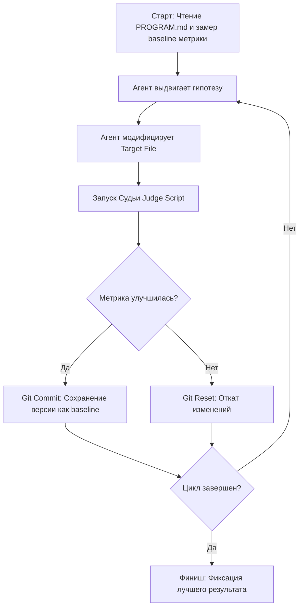

# Autoresearch от Андрея Карпати: Автономное рекурсивное самоулучшение AI-агентов и систем

**Source URL**: [YouTube Video Transcript - Autoresearch Karpathy](file:///C:/Users/DavASko/.gemini/antigravity-ide/brain/5df6a0c7-a3ee-47bb-abd5-9c9faa0e32f5/scratch/transcript_ksr5n.ru.txt)  
**Author/Channel**: Андрей Карпати (Andrej Karpathy) / Обзор концепции и репозитория Autoresearch  
**Date Analyzed**: 2026-07-22  

---

## 1. Контекст, Проблема и Стек

### 1.1 Решаемая проблема
В современном цикле разработки и оптимизации цифровых систем (от обучения нейросетей до веб-перформанса и лидогенерации) человек остается главным «узким местом» (bottleneck). Инженеры вручную выдвигают гипотезы, меняют гиперпараметры или код, запускают тесты, анализируют результаты и откатывают неработающие изменения.

**Autoresearch** (автоисследования) решает эту проблему за счет создания замкнутого автономного цикла **рекурсивного самоулучшения (recursive self-improvement)**:
* AI-агент самостоятельно формирует гипотезы;
* Агент вносит изменения в целевые файлы (код, текстовые шаблоны, конфигурации);
* Автоматическая система-судья оценивает результаты по объективной численной метрике;
* Агент принимает решение о фиксации (commit) успешных гипотез или откате (reset) неудачных.

### 1.2 Опытный контекст и феномен Karpathy
Андрей Карпати (экс-директор по AI в Tesla, сооснователь OpenAI) разработал репозиторий Autoresearch как «песочницу» для тренировки LLM с помощью другой LLM. В качестве полигона использовалось обучение компактных моделей класса GPT-2. 

**Ключевой инсайт автора:** Имея 20-летний опыт в ML и проведя тысячи экспериментов по ручному обучению моделей, Карпати считал свой обучающий код максимально оптимизированным. Однако Autoresearch, запущенный в автономном режиме на ночь, смог обнаружить комбинации гиперпараметров и паттернов в коде, которые Карпати пропустил.

### 1.3 Технологический стек
* **Язык & Среда:** Python (`train.py`, `prep.py`), Shell / Git;
* **LLM Engine:** Claude (Claude 3.5 / 3.7 / 4 / Opus) или GPT-модели, доступные через API;
* **Система контроля версий:** `Git` (используется как механизм атомарных транзакций для гипотез: `git commit` / `git reset`);
* **Оркестрация / Cron:** Автономные скрипты на сервере или локально, запускаемые по расписанию (Cron-триггеры).

---

## 2. Архитектура и Концептуальная модель

### 2.1 Контур трех компонентов
Архитектура Autoresearch строится на абсолютном разделении обязанностей между тремя элементами:

```
+-----------------------------------------------------------------------+
|                             AI-АГЕНТ                                  |
|  (Анализирует метрики, выдвигает гипотезы, модифицирует Target File)   |
+-----------------------------------------------------------------------+
        |                                                       ^
        | 1. Модификация                                        | 4. Возврат
        v                                                       |    метрики
+------------------------+      2. Запуск оценщика     +------------------------+
|   TARGET FILE (Код)    | --------------------------> |   JUDGE SCRIPT (Судья) |
| (Редактируемый файл)   |                             |   (НЕИЗМЕНЯЕМЫЙ СКРИПТ) |
+------------------------+                             +------------------------+
        |                                                       |
        +------------------ 3. Оценка результата --------------+
```

1. **Файл инструкций и границ (`PROGRAM.md`)**:
   * Содержит жесткие системные рамки и правила для AI-агента.
   * Читается агентом один раз при старте.
   * Определяет целевую метрику, разрешенные для изменения файлы и строго запрещает трогать скрипт-судью или инфраструктурный код.

2. **Модифицируемый объект (`Target File`)**:
   * Единственный файл (или группа файлов), который агент имеет право редактировать (`train.py` в ML-песочнице, `index.html` при оптимизации веб-сайта, шаблоны писем в аутриче).

3. **Скрипт-судья (`Judge Script` / `prep.py`)**:
   * Изолированный, строго **неизменяемый** агентом скрипт оценки.
   * Выполняет объективный замер метрики (задержка в мс, loss при обучении, CTR %, conversion rate).
   * Возвращает единственное числовое значение (score).

### 2.2 Модель транзакций на базе Git
Каждая гипотеза рассматривается как атомарная транзакция:
* **Успех (Score_new < Score_best для задержки / Score_new > Score_best для конверсии):** Агент создает `git commit` с понятным описанием гипотезы. Новое состояние становится базлайном.
* **Неудача:** Агент выполняет `git reset --hard`, откатывая изменения к предыдущему стабильному коммиту, регистрирует ошибку в логе гипотез и переходит к следующей идее.

---

## 3. Пошаговый цикл работы (Execution Workflow)



### Подробное описание этапов цикла:

1. **Инициализация:**
   * Настройка файла `PROGRAM.md` с описанием задачи, ограничений и целей.
   * Первый запуск скрипта-судьи для получения начальной метрики ($M_{base}$).

2. **Генерация гипотезы (Hypothesis Phase):**
   * AI-агент анализирует текущий код и журнал прошлых попыток (что сработало, а что нет).
   * Словесно формулирует гипотезу (например: *«Удаление неиспользуемых inline-стилей и минификация JS позволит снизить время первой отрисовки»*).

3. **Мутация кодовой базы (Mutation Phase):**
   * Агент вносит минимально необходимые правки непосредственно в `Target File`.

4. **Оценка (Evaluation Phase):**
   * Автоматически запускается скрипт-судья.
   * Судья выполняет бенчмарк в изолированном окружении и выводит итоговое число $M_{new}$.

5. **Решение и транзакция (Decision Phase):**
   * Если $M_{new}$ лучше $M_{best}$: Сохранение изменений в Git (`git commit -m "Hypothesis X succeeded: metric reduced from A to B"`), обновление $M_{best} = M_{new}$.
   * Если $M_{new}$ хуже или равна $M_{best}$ (или если скрипт упал с ошибкой): Сброс изменений (`git reset --hard HEAD`), запись вывода в лог неудачных гипотез.

6. **Повтор:**
   * Процесс повторяется беспрерывно в автономном режиме (включая работу по расписанию через cron на удаленном сервере).

---

## 4. Критерии применимости и ограничения

### 4.1 Три обязательных условия для работы Autoresearch

Для успешного применения Autoresearch в любой предметной области необходимо выполнение 3 условий:

| № | Условие | Описание и требования | Пример реализации |
|---|---|---|---|
| 1 | **Быстрый фидбек-луп (Fast Feedback Loop)** | Время от вноса правки до получения ответа судьи должно занимать от секунд до нескольких минут. Чем короче цикл, тем больше итераций пройдет система. | В веб-оптимизации: 1-3 секунды на запуск локального бенчмарка. |
| 2 | **Четкая числовая метрика (Clear Numeric Metric)** | Результат должен выражаться скалярным числом (мс, %, loss, доход в $), однозначно указывающим, стало лучше или хуже. | Время загрузки страницы в мс, CTR писем в %, значение Loss при обучении. |
| 3 | **Программный/API-доступ для изменений (Automated Mutation API)** | Агент должен иметь техническую возможность вносить изменения без участия человека (редактирование локального файла или вызов REST API). | Прямое редактирование `index.html` или вызов Google Ads / Meta Ads API. |

### 4.2 Где Autoresearch НЕ работает (Анти-кейсы)

1. **Отсутствие объективной числовой метрики:**
   * *Пример:* Оценка эстетики дизайна или обложек для YouTube. Если оценка зависит от субъективного вкуса человека, а не от проверенного CTR/конверсии, AI не сможешь выбрать победителя без визуального фидбека от человека.
2. **Медленный фидбек-луп (Slow Feedback Loop):**
   * *Пример:* SEO-оптимизация статьи с периодом индексации 1-2 недели. Ожидание 1 недели для оценки одной гипотезы делает самостоятельный автоисследовательский цикл неэффективным.
3. **Отсутствие автоматизированного интерфейса мутаций:**
   * *Пример:* Процессы, где для внедрения изменений требуется ручная сборка физического оборудования или визуальный клик в закрытом GUI без API.

---

## 5. Практические сценарии применения (Use Cases)

### 5.1 Оптимизация скорости загрузки сайтов (Web Performance Tuning)
* **Target File:** `index.html`, `styles.css`, `app.js`.
* **Judge Script:** Скрипт на базе Lighthouse / Puppeteer / Playwright, измеряющий Time to First Byte (TTFB) или Largest Contentful Paint (LCP) в миллисекундах.
* **Результат:** Агент итеративно вырезает дублирующийся CSS, оптимизирует критический путь рендеринга, минифицирует структуры и убирает блокирующие скрипты.

### 5.2 Лидогенерация и холодные рассылки (Cold Outreach Optimization)
* **Target File:** Шаблоны писем и темы сообщений (`email_templates.json`).
* **Judge Script:** Скрипт, собирающий статистику ответов/конверсий через API почтового сервиса за короткий тестовый сплит.
* **Результат:** Непрерывный A/B-тест формулировок и заголовков с автоматическим утверждением шаблонов с наивысшим процентом отклика.

### 5.3 Рекламные кампании (Google Ads / Facebook Ads)
* **Target File:** Рекламные креативы и тексты (`ads_config.yaml`).
* **Judge Script:** Запрос к API рекламного кабинета для расчета актуального CTR и стоимости конверсии (CPA).
* **Результат:** Автономная оптимизация текстов объявлений для минимизации стоимости клика.

### 5.4 Авто-оптимизация AI-скиллов и промптов (Prompt & Agent Skill Tuning)
* **Target File:** Файлы навыков агентов (`SKILL.md`, системные промпты).
* **Judge Script:** Набор тестовых кейсов и авто-оценок (evals / cli-judge) эффективности выполнения задач.
* **Результат:** Эволюционное улучшение промптов и алгоритмов агента без ручного вмешательства.

---

## 6. Философский контекст и шаг к Технологической Сингулярности

Выход концепта Autoresearch подчеркивает фундаментальный сдвиг в AI-индустрии:
1. **Эволюция парадигм:**  
   `LLM Chatbot` (простой диалог) $\rightarrow$ `AI Agent` (выполнение задач по инструкциям) $\rightarrow$ `Self-Improving AI Agent` (автономное самоулучшение).
2. **Сингулярность в ML:** Момент, когда AI-системы начинают обучать и оптимизировать AI-системы быстрее и качественнее, чем это делают инженеры-люди. OpenAI, Anthropic и ведущие исследования Karpathy нацелены именно на закрытие этого рекурсивного цикла.

---

## 7. Справочные материалы и ссылки

* **Первоисточник (Транскрипция):** `C:\Users\DavASko\.gemini\antigravity-ide\brain\5df6a0c7-a3ee-47bb-abd5-9c9faa0e32f5\scratch\transcript_ksr5n.ru.txt`
* **Официальный репозиторий Karpathy (Autoresearch):** GitHub Andrey Karpathy Autoresearch
* **Ключевые файлы репозитория:** `PROGRAM.md` (инструкции), `train.py` (объект правки), `prep.py` (судья/подготовка).
