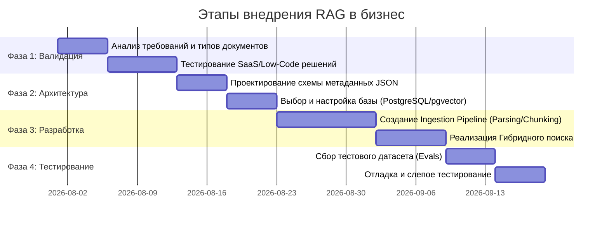

# Практическое применение RAG и нейросетей в бизнесе: Архитектура, гибридный поиск, метаданные и пайплайны

> **Источник**: Транскрипт доклада Петра (эксперта по внедрению LLM и RAG-систем в бизнес-продукты).  
> **Тематика**: Retrieval-Augmented Generation (RAG), Векторный и гибридный поиск, Парсинг сложных документов, Память агентов, Архитектура хранения данных, Валидация и оценка (Evals).  
> **Цель статьи**: Служить исчерпывающим практическим руководством и статьей базы знаний (Wiki) по проектированию, разработке и экономически эффективному внедрению RAG-систем в коммерческих продуктах.

---

## 1. Концепция RAG в бизнесе и разделение сущностей

### 1.1. Что такое RAG и его главная бизнес-функция
**RAG (Retrieval-Augmented Generation)** — это не абстрактная «интеллектуальная система», а конкретный инженерный механизм для **динамического обогащения контекста Large Language Model (LLM)** точной и релевантной информацией, которой изначально нет в весах базовой модели.

* **Главная задача RAG**: В нужный момент времени извлечь из внешнего хранилища точный фрагмент данных (базы знаний, коммерческого каталога, регламента, истории клиента) и передать его в контекстное окно LLM для формирования корректного ответа.
* **Бизнес-ценность**: Позволяет исключить галлюцинации LLM, обеспечивает актуальность ответов без дорогостоящего переобучения модели, дает возможность контролировать доступ к конфиденциальным корпоративным данным.

### 1.2. Принципиальное различие: RAG (База знаний) vs Память агента (Agent Memory)
В практике разработки часто путают или объединяют эти две концепции. Для правильной архитектуры их необходимо строго разделять:

| Параметр | Память агента (Agent Memory) | RAG / База знаний (Knowledge Base) |
| :--- | :--- | :--- |
| **Назначение** | Хранение истории взаимодействия, текущего состояния диалога, предпочтений конкретного пользователя. | Хранение внешних корпоративных документов, регуляторных актов, каталогов товаров, баз техподдержки. |
| **Характер данных** | Динамические, персональные данные (имя, история заказов, контекст текущей сессии). | Статические или периодически обновляемые общесистемные справочные данные. |
| **Технологии** | Простые JSON-структуры, specialized memory frameworks (MemGPT, Zep). | Гибридные базы данных, векторные индексы, поисковые системы (PostgreSQL + pgvector, Qdrant). |
| **Способ интеграции** | Напрямую подгружается в системный промпт текущей сессии. | Запрашивается через векторный/текстовый поиск по мере необходимости. |

---

## 2. Эволюция поиска: От чисто векторного к гибридному (Hybrid Search)

### 2.1. Мифы и ограничение чисто векторного поиска (Vector-Only Search)
Векторный поиск создает эмбеддинги (семантические вектора) текста и ищет релевантность по близости векторов в многомерном пространстве (например, косинусное сходство).

> [!WARNING]
> **Проблема чисто векторного поиска**: Маркетинг вокруг векторных БД сильно раздут. Попытка использовать *только* чистый векторный поиск в реальных бизнес-задачах приводит к провалам:
> * Векторный поиск плохо справляется с точными совпадениями (артикулы, торговые марки, точные химические формулы, даты, имена).
> * При росте базы схожие по вектору фрагменты могут смещать релевантный контекст, выдавая визуально близкие, но фактически неверные данные.

### 2.2. Архитектура гибридного поиска (Hybrid Search)
**Гибридный поиск** — золотой стандарт современных RAG-систем. Он объединяет двухкомпонентную логику:

1. **Векторный поиск (Semantic Search)** — находит смысловые аналогии и синонимичные концепции.
2. **Классический полнотекстовый поиск / Поиск по метаданным (Keyword & Filter Search)** — выполняет точную фильтрацию по ключевым словам, тегам, категориям, диапазонам цен или специфическим атрибутам (BM25, фильтры PostgreSQL / OpenSearch).

```mermaid
flowchart TD
    UserQuery[Запрос пользователя] --> Embedding[Векторизация запроса]
    UserQuery --> MetadataExtract[Извлечение фильтров и ключевых слов]
    
    Embedding --> VectorSearch[Векторный поиск по эмбеддингам]
    MetadataExtract --> MetadataFilter[Фильтрация по метаданным / BM25]
    
    VectorSearch --> Fusion[Объединение и ранжирование результатов (RRF / Re-ranking)]
    MetadataFilter --> Fusion
    
    Fusion --> ContextWindow[Обогащенный контекст для LLM]
    ContextWindow --> LLMResponse[Ответ LLM пользователю]
```

---

## 3. Метаданные — Сердце профессиональной RAG-системы

### 3.1. Зачем нужны метаданные?
Просто разрезать документ на куски текста (чанки) и положить их в векторную базу — **антипаттерн**. В каждый атомарный фрагмент необходимо внедрять качественные метаданные.

### 3.2. Что должно входить в структуру метаданных (JSON):
* **Технические метаданные**: Имя исходного файла, ссылка на хранилище S3, номер страницы PDF, время транскрибации, ID документа.
* **Извлеченные сущности (Entity Metadata)**: Торговые наименования, химические формулы, производители, целевые категории (например, культуры растений, симптомы, виды услуг).
* **Списки и теги**: Массивы сопутствующих характеристик для быстрой жесткой фильтрации в SQL.

> [!TIP]
> **Пример реализации**: В агрохимическом справочнике при поиске препарата против «хлопковой совки» для «томата защищенного грунта» метаданные позволяют моментально отсечь 90% нерелевантных препаратов через жесткий SQL-запрос `WHERE crop = 'томат' AND manufacturer = 'X'`, и только по оставшемуся узкому подмножеству (50-100 записей) выполнять векторный поиск. Это экономит вычислительные ресурсы и драматически повышает точность.

---

## 4. Архитектура хранения данных (Трехуровневое хранилище)

Для устойчивой и масштабируемой RAG-системы рекомендуется трехуровневая структура хранения:

```
[ Уровень 1: S3 Object Storage ]
  │ ──► Хранение бинарных оригиналов (PDF, изображения, видео, аудио)
  ▼
[ Уровень 2: Document / Raw DB (MongoDB / JSON) ]
  │ ──► Сырые структурированные JSON-извлечения (после OCR / LLM-обработки)
  ▼
[ Уровень 3: Relational + Vector DB (PostgreSQL + pgvector) ]
    ──► Фрагменты (summary / чанки), векторные эмбеддинги и метаданные для быстрого гибридного поиска
```

### 4.1. Сравнение баз данных для RAG

1. **PostgreSQL + pgvector (Рекомендуемый базовый выбор)**:
   * *Плюсы*: Объединяет в одной БД классический SQL, жесткую фильтрацию по JSONB-метаданным, полнотекстовый поиск и векторный поиск. Нет необходимости усложнять инфраструктуру.
   * *Область применения*: Проекты малого и среднего масштаба (до сотен тысяч документов).
2. **Специализированные векторные БД (Qdrant, Milvus, Pinecone, Weaviate)**:
   * *Плюсы*: Высочайшая скорость косинусного поиска на миллионах и миллиардах векторов.
   * *Минусы*: Дополнительный узел инфраструктуры, усложнение синхронизации данных.
   * *Область применения*: Огромные массивы данных (>500k-1M векторов) с жесткими требованиями к миллисекундному latency.
3. **OpenSearch / Elasticsearch (с векторной поддержкой)**:
   * *Плюсы*: Мощный гибридный полнотекстовый поиск.
   * *Минусы*: Очень тяжеловесны в поддержке и развертывании на собственных серверах.

---

## 5. Проблемы парсинга и стратегии чанкинга (Chunking Strategy)

Пайплайн предобработки (Ingestion Pipeline) — самый трудоемкий этап создания RAG.

### 5.1. Популярные стратегии чанкинга
* **Фиксированный размер с перехлестом (Fixed-size with overlap)**: Разбиение по N символов/токенов с перекрытием. Самый простой, но наименее интеллектуальный метод. Часто рвет смысл на полуслове.
* **Разбиение по абзацам / структурам (Paragraph / Structural Chunking)**: Использование естественных разделителей документа (заголовки Markdown, абзацы).
* **Семантический чанкинг (Semantic Chunking)**: Мониторинг скачков векторного расстояния между соседними предложениями. Если расстояние превышает порог — происходит разрыв чанка (смена темы).
* **Контекстуализация и Краткие резюме (Summary / Contextualized Chunking)**: С помощью LLM для каждого фрагмента генерируется адаптированный сжатый контекст (Summary), который векторизуется, а при выдаче клиенту передается оригинальный фрагмент документа.

### 5.2. Проблемы сложного парсинга
Стандартные Python-библиотеки парсинга PDF (PyPDF, pdfplumber) часто сбивают порядок чтения:
* **Многоколоночная верстка (брошюры, статьи)**: Парсер читает строки горизонтально через все колонки, превращая текст в бессмысленный набор слов.
* **Таблицы**: Строки таблицы теряют связь с заголовками колонок. Табличные данные необходимо парсить отдельно и преобразовывать в структурированный Markdown или JSON при помощи OCR/LLM.

---

## 6. Особенности работы с нетекстовыми типами данных

### 6.1. Транскрипты аудио и видео (YouTube, лекции, созвоны)
* **Специфика**: В сырой транскрибации отсутствуют знаки препинания, разбивка на абзацы и спикеры.
* **Решение**:
  1. Очистка и нормализация текста с помощью LLM или специализированных библиотек.
  2. Использование спикерной диаризации (Speaker Diarization), если участников несколько.
  3. Таймстемпинг: Связывание временных меток с фрагментами текста.

### 6.2. Мультимодальный RAG (Видео, Слайды, Изображения)
Если видеолекция сопровождается слайдами или графиками:
* Необходимо синхронизировать таймкоды речи с моментами смены кадров/слайдов.
* Извлекать скриншоты ключевых слайдов.
* Преобразовывать изображения слайдов в текстовое описание через Vision LLM (GPT-4o, Gemini Flash) или передавать изображения напрямую в мультимодальную модель на этапе генерации ответа.

---

## 7. Валидация, тестирование (Evals) и файн-тюнинг

### 7.1. Методология тестирования RAG-систем (Evals)
Нельзя оценивать качество RAG «на глаз». Требуется системный подход:

1. **Создание тестового датасета (Gold Standard)**: Формируется набор из 100+ реальных бизнес-вопросов с эталонными ответами.
2. **Разделение выборки**: 70 вопросов используются для отладки пайплайна, а 30 вопросов остаются «слепым тестом» (Unseen Holdout Test).
3. **Оценка ответа**: Использование комбинации метрик (LLM-as-a-Judge для проверки релевантности + обязательная регулярная валидация человеком).

### 7.2. Реальность файн-тюнинга эмбеддинг-моделей
> [!NOTE]
> **Практический инсайт**: Дообучение (Fine-tuning) собственных эмбеддинг-моделей в 95% бизнес-кейсов **не имеет смысла** и не окупается.
> * Промышленный стандарт — использование топовых готовых моделей (например, OpenAI text-embedding-3 или SOTA Open-Source моделей с MTEB benchmark).
> * Потенциал улучшения системы лежит не в модели эмбеддингов, а в **качестве очистки данных, дизайне метаданных, гибридном поиске и постобработке промптов**.

---

## 8. Обзор стека и готовых инструментов

### 8.1. SaaS и Готовые решения (Для быстрого старта)
При проверке гипотез не следует сразу писать собственный кастомный движок.
* **Готовые SaaS RAG API** (тарифы порядка $100–$600 в месяц за ~20,000 запросов и сотни мегабайт данных).
* *Стратегия*: Запустить продукт на SaaS. Переходить на собственную разработку только тогда, когда появится четкое понимание ограничений готовности решения под конкретную бизнес-задачу.

### 8.2. Low-Code / No-Code платформы для прототипирования
* **Flowise / RAGFlow / n8n**: Визуальные конструкторы для сборки RAG-цепочек и агентов. Идеально подходят для непрограммистов и быстрой проверки продуктовой логики.

### 8.3. Профессиональные фреймворки и Open-Source
* **LlamaIndex**: Лучший фреймворк для изучения паттернов RAG, работы с нодами, графами и инджестином документов.
* **LangChain**: Универсальная библиотека для сборки LLM-цепочек и агентов.
* **MCP (Model Context Protocol)**: Современный стандарт подключения LLM к внешним динамическим источникам данных и инструментам.

---

## 9. Пошаговая дорожная карта внедрения RAG в бизнес-проект



### Шаг 1: Формулировка задачи и подготовка датасета
Определить типы входящих документов (PDF, таблицы, скрипты созвонов) и характер пользовательских вопросов.

### Шаг 2: Проектирование JSON-схемы метаданных
Выделить обязательные сущности для фильтрации (категории, даты, ID, теги, атрибуты).

### Шаг 3: Настройка хранилища
Поднять PostgreSQL с расширением `pgvector`. Настроить таблицы под хранение оригинального текста, метаданных (JSONB) и эмбеддингов.

### Шаг 4: Построение Ingestion Pipeline
Разработать скрипты конвертации исходных документов в Markdown, очистки текста, извлечения метаданных через LLM и генерации эмбеддингов.

### Шаг 5: Реализация гибридного поиска и Post-Processing
Настроить комбинацию фильтров по метаданным + векторного поиска. Добавить этап ранжирования результатов (Re-ranking) перед отправкой контекста в LLM.

### Шаг 6: Запуск тестов и непрерывная оценка качества
Оценить точность на контрольной выборке вопросов, внести корректировки в промпты и алгоритм чанкинга.

---

## 10. Ключевые выводы и чек-лист готовности

1. **RAG — это инструмент расширения контекста**, а не волшебная таблетка.
2. **Гибридный поиск обязателен**: Чистый векторный поиск не подходит для профессионального бизнеса.
3. **Инвестируйте в метаданные**: Качество ответов RAG-системы на 80% зависит от качества подготовки данных и метаданных.
4. **Не усложняйте стек на старте**: PostgreSQL + `pgvector` перекрывает потребностей большинства проектов.
5. **Тестируйте гипотезы на готовых сервисах**: Переходите к кастомной разработке только при исчерпании возможностей готовых решений.
