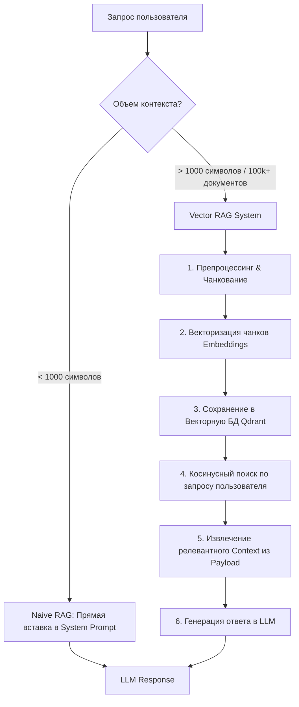
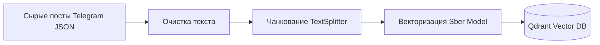
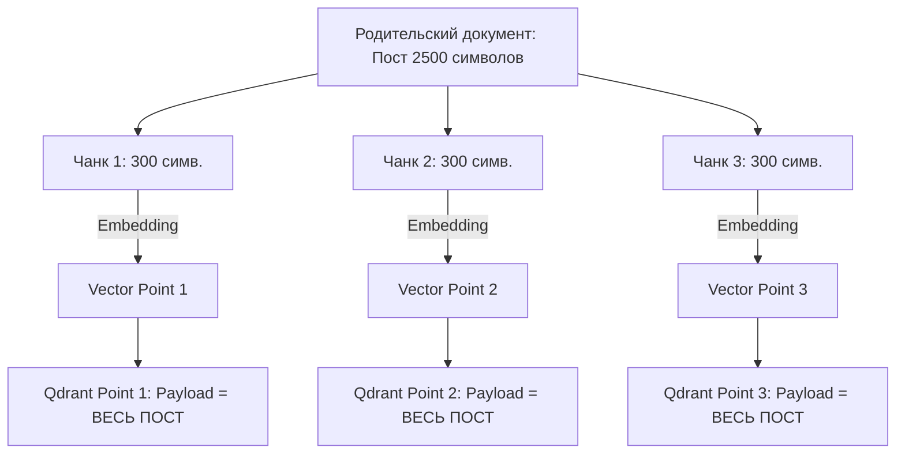

# RAG-системы: Глубокое погружение (Theory, Vector Search, Qdrant, Data Engineering)

> **Источник:** Практический разбор построения RAG-систем (YouTube Transcript / Python + Qdrant + Sber Embeddings + LangChain)  
> **Категория:** AI Architecture / Knowledge Base / RAG Engineering  
> **Дата анализа:** 2026-07-22  

---

## 1. Введение: Зачем нужен RAG и какую проблему он решает

### 1.1 Ограничения фундаментальных LLM
Большие языковые модели (Mistral, GPT-4, Llama и др.) имеют два фундаментальных ограничения в продакшене:
1. **Отсечка датасета (Knowledge Cutoff):** Модель ограничена датой завершения своего обучения (например, октябрь 2023 г.). События и данные после этой даты модели неизвестны.
2. **Отсутствие приватного контекста (Private Business Data):** Модели не знают внутреннюю спецификацию компании, графики работы филиалов, остатки на складах, номенклатуру товаров или регламенты конкретной организации (например, ООО «Ромашка» в г. Киров).

при попытке запросить такие данные модель либо честно признается в отсутствии информации, либо начинает **галлюцинировать**.

---

### 1.2 Эволюция подходов: От Naive Prompting к Vector RAG



#### Вариант 1: Naive RAG (Инжект контекста в промпт)
Если объем справочных данных крайне мал (до 1000 символов):
- Передаем все данные непосредственно в `system` промпт.
- **Промпт:** *"Ты продавец-консультант. Отвечай ТОЛЬКО на основе контекста: Контекст: [Режим работы с 8 до 20, шоурум на ул. Ленина, пункт выдачи на ул. Пушкина]. Вопрос: График работы?"*
- **Плюсы:** Работает из коробки, не требует инфраструктуры.
- **Минусы:** Падает при росте объемов данных (лимиты контекстного окна, зашумление внимания LLM, высокий расход токенов).

#### Вариант 2: Vector RAG (Дополненная генерация с векторным поиском)
Когда база данных включает тысячи товаров, постов, статей или регламентов:
- Поместить все данные в промпт невозможно.
- Строится динамическая система извлечения: запрос пользователя векторизуется, в БД находится наиболее семантически похожий кусок информации, и **только он** передается в контексте LLM.

---

## 2. Теория векторного пространства и Эмбеддингов

### 2.1 Что такое Вектор и Эмбеддинг (Embedding)?
Обычный полнотекстовый поиск (например, SQL `LIKE` или поисковые индексы по ключевым словам) ищет точное совпадение букв/слов. Но слова с одинаковым корнем или написанием могут иметь абсолютно разный смысл (*«привет»*, *«прикорм»*, *«приготовить»*).

**Эмбеддинг** — это перевод текста (слова, предложения или документа) в многомерный вектор (массив чисел с плавающей точкой, например 1024 значения), отражающий семантический смысл в пространстве.

* Упрощенная аналогия: Каждое понятие получает «GPS-координаты» в многомерном пространстве.
* Чем ближе смысл двух фраз, тем меньше расстояние между их векторами в пространстве.

---

### 2.2 Метрики сходства и Косинусное сходство (Cosine Similarity)
Для сравнения векторов в векторных БД чаще всего применяется **Косинусное сходство (Cosine Similarity)**:
$$\text{Similarity} = \cos(\theta) = \frac{\mathbf{A} \cdot \mathbf{B}}{\|\mathbf{A}\| \|\mathbf{B}\|}$$

* Значение колеблется от -1 до 1 (или 0 до 1 в зависимости от нормализации).
* Чем ближе значение к 1.0, тем более релевантен найденный документ запросу пользователя.

---

### 2.3 Выбор Эмбеддинг-модели: Мультиязычные vs Русскоязычные
В практическом эксперименте сравнивались модели:
1. **OpenAI (`text-embedding-3-small` / `ada-002`):** Мультиязычные универсальные модели.
2. **Sber Open Embedding Model (с Hugging Face):** Открытая специализированная модель для русского языка с поддержкой инструкций (размерность вектора = 1024).

> 💡 **Ключевой Инсайт по выбору модели:**  
> Универсальные зарубежные мультиязычные эмбеддеры (OpenAI) на русском языке при абстрактных бизнесовых запросах (*«точки роста бизнеса»*, *«маркетинговая стратегия»*) часто выдают несвязанный шум (например, выдают посты про Мальдивы на запрос про миллион).  
> Специализированные русскоязычные модели (например, от Сбера), развернутые локально или через API, показывают значительно более высокую семантическую кучность и качество выдачи для русскоязычных текстов.

---

## 3. Архитектура и реализация на Python + Qdrant

### 3.1 Квадрант (Qdrant) как векторная БД
В отличие от реляционных таблиц, Qdrant оперирует **Коллекциями (Collections)** и **Точками (Points)**.

#### Конфигурация коллекции в Python:
```python
from qdrant_client import QdrantClient
from qdrant_client.http import models

client = QdrantClient(host="localhost", port=6333)

# Создание коллекции
client.create_collection(
    collection_name="telegram_posts",
    vectors_config=models.VectorParams(
        size=1024, # Размерность вектора выбранной модели (Sber = 1024)
        distance=models.Distance.COSINE # Метрика косинусного сходства
    )
)
```

---

### 3.2 Золотое правило размерности и единства моделей

> ⚠️ **КРИТИЧЕСКОЕ ПРАВИЛО:**  
> 1. Размерность коллекции (`size`) должна строго совпадать с выходом эмбеддер-модели (1024).  
> 2. **Нельзя векторизовать базу одной моделью, а делать поисковый запрос другой моделью.** Модели строят абсолютно разные векторные пространства. Выбранная эмбеддинг-модель фиксируется для всего жизненного цикла индекса.

---

### 3.3 Структура точки (Point) и Payload Schema
Вектор **необратим** (из массива 1024 чисел нельзя восстановить исходный текст). Поэтому исходный текст и метаданные сохраняются в `payload`.

#### Анатомия Point:
* `id`: Уникальный идентификатор (UUID или integer).
* `vector`: Массив из 1024 float32 чисел.
* `payload`: JSON-объект с исходным текстом и метаданными.

#### Стандартная схема Payload для LLM-интеграций:
```json
{
  "content": "Полный или очищенный текст посты/документа...",
  "metadata": {
    "message_id": 8741,
    "source": "telegram",
    "author": "channel_name",
    "created_at": "2024-05-10"
  }
}
```

---

## 4. Подготовка данных (Data Engineering & Preprocessing)

Тестирование проводилось на экспорте реального Telegram-канала (2 668 постов в формате JSON). Сырая загрузка без обработки показала неудовлетворительные результаты: низкий Cosine Score, попадание эмодзи и размытие смысла.



### 4.1 Три уровня очистки текста

| Уровень очистки | Методика | Преимущества | Недостатки |
| :--- | :--- | :--- | :--- |
| **1. Программный (Basic)** | Нижний регистр, `strip()`, regex-удаление спецсимволов, HTML и эмодзи. | Очень быстро, нулевая стоимость. | Не убирает мусорный контекст («Привет всем», «Подскажите»). |
| **2. LLM-Based** | Пропуск через LLM с промптом: *«Удали стоп-слова, приведи сокращения к полной форме, убери приветствия»*. | Высокое качество смысловой очистки. | Дорого на больших объемах, задержки. |
| **3. Ручной (Manual)** | Ручное редактирование базы знаний экспертом. | 100% точность и отсутствие мусора. | Трудоемко, подходит только для малых баз. |

---

### 4.2 Системный промпт для LLM-очистки данных перед векторизацией:
```text
Ты — эксперт по подготовке текстов и данных для создания векторных представлений (embeddings).
Твоя задача — очистить исходный текст:
1. Удали все HTML-теги, специальные символы, эмодзи и служебный мусор.
2. Раскрой все сокращения в полную форму.
3. Удали мусорные фразы и стоп-слова (приветствия, обращения "добрый день", "подскажите пожалуйста").
4. Сохрани исходный смысловой факт без искажений.
```

---

## 5. Чанкование (Chunking) и Продвинутая Архитектура Поиска

### 5.1 Проблема большого контекста
Если векторизовать пост размером в 1500–3000 символов целиком:
* Пользователь задает короткий вопрос (50–100 символов, например: *«Как увеличить продажи быстро?»*).
* Вектор короткого вопроса сильно отличается от вектора огромного разнородного поста.
* Результат: Косинусное сходство падает до 0.5–0.6, поиск выдает случайные посты.

---

### 5.2 Решение: Чанкование через `RecursiveCharacterTextSplitter` (LangChain)
Текст разбивается на небольшие фрагменты (**чанки**) с перекрытием (overlap):
* **Размер чанка (Chunk Size):** ~300 символов.
* **Перекрытие (Chunk Overlap):** ~50 символов (для сохранения контекста на стыках).
* **Разделители (Separators):** `["\n\n", "\n", ". ", " ", ""]`.

---

### 5.3 ARCHITECTURAL PATTERN: Small Chunk Vectoring + Full Context Payload

> 🚀 **ГЛАВНЫЙ ИНСАЙТ ВИДЕО:**  
> **Индексируем по МЕЛКИМ ЧАНКАМ, но в Payload кладем ПОЛНЫЙ родительский документ!**



1. Мы режем 1 пост на 5 мелких чанков по 300 символов.
2. Для каждого из 5 чанков считаем вектор и создаем отдельную **Точку (Point)** в Qdrant.
3. Но в `payload.content` **каждого из 5 поинтов** записываем **полный исходный пост** (или ссылку на родительский документ).
4. **Результат:**
   * Поиск попадает в мелкий чанк с высокой точностью (Score > 0.85).
   * При извлечении из Qdrant мы достаем из payload **цельный текст**, передавая в LLM полный контекст без потери смысла!

#### Статистика эксперимента:
* **Без чанкования (сырые посты):** 1 357 векторных точек на весь канал.
* **С чанкованием (300 char + 50 overlap):** 5 493 векторных точек на тот же объем данных.
* **Качество поиска:** Рост точности выдачи и релевантности ответов в 2-3 раза.

---

## 6. Использование префиксов инструкций (`search_document` / `search_query`)

Некоторые современные открытые эмбеддинг-модели (включая Sber/BGE) требуют использования специальные префиксов перед текстом:

1. **При индексации (добавлении в БД):**
   ```python
   text_to_embed = "search_document: " + cleaned_chunk_text
   ```
2. **При поиске (запросе пользователя):**
   ```python
   query_to_embed = "search_query: " + user_query_text
   ```

* **Зачем:** Это помогает модели оптимизировать векторизацию в зависимости от того, является ли текст хранимым документом или поисковым вопросом.
* **Вывод эксперимента:** Использование префиксов дает прирост релевантности (Cosine Score) на 5–10% по сравнению с векторизацией без префиксов.

---

## 7. Сравнительная сводка результатов экспериментов

| Режим RAG | Точек в БД | Качество релевантности | Оценка ответа LLM |
| :--- | :---: | :--- | :--- |
| **1. Сырой текст без очистки и без чанков** | 1 357 | 🔴 Низкая (~0.55 - 0.65). Выдача нерелевантных фрагментов, шума и эмодзи. | Посредственная, частые галлюцинации. |
| **2. Базовая очистка (без чанков)** | 1 357 | 🟡 Средняя (~0.65 - 0.72). Попадает в тему, но размывает смысл из-за размера. | Приемлемая для общих вопросов. |
| **3. Очистка + Чанкование (300/50) + Full Payload** | 5 493 | 🟢 Высокая (> 0.80). Точное точечное попадание в нужные мысли. | **Отличная.** Выдача точных фактов и связного контекста. |
| **4. Очистка + Чанки + Prefixes (`search_*`)** | 5 493 | 🟢 **Максимальная.** Наивысший Cosine Score и кучность векторов. | **Превосходная.** Идеальная основа для генерации. |

---

## 8. Итоговый Чек-лист по сборке Production-Ready RAG системы

1. **[ ] Выбор модели эмбеддингов:** Для русскоязычных проектов предпочтительны специализированные русскоязычные модели с инструкциями (Sber/BGE), развернутые локально или через API.
2. **[ ] Фиксация единой модели:** Проверить, что модель эмбеддинга при сохранении и при поиске — строго одна и та же.
3. **[ ] Очистка текста:** Удалить HTML, спецсимволы, эмодзи, мусорные приветствия и стоп-слова.
4. **[ ] Стратегия чанкования:**
   * Резать текст на мелкие чанки (~300 символов) с перекрытием (50 символов).
   * Сохранять в `payload` родительский контекст/полный документ.
5. **[ ] Использование префиксов:** Применять `search_document:` для баз данных и `search_query:` для запросов (если поддерживает модель).
6. **[ ] Выбор векторной БД:** Настроить Qdrant с метрикой `Distance.COSINE` и точным `vector_size`.
7. **[ ] Промпт для LLM:** Передавать в System Prompt жесткое ограничение: *"Отвечай строго на основе предоставленного контекста. Если информации в контексте нет, ответь 'Информация не найдена'"*.
