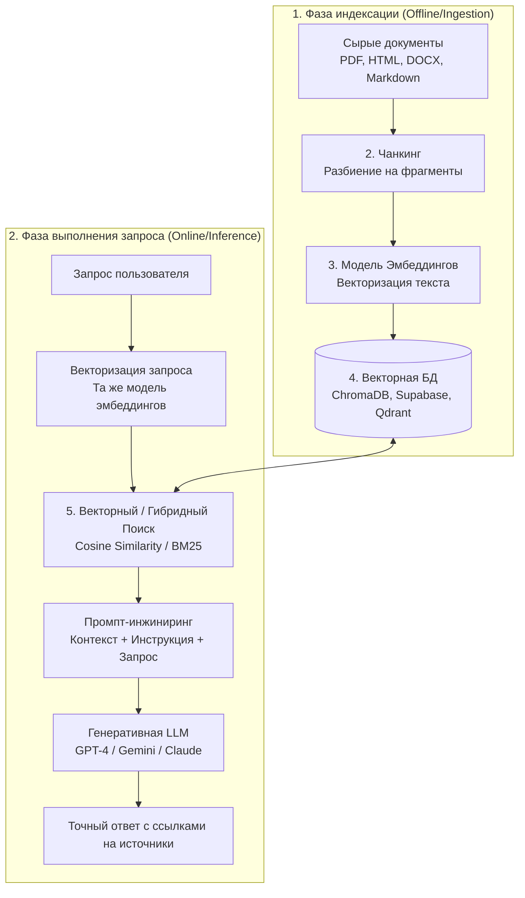
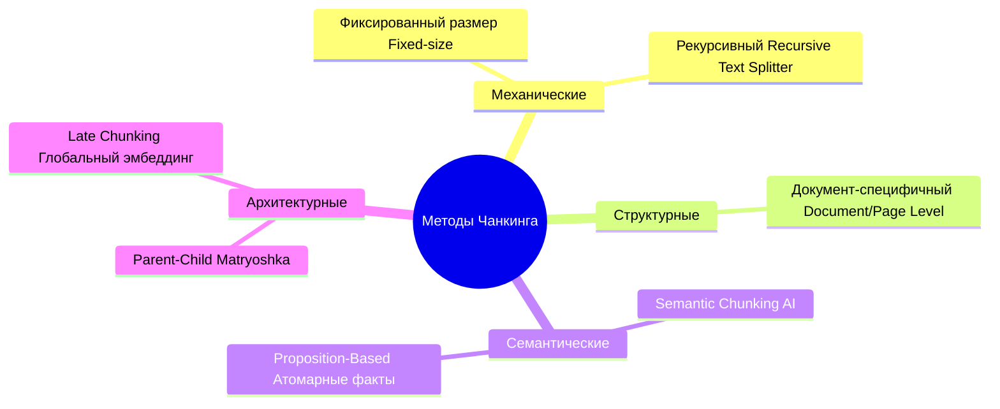
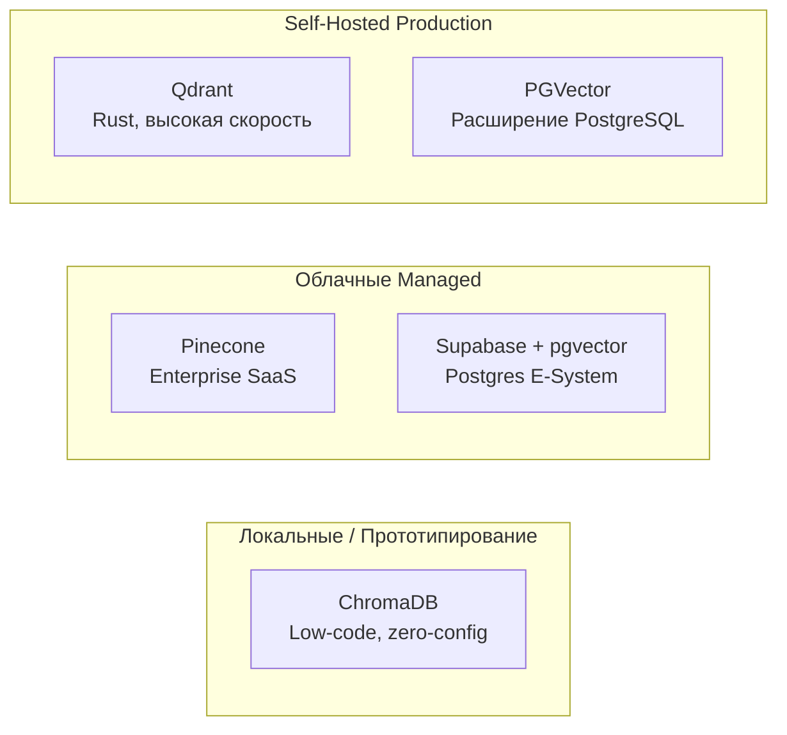
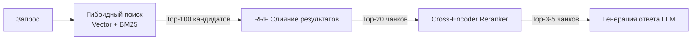
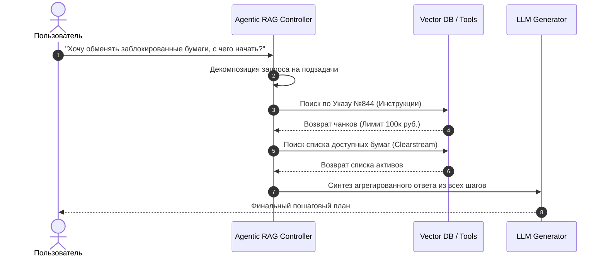

# Технология RAG (Retrieval-Augmented Generation): Полная архитектура, методы чанкинга, эмбеддинги и практическое применение

> [!NOTE]
> данный документ представляет собой исчерпывающий конспект и архитектурный разбор технологии **RAG (Retrieval-Augmented Generation)**, составленный на основе материалов обучающего видео. Предназначен для включения в базу знаний по архитектуре современных LLM-систем и корпоративных AI-сервисов.

---

## 1. Введение и фундаментальная проблематика RAG

### 1.1. Проблема базовых LLM в корпоративном сегменте
При внедрении фундаментальных языковых моделей (LLM, таких как GPT-4, Claude, Gemini) в бизнес-процессы возникает ключевое ограничение: **модель не знает о внутреннем контексте компании**. 
* Базовые LLM обучены на открытых публичных данных интернета.
* Внутренние регламенты, базы знаний, прайс-листы, спецификации продуктов и документация клиентов отсутствовали в обучающей выборке.
* При попытке запросить специфичную корпоративную информацию модель начинает **галлюцинировать** — генерировать уверенные, но полностью вымышленные ответы. LLM создавались для генерации продолжения текста, а не для корректного признания отсутствия знаний.

### 1.2. Сравнение альтернативных подходов к интеграции данных

| Подход | Суть метода | Преимущества | Недостатки / Затраты |
| :--- | :--- | :--- | :--- |
| **Fine-Tuning (Дообучение)** | Модификация весов модели на собственном датасете. | Запоминание стиля и специфичной терминологии. | **Десятки тысяч долларов**, требуется команда ML-инженеров, длительный цикл обучения, риск забывания базовых навыков (*catastrophic forgetting*), данные быстро устаревают. |
| **Full Context Window (Всё в промпт)** | Подача всей базы знаний в контекстное окно (1M+ токенов). | Простота реализации, отсутствие этапа индексации. | **Высокая стоимость каждого запроса** (оплата за миллионы входящих токенов), высокая задержка (latency), падение точности из-за эффекта "иглы в стоге сена" (*Lost in the Middle*). |
| **RAG (Retrieval-Augmented Generation)** | Динамический поиск нужных фрагментов и подмешивание их в промпт. | **Минимальная стоимость**, актуальность данных "на лету", защита от галлюцинаций (60–80%), прозрачность источников. | Требует настройки инфраструктуры поиска (векторные БД, чанкинг, эмбеддинги). |

> [!TIP]
> **Аналогия с экзаменом**: 
> * **Без RAG (обычная LLM)** — студент приходит на экзамен без подготовки и пытающийся угадать ответы (высокий риск провала).
> * **C RAG** — студент приходит на экзамен с полным комплектом конспектов и шпаргалок, умеет быстро находить нужный абзац и отвечать строго по нему.

---

## 2. Архитектура и 5 ключевых узлов RAG-пайплайна

Архитектурно классический RAG-пайплайн делится на две фазы: **Фаза индексации (Ingestion)** и **Фаза исполнения запроса (Inference/Retrieval)**.



### 5 основных узлов системы:
1. **Документы (Raw Data Layer)** — сбор, очистка и формализация исходных данных (Markdown, HTML, PDF, базы знаний).
2. **Чанкер (Chunking Node)** — интеллектуальная нарезка сплошного текста на оптимизированные фрагменты (чанки).
3. **Эмбеддер (Embedding Pipeline)** — преобразование текста в многомерные смысловые векторы.
4. **Хранилище (Vector Database)** — индексация и эффективный поиск ближайших векторов.
5. **Генератор (RAG Query Processor & LLM)** — сборка расширенного промпта и синтез ответа.

---

## 3. Детальный разбор 8 методов чанкинга (Chunking Strategies)

Чанкинг — это **«тихий убийца» RAG-систем**. Ошибки на этапе нарезки текста не могут быть исправлены ни лучшей моделью эмбеддингов, ни самой мощной LLM.

> [!WARNING]
> **Пример разрушения смысла при плохом чанкинге**:
> Исходный текст: *«Банк предлагает ставку 15% по вкладам, но только для VIP-клиентов.»*
> Если жесткий чанкинг разрежет предложение пополам:
> * **Чанк A**: *«Банк предлагает ставку 15% по вкладам»*
> * **Чанк B**: *«но только для VIP-клиентов.»*
> 
> Пользователь спрашивает: *«Какая ставка по вкладу?»* -> Система находит Чанк A и LLM уверенно отвечает: *«15%»*, вводя клиента в заблуждение из-за потери ключевого условия!

Все методы нарезки делятся на 4 категории:



### 3.1. Механические методы
#### 1. Фиксированная нарезка (Fixed-size Chunking)
* **Принцип**: Текст режется строго через каждые $N$ токенов (например, 512 токенов) без учета структуры.
* **Плюсы**: Высокая скорость, нулевые вычислительные затраты, одинаковый размер фрагментов.
* **Минусы**: Разрезает слова, предложения и логические мысли на середине.
* **Применение**: Простейшие однородные тексты без структуры (устаревший подход).

#### 2. Рекурсивный чанкинг (Recursive Character Text Splitter)
* **Принцип**: Стандарт индустрии (дефолтный метод в LangChain / LlamaIndex). Использует каскад разделителей: `\n\n` (абзацы) -> `\n` (строки) -> `.` (предложения) -> ` ` (слова). Режет по верхнему уровню, пока фрагмент не впишется в лимит (например, 512 токенов).
* **Перекрытие (Overlap)**: Обязательно задается 10–20% перекрытия соседних чанков, чтобы не терять контекст на стыках.
* **Бенчмарки**: По данным тестирования *Flow Torch (2026)*, рекурсивный чанкинг на 512 токенов показал **69% точности** извлечения (один из лучших показателей цена/качество).

### 3.2. Структурные методы
#### 3. Документ-специфичный и постоничный чанкинг (Document / Page Level)
* **Принцип**: Ориентируется на разметку документа: заголовки Markdown (`#`, `##`), теги HTML (`<div>`, `<article>`), разделы Word или страницы PDF.
* **Плюсы**: Сохраняет целостность таблиц, списков, фин. отчетов и инструкций.
* **Минусы**: Размер чанка зависит от автора документа (может получиться слишком большим или маленьким).

### 3.3. Семантические методы
#### 4. Семантический чанкинг (Semantic Chunking)
* **Принцип**: Модель эмбеддингов попредложенно вычисляет косинусное сходство между соседними предложениями. Когда тема меняется, графическое сходство резко падает (на графике возникает «пик/пропасть»), где и делается разрез.
* **Реальность и бенчмарки**: В тестах показал лишь **54% точности** (хуже рекурсивного).
* **Причина провала**: Создает слишком мелкие фрагменты (~43 токена). Векторный поиск находит факт, но LLM не хватает окружающего контекста для формирования ответа. Дорого при индексации.

#### 5. Чанкинг на основе атомарных утверждений (Proposition-Based Chunking)
* **Принцип**: LLM переписывает исходный текст в набор независимых, самодостаточных фактов (пропозиций), устраняя местоимения и контекстные ссылки.
  * *Исходник*: «Иванов подписал договор в марте, он предусматривает рассрочку на 12 месяцев.»
  * *Пропозиции*: 
    1. «Иванов подписал договор в марте 2025 года.»
    2. «Договор Иванова предусматривает рассрочку на 12 месяцев.»
* **Плюсы**: Идеальный точечный поиск.
* **Минусы**: Объем чанков растет в 3–5 раз; огромные затраты на предобработку через LLM.

### 3.4. Продвинутые архитектурные методы
#### 6. Двухуровневый чанкинг "Матрешка" (Parent-Child Chunking)
* **Принцип**: Разрешение противоречия «Маленький чанк = точный поиск, но мало контекста» vs «Большой чанк = много контекста, но размытый поиск».
  * **Child Chunks (Дочерние)**: Мелкие фрагменты (~100 токенов) индексируются в векторной базе для поиска.
  * **Parent Chunks (Родительские)**: Крупные разделы / страницы связываются с дочерними. При совпадении дочернего чанка в LLM передается его родительский контекст.
* **Результат**: Высокая точность поиска + богатый контекст для генерации. Рекомендуется для сложных enterprise-систем.

#### 7. Поздний чанкинг (Late Chunking)
* **Принцип**: Изменяет традиционную последовательность. Сначала весь документ целиком прогоняется через модель эмбеддингов (каждый токен видит глобальный контекст документа), и только потом векторные представления математически нарезаются на чанки.
* **Результат**: Каждый чанк несет в себе информацию обо всем документе, даже если содержит слова «он», «этот приказ».

### 3.5. Сводное сравнение и выбор стратегии

| Метод | Точность (Retrieval) | Стоимость индексации | Рекомендуемые сценарии |
| :--- | :--- | :--- | :--- |
| **Recursive (512 t + 15% overlap)** | **69%** | **Минимальная** | **Стандарт по умолчанию** для любых баз знаний и статей. |
| **Semantic Chunking** | 54% | Средняя/Высокая | Сложные нарративные тексты (требует аккуратной настройки порога). |
| **Document / Page Level** | 60–65% | Минимальная | Юридические PDF, финансовые отчеты, мануалы. |
| **Parent-Child Chunking** | **75–85%** | Средняя (двойная индексация) | Корпоративные чат-боты, техническая поддержка, точный поиск. |
| **Proposition-Based** | 80–90% | Очень высокая | Базы вопросов и ответов (FAQ), короткие фактологические справки. |

---

## 4. Эмбеддинги и векторные пространства

### 4.1. Математическая сущность эмбеддингов
Эмбеддинг — это перевод текстового фрагмента в плотный вектор чисел в многомерном пространстве (от 384 до 3072 измерений), где **семантически близкие понятия располагаются близко друг к другу**.

$$\vec{v} = [f_1, f_2, f_3, \dots, f_d]$$

Косинусное сходство (Cosine Similarity) между вектором запроса $\vec{Q}$ и вектором документа $\vec{D}$:

$$\text{Cosine Similarity}(\vec{Q}, \vec{D}) = \frac{\vec{Q} \cdot \vec{D}}{\|\vec{Q}\| \|\vec{D}\|} = \cos(\theta)$$

* Значение $\cos(\theta) \to 1$: идеи абсолютно идентичны по смыслу.
* **Пример**: Запрос *«Как получить займ?»* и документ *«Процедура оформления кредита»* не имеют общих ключевых слов, но их косинусное сходство составит **~0.92**, так как векторные модели улавливают смысловой контекст.

### 4.2. Обзор моделей эмбеддингов и выбор размерности

```mermaid
gantt
    title Спектр моделей эмбеддингов по размерности и назначению
    dateFormat X
    axisFormat %s

    section 384 Dim
    bge-small / MiniLM (Быстрые, локальные, только EN) :0, 384
    section 768 - 1024 Dim
    Cohere v3 / Multilingual-E5 (Отличный RU, Баланс) :0, 1024
    section 1536 - 3072 Dim
    OpenAI text-embedding-3-small/large (Макс. тональность) :0, 3072
```



| Модель | Размерность (Vector Size) | Стоимость | Поддержка RU | Особенности и рекомендации |
| :--- | :--- | :--- | :--- | :--- |
| **OpenAI text-embedding-3-small** | 1536 | $0.02 / 1M токенов | Отличная | Стандарт для облачных решений. |
| **OpenAI text-embedding-3-large** | 3072 | $0.13 / 1M токенов | Высочайшая | Различает тончайшие нюансы (досрочное погашение кредита vs расторжение вклада). |
| **Cohere Embed v3** | 1024 | $0.12 / 1M токенов | Отличная | Встроена поддержка мультимодальности и реранкинга. |
| **Multilingual-E5-large (Open-Source)** | 1024 | Бесплатно (Локально) | Отличная | **Лучший выбор для On-Premise/Privacy-first** решений. |
| **all-MiniLM-L6-v2** | 384 | Бесплатно (Локально) | Плохая | Слишком грубый поиск, подходит только для быстрых тестов на EN. |

> [!IMPORTANT]
> **Влияние размерности на память**:
> Хранение 1,000,000 документов:
> * При размерности **3072**: `~12 Гб` RAM / диска.
> * При размерности **768**: `~3 Гб` (в 4 раза меньше места, в 4 раза быстрее поиск).
> 
> **Векторная технология "Матрешка" (Matryoshka Representation Learning)**: Модели (Jina v3, Nomic, OpenAI) обучаются так, что вектор можно просто обрезать с 3072 до 768 без переобучения модели и с минимальной потерей качества.

### 4.3. Выбор по масштабу проекта
* **< 10,000 документов**: Подойдет любая стандартная модель (OpenAI small или E5).
* **10,000 – 1,000,000 документов**: Использовать размерность 768–1024 для баланса точности и скорости.
* **> 1,000,000 документов**: Размерность 1536+ с применением векторных индексов (HNSW / IVF) и квантования.

> [!CAUTION]
> **Золотое правило**: Модель эмбеддингов для индексации документов и модель эмбеддингов для векторизации пользовательских запросов **ДОЛЖНЫ БЫТЬ СТРОГО ОДНОЙ И ТОЙ ЖЕ**. При смене модели необходима полная переиндексация базы.

---

## 5. Векторные базы данных (Vector Databases)

Реляционные БД ищут по точному совпадению символов (`WHERE name = 'X'`). Векторные БД ищут точки в $N$-мерном пространстве, находящиеся по соседству с заданным вектором.



* **ChromaDB**: Идеально для старта, локальной разработки и скриптов. 0 конфигурации.
* **Qdrant**: Написана на Rust. Максимальная производительность, фильтрация по метаданным, отличный Self-hosted вариант.
* **Supabase (pgvector)**: Позволяет совместить реляционные таблицы пользователей с векторным поиском в одном инстансе PostgreSQL.

---

## 6. Стратегии поиска и реранкинг (Retrieval & Re-ranking)

Одиночный векторный поиск часто проваливается, если запрос содержит точные артикулы, наименования брендов или редкие термины (например, *«Карта Tinkoff Black»* семантически похожа на *«Platinum»*, но пользователю нужен точный продукт).

### 6.1. 3 Уровня поиска



#### Уровень 1: Простой векторный поиск (Dense Retrieval)
Ищет строго по смысловому сходству векторов.

#### Уровень 2: Гибридный поиск (Hybrid Search = Dense + Sparse BM25)
Запускается два алгоритма параллельно:
1. **Dense (Векторный)** — улавливает смысл и синонимы.
2. **Sparse (BM25)** — традиционный алгоритм подсчета частоты слов (находит точные совпадения).

Результаты объединяются алгоритмом **RRF (Reciprocal Rank Fusion)**:

$$RRF\_Score(d) = \sum_{m \in M} \frac{1}{k + r_m(d)}$$

где $k \approx 60$ (константа, сглаживающая доминирование первых мест), $r_m(d)$ — ранг документа $d$ в поиске $m$.

#### Уровень 3: Реранкинг (Re-ranking)
Векторный и гибридный поиск быстро находят Top-50 кандидатов, но их сортировка может быть неоптимальной. Реранкер — это отдельная тяжелая нейросеть, которая детально оценивает парное соответствие `(Запрос, Чанк)`.

| Тип реранкера | Механизм работы | Скорость / Точность | Модели |
| :--- | :--- | :--- | :--- |
| **Cross-Encoder** | Прогоняет текст запроса и чанка вместе через внимание Transformer. | Средняя скорость, **высокая точность**. | `bge-reranker-large`, `Cohere Rerank v3` |
| **ColBERT** | Сравнивает слова запроса и документа по отдельности с помощью матричного умножения. | Очень быстрый, хорошая точность. | `ColBERT v2` |
| **LLM-as-a-Reranker** | Запрос к GPT-4o / Gemini: *«Отсортируй эти 10 документов по релевантности»*. | Медленно, дорого, **максимальное качество**. | GPT-4o, Gemini 1.5 Pro |

---

## 7. Продвинутые парадигмы RAG

### 7.1. GraphRAG (Графовый RAG)
Вместо изолированных текстовых чанков строится **Граф Знаний (Knowledge Graph)**:
* **Узлы (Entities)**: *Кредит*, *Паспорт*, *Процентная ставка*, *Срок*.
* **Ребра (Relations)**: *Кредит -> ТРЕБУЕТ -> Паспорт*, *Ставка -> ЗАВИСИТ ОТ -> Срок*.

**Применение**: Отвечает на сложные multi-hop вопросы, где информацию нужно собрать из 5 разных документов.

### 7.2. Standard RAG vs Agentic RAG



* **Standard RAG**: Одноходовая цепочка: *Вопрос -> Поиск -> Промпт -> Ответ*. Проваливается на сложных или нечетких запросах.
* **Agentic RAG**: Автономный AI-агент использует RAG как один из инструментов (Tool Call). Агент сам переформулирует вопросы, делает несколько запросов к БД, проверяет полноту данных и при необходимости делает уточения.

---

## 8. Бизнес-кесы, ROI и метрики

### 8.1. Экономический эффект от внедрения RAG
* **Снижение галлюцинаций**: Снижает недостоверность ответов на **60–80%**.
* **Аналитика Gartner**: К 2026 году более **60% корпоративных AI-проектов** используют RAG-архитектуру. Объем рынка векторных БД превышает **$8 млрд**.

### 8.2. Ключевые корпоративные сценарии
1. **Клиентская поддержка (Customer Support)**: 24/7 ответы на вопросы клиентов strictly по регламентам с ссылками на пункты договора.
2. **HR & Onboarding**: Внутренний бот для сотрудников (оформление отпусков, больничных, регламенты компании).
3. **Юридические и финансовые ассистенты (Legal & Finance Copilots)**: Экспресс-анализ договоров, выявление рисков по нормативным актам.
4. **Медицинская диагностика**: Вспомогательный поиск по клиническим протоколам и историям болезней (повышение точности первичного выявления патологий).

---

## 9. Практическая реализация и шаблоны

### 9.1. Промпт-шаблон для RAG-генерации
Для гарантированного предотвращения галлюцинаций используется строгий системный промпт:

```text
Ты — корпоративный бизнес-ассистент компании. 
Твоя задача — ответить на вопрос пользователя, используя ИСКЛЮЧИТЕЛЬНО предоставленный ниже контекст.

ПРАВИЛА:
1. Отвечай только на основе фактов из блока КОНТЕКСТ.
2. Если в контексте нет прямого ответа на вопрос, ответь: "К сожалению, в базе знаний нет информации по данному вопросу."
3. Запрещено использовать свои внешние знания или додумывать факты.
4. В конце ответа укажи названия документов-источников, если они присутствуют в метаданных.

КОНТЕКСТ:
{retrieved_chunks_with_metadata}

ВОПРОС ПОЛЬЗОВАТЕЛЯ:
{user_query}
```

---

## 10. Главные выводы и чек-лист внедрения

1. **Не верьте только теории — тестируйте на своих данных**: Универсального чанкинга не существует.
2. **Стартуйте с базового стандара**: `Recursive Text Splitter` (512 токенов + 15% overlap) + `OpenAI text-embedding-3-small` / `E5-large` + `ChromaDB` / `Supabase`.
3. **Качество чанкинга важней размерности эмбеддингов**: Плохо нарезанный текст не спасут даже 3072-мерные векторы.
4. **Для Enterprise подключайте Hybrid Search + Reranking**: Это поднимет accuracy поиска с ~60% до 85%+.
5. **Стройте Agentic RAG для нечетких пользовательских сценариев**.
