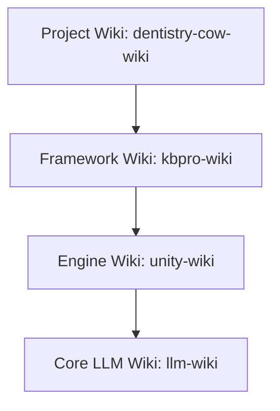

# Architecture Setup Guide

The **DavASko LLM Wiki** is a multi-layered, Obsidian-compatible knowledge base designed specifically to cleanly separate general AI rules, engine-specific rules, framework-specific details, and project-specific documentation.

---

## 1. The Multi-Layer Concept

Instead of a monolith knowledge base, the wiki uses distinct, hierarchical folders called **layers**. Each layer behaves like an independent sub-wiki but can reference layers below it in the dependency chain.

### Conceptual Hierarchy


- **Core LLM Layer (`llm-wiki`)**: Completely independent. Contains general rules for writing code with AI, managing plans, and general helper scripts.
- **Engine Layer (`unity-wiki`)**: Knows about the development platform (e.g. Unity, Unreal, Next.js). Inherits from the LLM Layer.
- **Framework Layer (`kbpro-wiki`)**: Knows about the target core libraries, custom packages, and architecture protocols. Inherits from the Engine Layer.
- **Project Layer (`dentistry-cow-wiki`)**: Contains business logic, game design documents (GDD), and gameplay module definitions. Inherits from the Framework Layer.

---

## 2. Priority Levels of Knowledge

When resolving links, searching for pages, or applying rules, the system adheres to a strict priority hierarchy based on "proximity to the project":

$$\text{Project Layer} > \text{Framework Layer} > \text{Engine Layer} > \text{Core LLM Layer}$$

### Priority Conflict Resolution Rules
If a page, rule, or concept exists in multiple layers (e.g., both `unity-wiki` and `llm-wiki` contain a page/rule with conflicting conventions):
1. **Default to Specifics**: The version in the most specific (higher-priority) layer is followed by default.
2. **Warn the User**: The AI assistant must print a warning message notifying the user about the duplicate definitions in the layers.
3. **Offer Choice**: The AI assistant must ask the user whether to continue with the default (more specific) version or override it with the base version.

---

## 3. Layer Manifest: `wiki.json`

Every layer directory MUST contain a `wiki.json` file in its root. This manifest defines the layer name and its explicit dependencies.

### Configuration Format
```json
{
  "name": "project-wiki",
  "dependencies": [
    "framework-wiki",
    "engine-wiki",
    "llm-wiki"
  ]
}
```

*Note: Order in the `dependencies` array defines the search priority for link resolution. The current layer is always searched first, followed by dependencies in order.*

---

## 4. Directory Layout of a Layer

Each layer must have the following directories:

```
<layer-directory>/
├── wiki.json                   ← Manifest file
├── wiki/                       ← Compiled, AI-maintained knowledge (durable)
│   ├── index.md                ← Required layer table of contents
│   ├── log.md                  ← Append-only changelog
│   ├── contradictions.md       ← Log of conflicting claims and open questions
│   ├── stubs.md                ← Placeholder/stub links
│   ├── concepts/               ← Reusable ideas and rules
│   ├── entities/               ← Classes, packages, tools, scenes
│   ├── runbooks/               ← Step-by-step developer checklists and guides
│   ├── sources/                ← AI-generated summaries of raw materials
│   ├── syntheses/              ← Comparative designs and analyses
│   └── decisions/              ← Architectural decisions (ADRs)
└── raw/                        # Immutable source materials (read-only)
    ├── docs/                   # Copied source docs
    ├── transcripts/            # Meeting or review notes
    └── ai-skills~/             # Portable AI skills (SKILL.md and assets)
```

---

## 5. Resolving Cyclic Dependencies: The Stub Mechanism

Dependencies flow **downward** (e.g., Project Layer can reference Engine Layer, but Engine Layer cannot reference Project Layer). 

If a lower-level page (e.g., `unity-wiki/wiki/runbooks/unity-shader-ai-guidelines.md`) needs to mention a page belonging to a higher layer (e.g., `dentistry-cow-wiki`), it cannot use a direct link because that would cause a validation error (out-of-bounds dependency).

### Solution: `stubs.md`
To reference a page that is outside or above the layer's dependency chain, register a link to that page inside the layer's `wiki/stubs.md` file:

```markdown
# Placeholder Stubs

- [[my-project-specific-module]] - Project-specific gameplay module definition.
```

The wiki linter will recognize this stub as a valid reference. When the actual page is eventually ingested into the project layer, the stub prevents link errors while keeping the engine/framework layer completely portable and independent.
