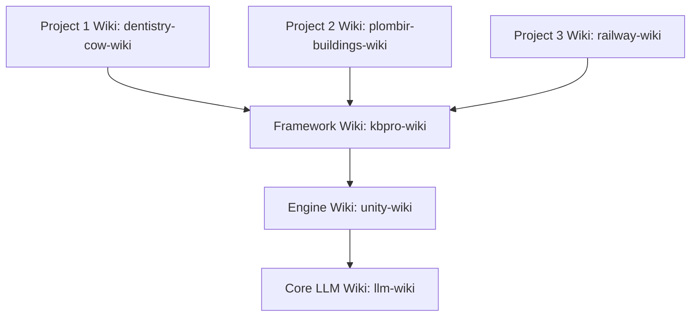

# Architecture Setup Guide

The **DavASko LLM Wiki** is a multi-layered, Obsidian-compatible knowledge base designed to cleanly separate general AI rules, engine-specific rules, framework-specific details, and project-specific documentation.

---

## 1. The Multi-Layer Concept

Instead of a monolith knowledge base, the wiki uses distinct, hierarchical folders called **layers**. Each layer behaves like an independent sub-wiki but can reference layers below it in the dependency chain.

### Conceptual Hierarchy


- **Core LLM Layer (`llm-wiki`)**: Completely independent. Contains general rules for writing code with AI, managing plans, video transcripts, and general helper scripts.
- **Engine Layer (`unity-wiki`)**: Knows about the development platform (e.g. Unity, Unreal, Next.js). Inherits from the LLM Layer.
- **Framework Layer (`kbpro-wiki`)**: Knows about the target core libraries, custom packages, C# code styles, and architecture protocols. Inherits from the Engine Layer.
- **Project Layers (`dentistry-cow-wiki`, `plombir-buildings-wiki`, `railway-wiki`, etc.)**: Each contains independent business logic, game design documents (GDD), and gameplay module definitions for that specific project. All projects inherit from the same common Framework Layer, but remain completely isolated from each other.

---

## 2. Layer Manifest: `wiki.json`

Every layer directory MUST contain a `wiki.json` file in its root. This manifest defines the layer name and its explicit dependencies.

### Configuration Format
```json
{
  "name": "project-wiki",
  "dependencies": [
    "framework-wiki",
    "engine-wiki",
    "llm-wiki"
  ]
}
```

*Note: Order in the `dependencies` array defines the search priority for link resolution. The current layer is always searched first, followed by dependencies in order.*

---

## 3. Directory Layout of a Layer

The overall workspace directory layout consists of root-level folders and multi-layered subdirectories:

### Workspace Root Layout
```
<workspace-root>/
├── plans/                      ← Task checklists, implementation plans, walkthroughs (centralized)
├── system/                     ← Maintenance scripts (lint-wiki.js, query-wiki.js, etc.)
├── NewData/                    ← Incoming buffer folder for manual ingestion
├── llm-wiki/                   ← Core LLM Layer (contains general rules, scripts, transcripts)
├── unity-wiki/                 ← Engine Layer (Unity/platform specific)
├── kbpro-wiki/                 ← Framework Layer (contains kbpro framework details, code style)
├── dentistry-cow-wiki/         ← Project-specific Layer (Dentistry project)
├── plombir-buildings-wiki/     ← Project-specific Layer (Plombir project)
└── railway-wiki/               ← Project-specific Layer (Railway project)
```

### Folder Structure of a Single Layer
Each individual layer directory must have the following structure:
```
<layer-directory>/
├── wiki.json                   ← Manifest file defining dependencies
├── wiki/                       ← Compiled, AI-maintained knowledge (durable)
│   ├── index.md                ← Required layer table of contents
│   ├── log.md                  ← Append-only local changelog
│   ├── contradictions.md       ← Log of conflicting claims and open questions
│   ├── stubs.md                ← Placeholder/stub links for cyclic dependencies
│   ├── concepts/               ← Reusable ideas and rules
│   ├── entities/               ← Classes, packages, tools, scenes
│   ├── runbooks/               ← Step-by-step procedures
│   ├── sources/                ← AI-generated summaries of raw materials
│   ├── syntheses/              ← Comparative analyses
│   └── decisions/              ← Architectural decisions (ADRs)
└── raw/                        ← Immutable source materials (read-only)
    ├── docs/                   ← Copied source docs
    ├── transcripts/            ← Meeting or review notes (llm-wiki/raw/transcripts/ only)
    └── ai-skills~/             ← Portable AI skills package folders
```

---

## 4. Resolving Cyclic Dependencies: The Stub Mechanism

Dependencies flow **downward** (e.g., Project Layer can reference Engine Layer, but Engine Layer cannot reference Project Layer). 

If a lower-level page (e.g., `unity-wiki/wiki/runbooks/unity-shader-ai-guidelines.md`) needs to mention a page belonging to a higher layer (e.g., `dentistry-cow-wiki`), it cannot use a direct link because that would cause a validation error (out-of-bounds dependency).

### Solution: `stubs.md`
To reference a page that is outside or above the layer's dependency chain, register a link to that page inside the layer's `wiki/stubs.md` file:

```markdown
# Placeholder Stubs

- [[my-project-specific-module]] - Project-specific gameplay module definition.
```

The wiki linter will recognize this stub as a valid reference. When the actual page is eventually ingested into the project layer, the stub prevents link errors while keeping the engine/framework layer completely portable and independent.
