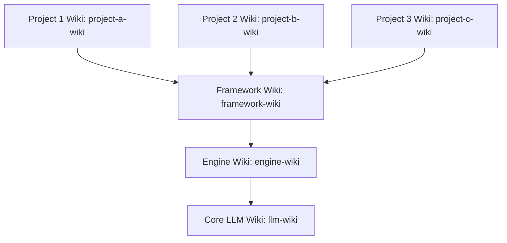

# Architecture Setup Guide

The **DavASko LLM Wiki** is a multi-layered, Obsidian-compatible knowledge base designed to cleanly separate general AI rules, engine-specific rules, framework-specific details, and project-specific documentation.

---

## 1. The Multi-Layer Concept

Instead of a monolith knowledge base, the wiki uses distinct, hierarchical folders called **layers**. Each layer behaves like an independent sub-wiki but can reference layers below it in the dependency chain.

### Conceptual Hierarchy


- **Core LLM Layer (`llm-wiki`)**: Completely independent. Contains general rules for writing code with AI, managing plans, video transcripts, and general helper scripts.
- **Engine Layer (`engine-wiki`)**: Knows about the development platform (e.g. Unity, Unreal, Next.js). Inherits from the LLM Layer.
- **Framework Layer (`framework-wiki`)**: Knows about the target core libraries, custom packages, code styles, and architecture protocols. Inherits from the Engine Layer.
- **Project Layers (`project-a-wiki`, `project-b-wiki`, etc.)**: Each contains independent business logic, specifications/game design documents, and feature definitions for that specific project. All projects inherit from the same common Framework Layer, but remain completely isolated from each other.

---

## 2. Layer Manifest: `wiki.json`

Every layer directory MUST contain a `wiki.json` file in its root. This manifest defines the layer name and its explicit dependencies. In the layer description indexes and LLM-WIKI guides, dependency references must include clickable local paths to their folders, e.g. `[davasko-wiki](../davasko-wiki)`.

### Configuration Format
```json
{
  "name": "project-wiki",
  "dependencies": [
    "framework-wiki",
    "engine-wiki",
    "llm-wiki"
  ]
}
```

*Note: Order in the `dependencies` array defines the search priority for link resolution. The current layer is always searched first, followed by dependencies in order.*

---

## 3. Directory Layout of a Layer

The overall workspace directory layout consists of root-level folders and multi-layered subdirectories:

### Workspace Root Layout
```
<workspace-root>/
├── plans/                      ← Task checklists, implementation plans, walkthroughs (centralized)
├── system/                     ← Maintenance scripts (lint-wiki.js, query-wiki.js, etc.)
├── NewData/                    ← Incoming buffer folder for manual ingestion
├── llm-wiki/                   ← Core LLM Layer (contains general rules, scripts, transcripts)
├── engine-wiki/                ← Engine Layer (Engine/platform specific)
├── framework-wiki/             ← Framework Layer (contains framework details, code style)
├── project-a-wiki/             ← Project-specific Layer (Project A)
├── project-b-wiki/             ← Project-specific Layer (Project B)
└── project-c-wiki/             ← Project-specific Layer (Project C)
```

### Folder Structure of a Single Layer
Each individual layer directory must have the following structure:
```
<layer-directory>/
├── wiki.json                   ← Manifest file defining dependencies
├── wiki/                       ← Compiled, AI-maintained knowledge (durable)
│   ├── index.md                ← Required layer table of contents
│   ├── contradictions.md       ← Log of conflicting claims and open questions
│   ├── stubs.md                ← Placeholder/stub links for cyclic dependencies
│   ├── concepts/               ← Reusable ideas and rules
│   ├── entities/               ← Classes, packages, tools, scenes
│   ├── runbooks/               ← Step-by-step procedures
│   ├── sources/                ← AI-generated summaries of raw materials
│   ├── syntheses/              ← Comparative analyses
│   └── decisions/              ← Architectural decisions (ADRs)
└── raw/                        ← Immutable source materials (read-only)
    ├── docs/                   ← Copied source docs
    ├── transcripts/            ← Meeting or review notes (llm-wiki/raw/transcripts/ only)
    └── ai-skills~/             ← Portable AI skills package folders
```

---

## 4. Resolving Cyclic Dependencies: The Stub Mechanism

Dependencies flow **downward** (e.g., Project Layer can reference Engine Layer, but Engine Layer cannot reference Project Layer). 

If a lower-level page (e.g., a page in the Engine Layer) needs to mention a page belonging to a higher layer (e.g., a Project Layer), it cannot use a direct link because that would cause a validation error (out-of-bounds dependency).

### Solution: `stubs.md`
To reference a page that is outside or above the layer's dependency chain, register a link to that page inside the layer's `wiki/stubs.md` file:

```markdown
# Placeholder Stubs

- [[my-project-specific-module]] - Project-specific gameplay module definition.
```

The wiki linter will recognize this stub as a valid reference. When the actual page is eventually ingested into the project layer, the stub prevents link errors while keeping the engine/framework layer completely portable and independent.
